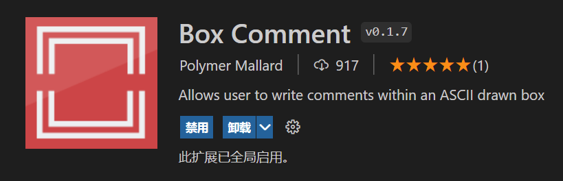
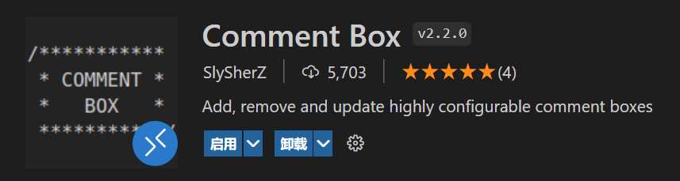

---

**创建时间**：2022年4月28日10:57:03
**最新更新**：2022年4月29日15:33:16

---

**Problem Description**：Box Comment Fix Version Release - How to add a custom box to a comment block in Visual Studio Code? How to add a beautified comment block with Box?

**核心思路**：
* 两个插件推荐（俩名儿反过来...）
	* `Box Comment`插件
	* `Comment Box`插件
* 这里提供的是支持多行文本的`Comment Box`插件，`Comment Divider`不支持多行文本的`Comment Box`注释，故此处不做推荐

---

* 像下面这样带方框的注释，其实英文就是`Box Comment`
	* 下面第一个是`Box Comment`画的（指默认配置）
	* 下面第二个是`Comment Box`画的（指默认配置）
		* 可以通过设置达到类似或一样的效果
		* 我更喜欢`Box Comment`画的，但原作者很久没维护，[Willasm修复的版本](https://github.com/willasm/vscode-box-comment)没有编译，编译搞了我半天..
			* 我直接Release了一个带编译的`.vsix`版本，大家可以直接用，[代码仓Release](https://github.com/Myoontyee/vscode-box-comment-withRelease/releases/tag/v1.0.0)

```
// ╔══════════════════════════════════════════════════════════╗  
// ║ Lorem ipsum dolor sit amet 							  ║  
// ╠══════════════════════════════════════════════════════════╣  
// ║ Consectetur adipiscing elit                              ║  
// ╚══════════════════════════════════════════════════════════╝
```

```
/***********************  
* COULD YOU *  
* COMMENT BOX THIS? *  
* PRETTY PLEASE (*.*) *  
***********************/
```


# Box Comment
* `Polymer Mallard`佬画了一个周末写的..牛逼！
	* 但是`Visual Studio Code`的`扩展`里直接安装的版本有BUG！没法配置，快捷键无响应
* 原作者很久没维护，[Willasm修复的版本](https://github.com/willasm/vscode-box-comment)没有编译，编译搞了我半天..
* 我直接Release了一个带编译的`.vsix`版本，大家可以直接用，[代码仓Release](https://github.com/Myoontyee/vscode-box-comment-withRelease/releases/tag/v1.0.0)

* 

## 一些Tricks
* `Polymer Mallard`佬的版本支持分割线，实际上这个功能让注释显得很美观，像下面这样
	* 输入下面的内容，选中内容，按快捷键，得到下下块注释效果
		* 我提供的版本快捷键是<kbd>Ctrl</kbd>+<kbd>Alt</kbd>+<kbd>;</kbd>

```
Lorem ipsum dolor sit amet  
--  
Consectetur adipiscing elit
```

```
// ╔══════════════════════════════════════════════════════════╗
// ║ Lorem ipsum dolor sit amet                               ║
// ╠══════════════════════════════════════════════════════════╣
// ║ Consectetur adipiscing elit                              ║
// ╚══════════════════════════════════════════════════════════╝
```

# Comment Box

* `Comment Box`是`SlySherZ`佬写的版本，如下图
  * 

* 经过设置可以搞成这样

```
##############################
#         THIS IS A          #
# MULTI-LINE COMMENT EXAMPLE #
##############################
```


# Ref
* [Comment Box](https://marketplace.visualstudio.com/items?itemName=slysherz.comment-box)
* [VSCode Extension: Box Comment](https://medium.com/@mattkenefick/vscode-extension-box-comment-a4be66785bdc)
* [vscode-box-comment-withRelease](https://github.com/Myoontyee/vscode-box-comment-withRelease)
