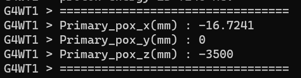

---

**创建时间**：2022年4月7日15:29:08
**最新更新**：2022年4月8日10:16:03

---

**Problem Description**：C++ defines global variables, how to define all parameters in the header file? How to use a file to store all the parameters in the project? How to pass global parameters? ——Take Geant4 passing ray exit coordinates as an example

**核心思路**：
* 通常操作
	* 头文件`.h`里声明，源文件`.cpp`里定义
	* Geant4头文件是`.hh`，源文件是`.cc`
* Geant4里的操作
	* `include/B5Constants.hh`声明变量（`extern`，不赋值）
	* 对应头文件`public`内声明变量，如`include/B5PrimaryGeneratorAction.hh`（`extern`，不赋值）
	* 对应源文件
		* 头部初始化变量（没有`extern`，只定义，如`G4double`，初始化赋值）
		* 函数部分赋值（没有`extern`，没有定义，直接赋值）
	* 写到`.root`文件里
		* `src/B5RunAction.cc`初始化表格，记下`Column Id`
		* `src/B5EventAction.cc`内直接使用上面定义的变量传递数据（没有`extern`，没有定义，直接使用）


---

# 基本思路与概念
* 例子
	* 头文件```state.h```
	* 源文件```state.cpp```
	* 其他源文件```t1.cpp```,```t2.cpp```,```t3.cpp```
		* 这些源文件都包含头文件```state.h```
	* 需要定义一个全局变量供这些源文件使用
* 方法如下
	* 在```state.h```中声明全局变量```extern int a;```
	* 在```state.cpp```中定义该全局变量```int a = 10;```
* 概念区别
	* 声明
		* 一个声明必须满足两个条件，否则就是定义
			* 声明必须使用```extern```关键字
			* 不能给变量赋初始值
	* 例子如下
		```C++
		extern int a; // 声明
		int a; // 定义
		int a = 0; // 定义
		extern int a = 0; 定义
		```
* 注意事项
	* 头文件中应使用```extern```关键字声明全局变量（不定义）
	* 如果这个变量有多个文件用到，可以新建一个```.cpp```文件，在其中定义，并把该文件加入工程并调用
	* 头文件尽量不要定义任何变量
	* 一般只在头文件声明，用```extern```在```.cpp```中定义，如果这个头文件被多个```.cpp```引用，会造成重复定义的链接错误
	* 头文件只能声明全局变量（```extern```），不可定义（不推荐使用）
	* ```.cpp```里，在最外层定义即可（```int gi```），并直接引用
	* 如果在```.cpp```里用```static```定义，则该变量只在当前```.cpp```文件中有效，在别的文件中无效
	* 如果在```.h```里用```static```定义，不会进行编译（```.h```文件不编译），只会在其每个```include```的```.cpp```文件中包含编译，相当于在```.cpp```里使用```static```定义


# 魔改exampleB5实现射线位置传递

## 声明变量
* 用代码编辑器打开`include/B5Constants.hh`，添加以下内容
```C++
extern G4double Primary_worldpos_x;
extern G4double Primary_worldpos_y;
extern G4double Primary_worldpos_z;
```

* 用代码编辑器打开`include/B5PrimaryGeneratorAction.hh`，在`#include`各种库下方，`class B5PrimaryGeneratorAction : public G4VUserPrimaryGeneratorAction`上方添加以下内容

```C++
// =============================================================================
// 传递变量
// =============================================================================
// 2022年4月7日
// 首次添加
// 粒子出射位置的x、y、z坐标
// =============================================================================
extern G4double Primary_worldpos_x;
extern G4double Primary_worldpos_y;
extern G4double Primary_worldpos_z;
// =============================================================================
```

## 定义变量
* 用代码编辑器打开`src/B5PrimaryGeneratorAction.cc`，添加修改以下内容
	* 别忘记该文件要`#include "Randomize.hh"`用于产生随机数

* 在`#include`下方，`B5PrimaryGeneratorAction::B5PrimaryGeneratorAction()`上方进行初始化

```C++
G4double Primary_worldpos_x = 0.; // 初始化
G4double Primary_worldpos_y = 0.; // 初始化
G4double Primary_worldpos_z = 0.; // 初始化
```


* 在`void B5PrimaryGeneratorAction::GeneratePrimaries(G4Event* event)`内添加并修改对应内容如下

```C++
   // =============================================================================
  // 随机数版本
  G4double x0 = G4UniformRand();
  G4double y0 = G4UniformRand();
  G4double z0 = G4UniformRand();
    // =============================================================================
    // 2022年4月7日
    // 添加粒子出射位置的传递
    // =============================================================================
    G4double Primary_worldpos_x = x0; // 传递数值
    G4double Primary_worldpos_y = y0; // 传递数值
    G4double Primary_worldpos_z = z0; // 传递数值
    
    G4cout << "=================================" << G4endl
          << "Primary_pox_x(mm) : " << (Primary_worldpos_x/mm) << G4endl
          << "Primary_pox_y(mm) : " << (Primary_worldpos_y/mm) << G4endl
          << "Primary_pox_z(mm) : " << (Primary_worldpos_z/mm) << G4endl
          << "=================================" << G4endl;
    // =============================================================================

  fParticleGun->SetParticlePosition(G4ThreeVector(x0,y0,z0));
  // =============================================================================
```

* `void B5PrimaryGeneratorAction::GeneratePrimaries(G4Event* event)`对应部分修改前后对比如下

<div style="overflow:auto;width:100%"> <table width="auto" style="white-space:nowrap">
<tr>
<td> <div align = center> <strong>修改前</strong></div> </td> <td> <div align = center> <strong>修改后</strong></div> </td>
</tr>
<tr>
<td>
```C++
  // =============================================================================
  // default particle kinematics
  // 默认粒子运动学（运行前默认加载内容）
  // =============================================================================
  // 粒子位置
  // 固定版本
  // =============================================================================
  fParticleGun->SetParticlePosition(G4ThreeVector(0., 0., 1.*m)); // 粒子位置
  // =============================================================================
```
</td>
<td>
```C++
   // =============================================================================
  // 随机数版本
  G4double x0 = G4UniformRand();
  G4double y0 = G4UniformRand();
  G4double z0 = G4UniformRand();
    // =============================================================================
    // 2022年4月7日
    // 添加粒子出射位置的传递
    // =============================================================================
    G4double Primary_worldpos_x = x0; // 传递数值
    G4double Primary_worldpos_y = y0; // 传递数值
    G4double Primary_worldpos_z = z0; // 传递数值
    G4cout << "=================================" << G4endl
          << "Primary_pox_x(mm) : " << (Primary_worldpos_x/mm) << G4endl
          << "Primary_pox_y(mm) : " << (Primary_worldpos_y/mm) << G4endl
          << "Primary_pox_z(mm) : " << (Primary_worldpos_z/mm) << G4endl
          << "=================================" << G4endl;
    // =============================================================================
  fParticleGun->SetParticlePosition(G4ThreeVector(x0,y0,z0));
  // =============================================================================
```
</td>
</table>
</div>


## 初始化表格
* 用代码编辑器打开`src/B5RunAction.cc`，在`B5RunAction::B5RunAction(B5EventAction* eventAction) : G4UserRunAction(), fEventAction(eventAction)`内添加以下内容
	* 我这3列对应的Id是26~28，具体到自己的代码里，要自己数一下对应的`column Id`
```C++
// 2022年4月7日
// 射线出射位置
analysisManager->CreateNtupleDColumn("Primary_pox_x");   // column Id = 26
analysisManager->CreateNtupleDColumn("Primary_pox_y");   // column Id = 27
analysisManager->CreateNtupleDColumn("Primary_pox_z");   // column Id = 28
```

## 输出进.root

* 用代码编辑器打开`src/B5EventAction.cc`，在`void B5EventAction::EndOfEventAction(const G4Event *event)`对应位置添加以下内容

```C++
  // columns 26-28
  // 出射粒子 位置
  // 下面这个输出的注释，当你需要确认参数是否传递过来，可以取消下面这个注释，检查效果
  // G4cout  << "=================================" << G4endl
  //         << "Primary_pox_x(mm) : " << (Primary_worldpos_x/mm) << G4endl
  //         << "Primary_pox_y(mm) : " << (Primary_worldpos_y/mm) << G4endl
  //         << "Primary_pox_z(mm) : " << (Primary_worldpos_z/mm) << G4endl
  //         << "=================================" << G4endl;
  // 下面这个对应的是Column Id，我是26-28
  analysisManager->FillNtupleDColumn(26, (Primary_worldpos_x));
  analysisManager->FillNtupleDColumn(27, (Primary_worldpos_y));
  analysisManager->FillNtupleDColumn(28, (Primary_worldpos_z));
```

## 输出效果




## 结果
* 你就可以把这几个数据传递到输出的`.root`文件里了！
* 读取`.root`文件见[Python如何基于uproot库读取.root文件，如何查看其内部数据，如何将其转化为DataFrame](./b20a8a22.html)

# Ref
* [c++多个文件中如何共用一个全局变量](https://blog.csdn.net/m1109048058/article/details/79485064)
