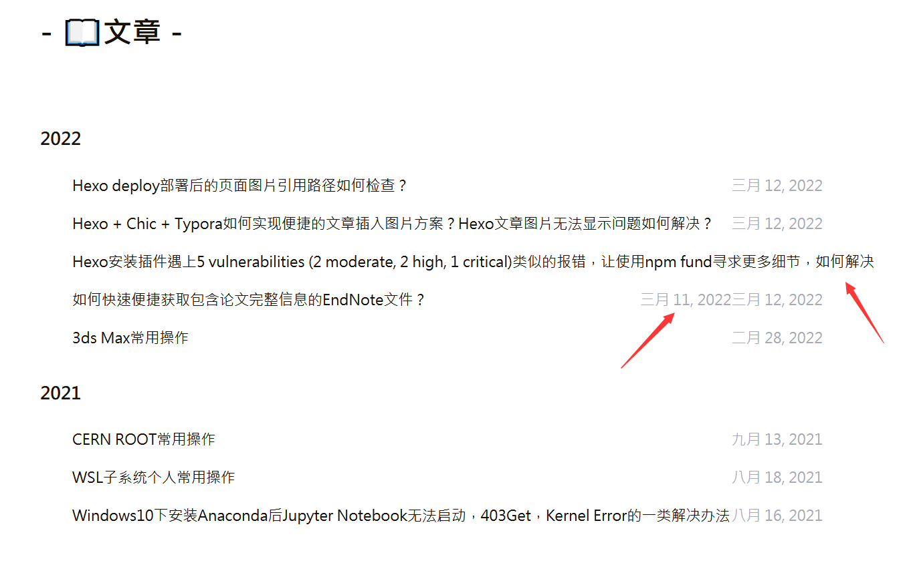
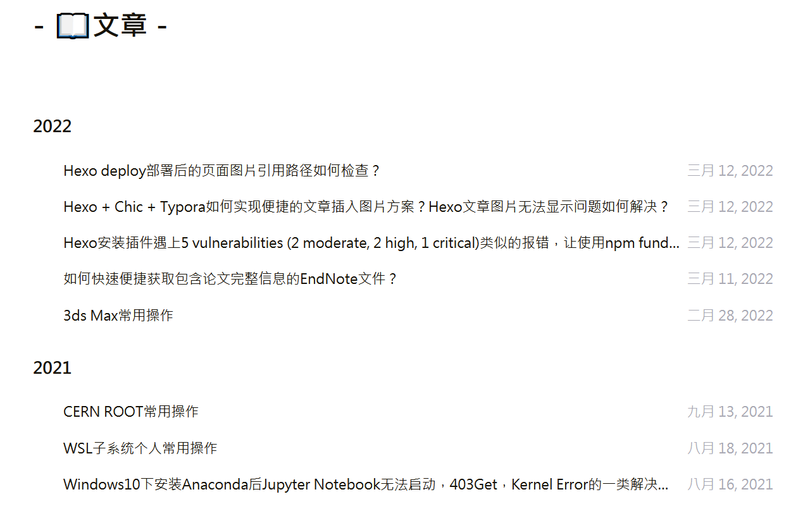

---

**核心思路**：调对应页面样式，用`li`

---

# 配置页面样式

* 用代码编辑器，如`Visual Studio Code`打开`themes\Chic\layout\_page\archive.ejs`，做如下两处修改
  * 在代码标题前后加`<li></li>`
  * 在`li`样式里设置宽、高、溢出情况的处理方式

* 添加`<li></li>`
  修改前

```ejs:themes\Chic\layout\_page\archive.ejs
 
 <article class="archive-item">

 <a class="archive-item-link" href="<%- url_for(post.path) %>">

 <%= post.title %>

 </a>

 <span class="archive-item-date"><%- date(post.date, theme.date_format) %></span>

 </article>

```

修改后

```ejs:themes\Chic\layout\_page\archive.ejs
 <article class="archive-item">

 <a class="archive-item-link" href="<%- url_for(post.path) %>">

 <li>

 <%= post.title %>

 </li>

 </a>

 <span class="archive-item-date"><%- date(post.date, theme.date_format) %></span>

 </article>

```

* 在`li`样式里设置宽、高、溢出情况的处理方式

在`themes\Chic\layout\_page\archive.ejs`最下方添加以下内容

```ejs:themes\Chic\layout\_page\archive.ejs
 
<style>

 li{

 width: 650px;

 height: 29.5px;

 /*不换行*/

 white-space: nowrap;

 /*溢出的话，隐藏*/

 overflow: hidden;

 /*文本溢出时，是否....*/

 text-overflow: ellipsis;

 }

</style>

```

* `themes\Chic\layout\_page\archive.ejs`整个文件修改前如下

```ejs:themes\Chic\layout\_page\archive.ejs
 
<div class="post-wrap archive">

 <!-- 添加了页面的头部与空一行 -->

 <h2 class="post-title">-&nbsp;📖文章&nbsp;-</h2>

 <br>

 <!-- 上面是添加的内容 -->

  

 <% var last_year = ''; %>

 <% page.posts.each(function (post) { %>

 <% var cur_year = post.date.year(); %>

  

 <% if(last_year !== cur_year){ %>

 <h3><%- cur_year %></h3>

 <% last_year = cur_year; } %>

  

 <article class="archive-item">

 <a class="archive-item-link" href="<%- url_for(post.path) %>">

 <%= post.title %>

 </a>

 <span class="archive-item-date"><%- date(post.date, theme.date_format) %></span>

 </article>

 <% }) %>

 <%- partial('_partial/paginator') %>

  

</div>


```

* `themes\Chic\layout\_page\archive.ejs`整个文件修改后如下

```ejs:themes\Chic\layout\_page\archive.ejs
 
<div class="post-wrap archive">

 <!-- 添加了页面的头部与空一行 -->

 <h2 class="post-title">-&nbsp;📖文章&nbsp;-</h2>

 <br>

 <!-- 上面是添加的内容 -->

  

 <% var last_year = ''; %>

 <% page.posts.each(function (post) { %>

 <% var cur_year = post.date.year(); %>

  

 <% if(last_year !== cur_year){ %>

 <h3><%- cur_year %></h3>

 <% last_year = cur_year; } %>

  

 <article class="archive-item">

 <a class="archive-item-link" href="<%- url_for(post.path) %>">

 <!-- <ul> -->

 <li>

 <%= post.title %>

 </li>

 <!-- </ul> -->

 </a>

 <span class="archive-item-date"><%- date(post.date, theme.date_format) %></span>

 </article>

 <% }) %>

 <%- partial('_partial/paginator') %>

  

</div>

  
  

<style>

 li{

 width: 650px;

 height: 29.5px;

 /*不换行*/

 white-space: nowrap;

 /*溢出的话，隐藏*/

 overflow: hidden;

 /*文本溢出时，是否....*/

 text-overflow: ellipsis;

 }

</style>


```


# 定义和用法

* `<li>`标签定义列表项目。

* `<li>` 标签可用在有序列表 (`<ol>`) 和无序列表 (`<ul>`) 中。
  * `ol` 有序列表。
    * 表现为：123的序号
  * `ul` 无序列表
    * 表现为`li`前面是大圆点而不是123

| 定义 | 全称            |
| ---- | --------------- |
| ul   | unordered lists |
| ol   | ordered lists   |
| li   | Lists           |

# 效果

* 部署前，箭头所指是页面布局出现错误的地方



* 部署后




# Ref

* [HTML中ul等标签的用法](https://blog.51cto.com/slddyb/421853)
* [css：文章标题过长时，使用省略号](https://www.shuzhiduo.com/A/WpdK0PnMzV/)
* [HTML  li  标签](https://www.w3school.com.cn/tags/tag_li.asp)

