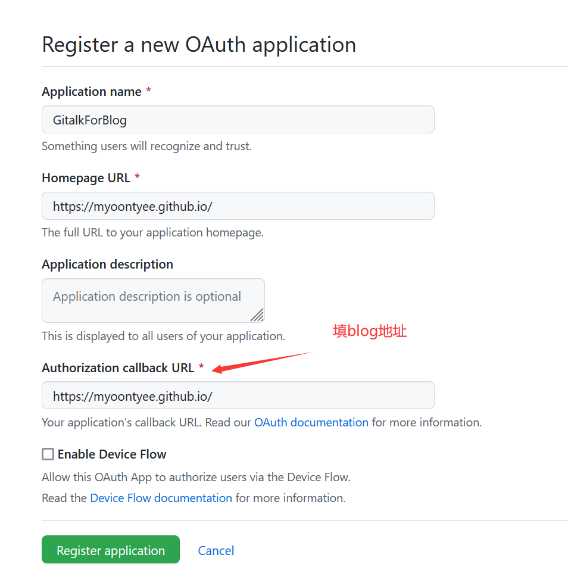
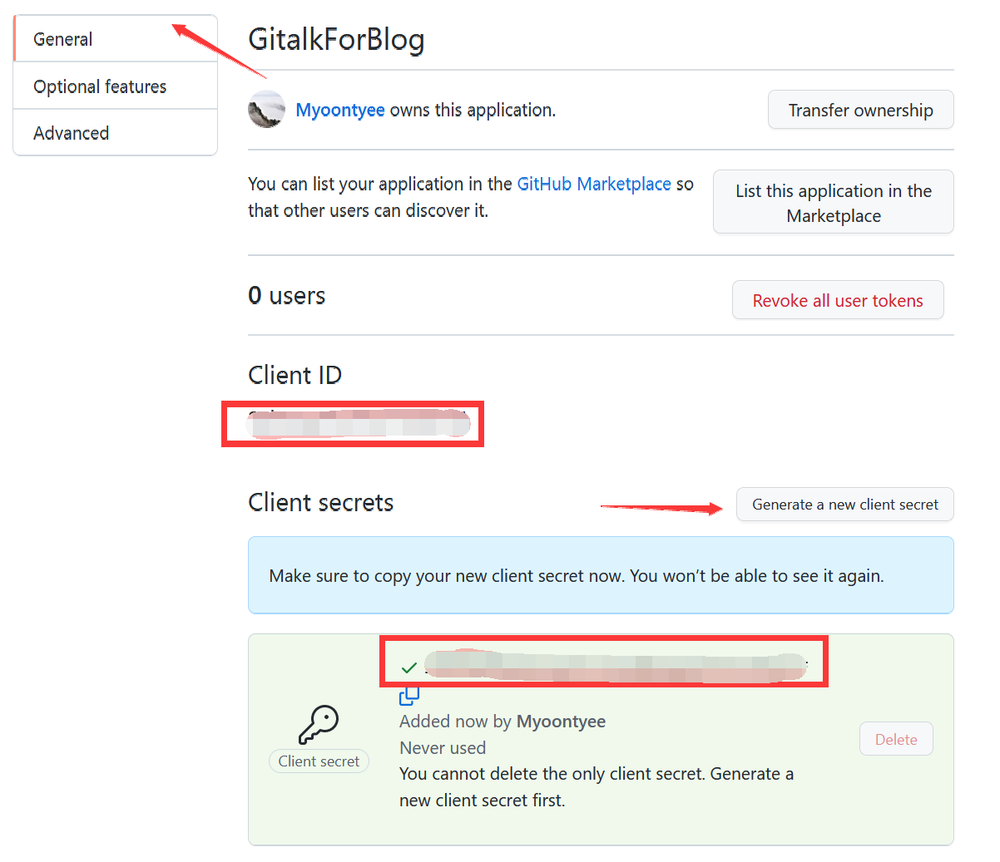

---

**创建时间**：2022年3月30日20:11:22
**最新更新**：2022年3月30日20:11:30


---


* 评论区无法评论、点击登录GitHub后返回首页解决办法，见[Hexo + Chic配置Gitalk显示error=redirect_uri_mismatch&，点击登录GitHub返回主页解决办法](./eab12f60.html)

# 添加js
* 在`themes\Chic\layout\_plugins\`中新建`gitalk.ejs`文件，内容如下：

```ejs:gitalk.ejs

<link rel="stylesheet" href="https://cdn.jsdelivr.net/npm/gitalk@1.7.2/dist/gitalk.css">  
<script src="https://cdn.jsdelivr.net/npm/gitalk@1.7.2/dist/gitalk.min.js"></script>  
<div id="gitalk-container"></div>  
<script type="text/javascript">  
 var gitalk = new Gitalk({  
 clientID: '<%= theme.gitalk.ClientID %>',  
 clientSecret: '<%= theme.gitalk.ClientSecret %>',  
 repo: '<%= theme.gitalk.repo %>',  
 owner: '<%= theme.gitalk.owner %>',  
 admin: '<%= theme.gitalk.adminUser %>',  
 id: <%= theme.gitalk.ID %>,  
 labels: '<%= theme.gitalk.labels %>'.split(',').filter(l => l),  
 perPage: <%= theme.gitalk.perPage %>,  
 pagerDirection: '<%= theme.gitalk.pagerDirection %>',  
 createIssueManually: <%= theme.gitalk.createIssueManually %>,  
 distractionFreeMode: <%= theme.gitalk.distractionFreeMode %>  
 })  
 gitalk.render('gitalk-container')  
</script>
```

# 启动Gitalk的js

* 在`themes\Chic\layout\post.ejs`文件中添加：

```ejs:post.ejs

<% if (theme.gitalk.enable) { %>  
 <div id="gitalk-container"></div>  
 <%- partial('_plugins/gitalk') %>  
<% } %>

```


# 配置_config.yml

* 获取client_id 和 client_secret，首先需要在[OAuth application](https://github.com/settings/applications/new)页面内创建一个新应用，头两个填写无要求，最后一个要求必须填写正确的blog地址，点击`Register application`→点击`Generate a new client secret`






* 在`themes\Chic\_config.yml`中添加配置，如下

```yml:themes\Chic\_config.yml

gitalk:  
 enable: true  
 ClientID: xxxxx #Client ID,填入上一步获取的ID  
 ClientSecret: xxxxxxxxxx #Client Secret，填入上一步获取的ID  
 repo: blog #你要存放的项目名,如果博客部署在github可以放一起  
 owner: Myoontyee #这个项目名的拥有者（GitHub账号或组织）  
 adminUser: ['Myoontyee'] #管理员用户  
 ID: location.pathname #页面ID  
 labels: ['Gitalk'] #GitHub issues的标签  
 perPage: 10 #每页多少个评论  
 pagerDirection: last #排序方式是从旧到新（first），还是从新到旧（last）  
 createIssueManually: true #是否自动创建isssue，自动创建需要当前登录的用户为adminuser  
 distractionFreeMode: false #是否启用快捷键(cmd|ctrl + enter) 提交评论

```

# 调整Gitalk样式

* 在`themes\Chic\source\css\custom.styl`内添加样式

```styl:custom.styl

// Gitalk评论样式  
.gt-container {  
 max-width: 780px;  
 margin: auto;  
}

```

# 更多设置

## 在page页面引入gitalk

* 在`themes\Chic\layout\page.ejs`文件中添加：

```ejs:page.ejs

<% if (theme.gitalk.enable) { %>  
 <div id="gitalk-container"></div>  
 <%- partial('_plugins/gitalk') %>  
<% } %>

```

## 解决labels的50个字符长度限制的问题

> * 前面提到中文路径的页面ID会在issues中将中文转换成url编码，那么长度就会超过50个字符

### 将中文ID转换成MD5值

#### 修改gitalk.ejs

* 在`themes\Chic\layout\_plugins\gitalk.ejs`中开头部分添加对`md5.js`的引用

**修改前**
```ejs:gitalk.ejs

<link rel="stylesheet" href="https://cdn.jsdelivr.net/npm/gitalk@1.7.2/dist/gitalk.css">

<script src="https://cdn.jsdelivr.net/npm/gitalk@1.7.2/dist/gitalk.min.js"></script>

<div id="gitalk-container"></div>

<script type="text/javascript">

 var gitalk = new Gitalk({

 clientID: '<%= theme.gitalk.ClientID %>',

 clientSecret: '<%= theme.gitalk.ClientSecret %>',

 repo: '<%= theme.gitalk.repo %>',

 owner: '<%= theme.gitalk.owner %>',

 admin: '<%= theme.gitalk.adminUser %>',

 id: <%= theme.gitalk.ID %>,

 labels: '<%= theme.gitalk.labels %>'.split(',').filter(l => l),

 perPage: <%= theme.gitalk.perPage %>,

 pagerDirection: '<%= theme.gitalk.pagerDirection %>',

 createIssueManually: <%= theme.gitalk.createIssueManually %>,

 distractionFreeMode: <%= theme.gitalk.distractionFreeMode %>

 })

 gitalk.render('gitalk-container')

</script>


```

**修改后**
```ejs:gitalk.ejs

<link rel="stylesheet" href="//unpkg.com/gitalk/dist/gitalk.css">

<script src="//unpkg.com/gitalk/dist/gitalk.min.js"></script>

<script src="//cdn.bootcss.com/blueimp-md5/2.10.0/js/md5.js"></script>

<div id="gitalk-container"></div>

<script type="text/javascript">

 var gitalk = new Gitalk({

 clientID: '<%= theme.gitalk.ClientID %>',

 clientSecret: '<%= theme.gitalk.ClientSecret %>',

 repo: '<%= theme.gitalk.repo %>',

 owner: '<%= theme.gitalk.owner %>',

 admin: '<%= theme.gitalk.adminUser %>',

 id: md5(<%= theme.gitalk.ID %>), 

 labels: '<%= theme.gitalk.labels %>'.split(',').filter(l => l),

 perPage: <%= theme.gitalk.perPage %>,

 pagerDirection: '<%= theme.gitalk.pagerDirection %>',

 createIssueManually: <%= theme.gitalk.createIssueManually %>,

 distractionFreeMode: <%= theme.gitalk.distractionFreeMode %>

 })

 gitalk.render('gitalk-container')

</script>


```

# Ref

* [Gitalk配置教程](https://yuanlichenai.cn/2020/01/16/Gitalk/)
* [Hexo博客添加Gitalk评论系统](https://www.itfanr.cc/2019/04/30/hexo-add-gitalk-comment/)
