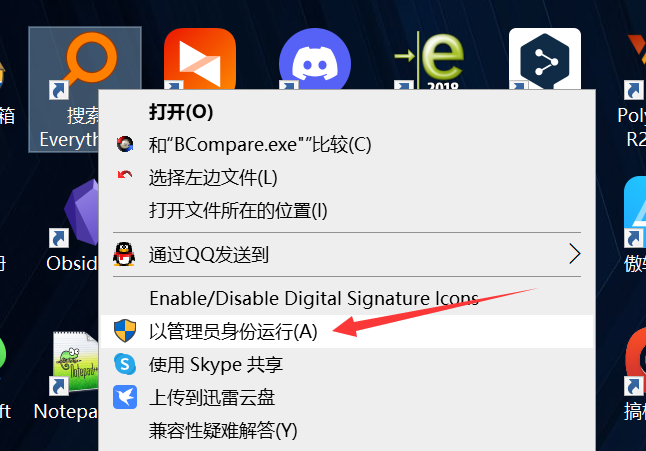
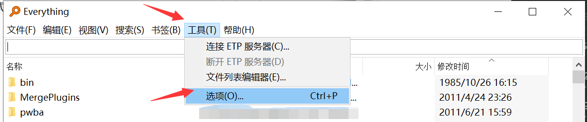
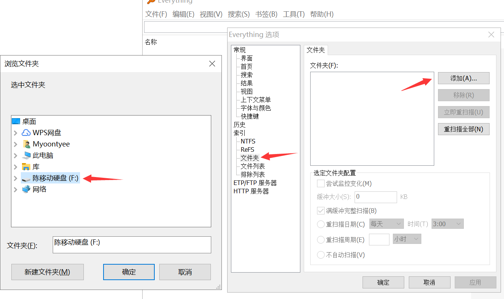
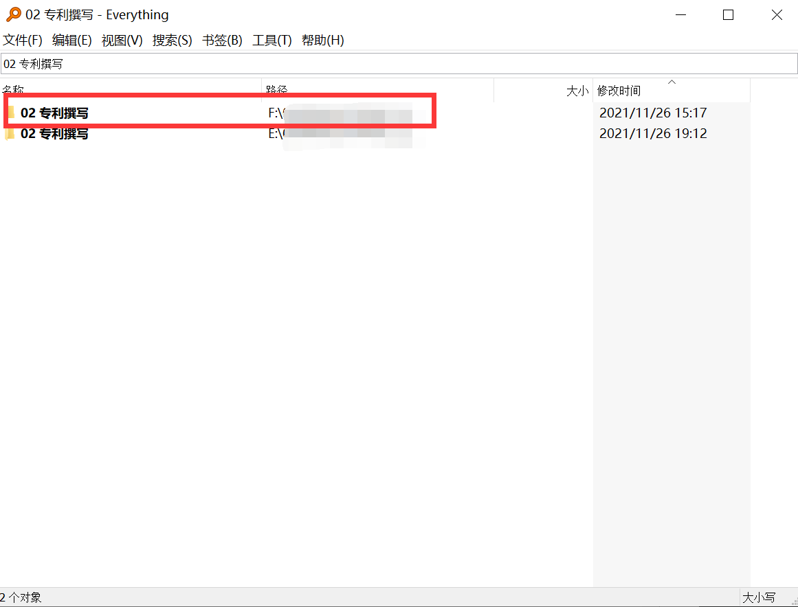

---

**创建时间**：2022年4月23日10:39:04
**最新更新**：2022年4月23日10:43:57

---

**Problem Description**：How does Everything search the contents of a removable drive?

**核心思路**：`管理员模式运行`→`工具`→`选项`→`文件夹`→把移动硬盘路径添加上

---

* 部分电脑连移动硬盘，`Everything`不会添加对应的索引信息，手动添加方法见下

# 添加移动硬盘索引
* 管理员模式打开`Everything`，`工具`→`选项`→`文件夹`→把移动硬盘路径添加上
  * 
  * 
  * 

* 即可直接搜索移动硬盘里的内容
  * 

# Ref
* [everything不能读取到移动硬盘](https://blog.csdn.net/weixin_44688675/article/details/107763334)
