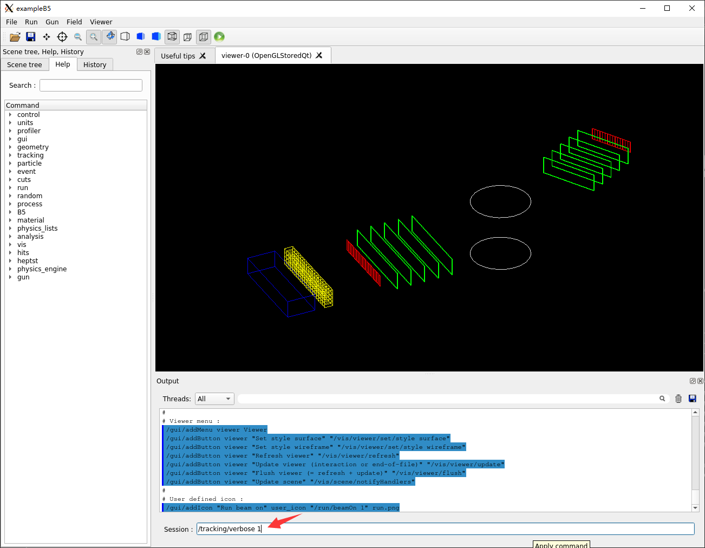
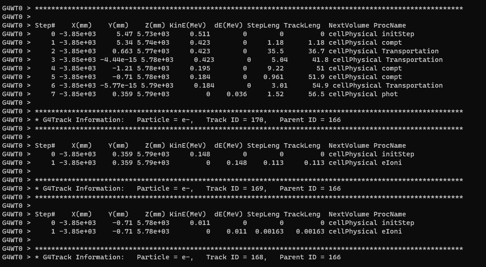

---

**创建时间**：2022年4月27日16:41:10
**最新更新**：2022年4月27日16:47:03

---

**Problem Description**：How does Geant4 enable Track's information printing?

**核心思路**：
* 用宏指令`/tracking/verbose 1`
* `/tracking/verbose 0`是不打印

---

# 具体操作
* 打开你的对应`.mac`文件输入`/tracking/verbose 1`
	* 我如果奔着在可视化窗口能打印这个信息，运行时候不打印，那我就在`vis.mac`加就行
	* 或者直接在`GUI`窗口输入`/tracking/verbose 1`（下面图里就是这个操作）
* 编译对应项目，在`bash`内进入对应项目文件夹的`build`文件夹，`cmake ..`，`make -j16`，然后运行，以`B5`为例，就是在`bash`内输入`./exampleB5`
* 输入这个指令`/tracking/verbose 1`，回车
	* 
* `run/beamOn 1`，看`bash`内打印效果如下图
	* 这个操作会降低运算效率，所以实际跑的时候还是得关
	* 要么你想提效率，不开`GUI`跑这个也行，看看打印信息
	* 
