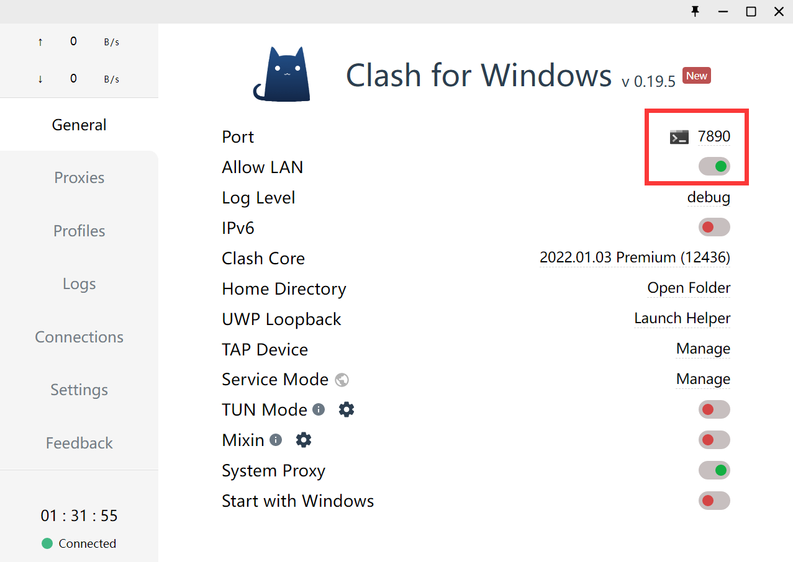

---


**创建时间**：2022年3月29日20:11:01
**最新更新**：2022年3月29日20:11:07


---

**核心思路**：设置代理端口为对应的代理软件端口

---

* 打开`Git-Bash`，输入如下指令，端口修改为Clash界面内对应的端口，同时记得打开`Allow LAN`

```Git

 git config --global https.proxy http://127.0.0.1:7890
 git config --global http.proxy http://127.0.0.1:7890

```


