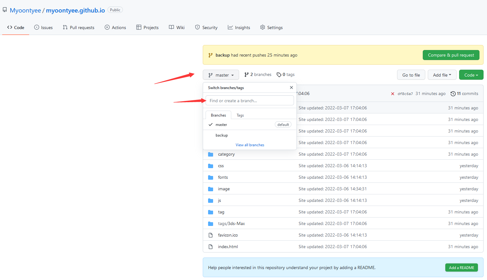
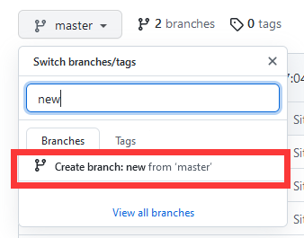
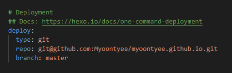
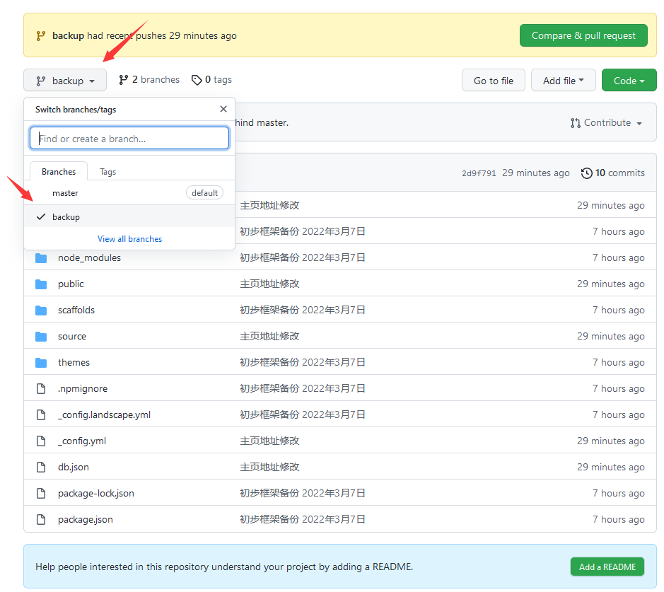
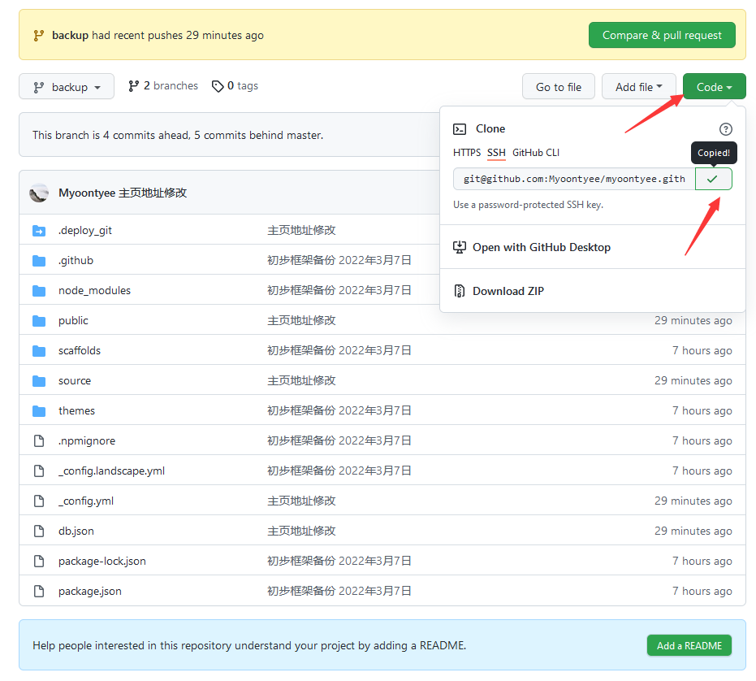
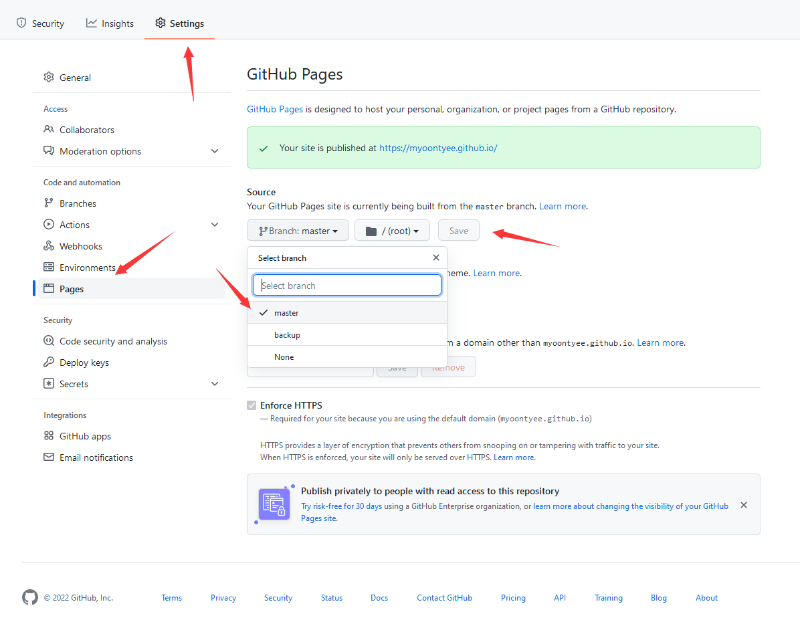

---

title: GitHub+Hexo的个人博客，blog，GitHub Page如何实现一个分支作为博客源码，一个分支用于全部源码备份？
abbrlink: f338e400
date: 2022-03-29 17:20:55
tags:
  - Hexo
  - Chic
category:
  - 博客搭建
---

---

**创建时间**：2022年3月29日17:20:55
**最新更新**：2022年3月29日17:21:08

---

**核心思路**：

1.建分支

2.配置好blog源码的_config.yml文件与.git下的config文件

3.配置GitHub Pages的Source

---

# 建分支（用于源码备份）
* 打开代码仓，分支→在输入栏里输入一个新的分支名→点`Create`，**这个分支要用于源码备份**

# 配置Blog源码根目录文件
* 打开**Blog源码根目录**下的`_config.yml`文件，拉到最底下，`deploy`下添加新的一行`branch`，输入你想使用的`branch`，比如`master`
	* **这个分支要作为页面显示的源码**

# 配置.git文件下的config文件
* 简单粗暴的方法，进入代码仓→`Branch`→换成你刚刚建的那个分支→`Code`→复制

* 接下来在本地找个空文件夹，在`Git-Bash`内`cd`到这个空文件夹的路径下→`git clone` + 分支名 + 对应的代码仓路径
	* 如`git clone backup git@github.com:Myoontyee/myoontyee.github.io.git`
* 接下来把`clone`过来的.git文件夹，直接覆盖掉你放**Blog源码根目录**下的.git文件夹
* 最后可以`git add .`与`git push`做个测试

# GitHub Pages的Source配置
* 浏览器打开代码仓，进入`Settings`→`Pages`→`Source`→选中你前面想用作页面显示的`Branch`，此处是`master`→`Save`

# 参考
* [git clone 指定分支 拉代码](https://blog.csdn.net/weixin_39800144/article/details/78205617)
