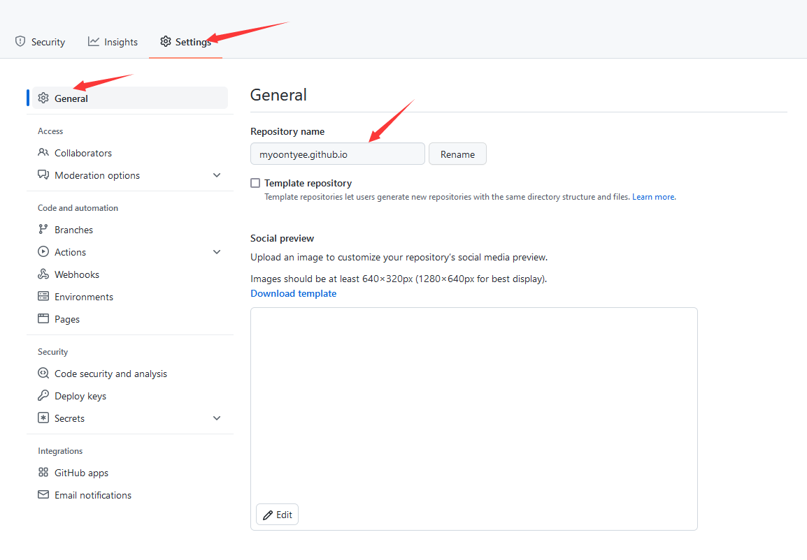
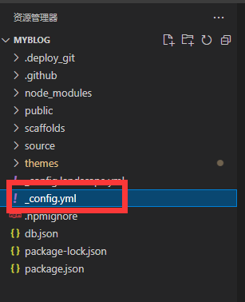
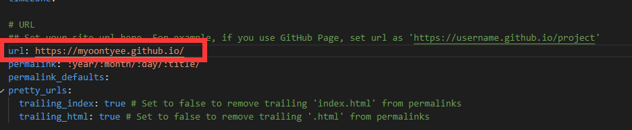
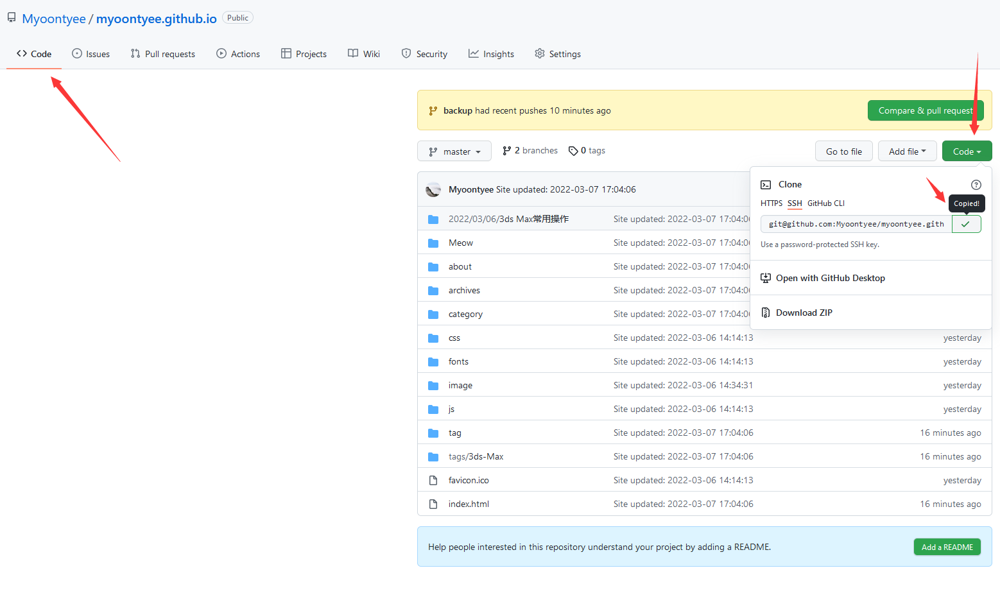
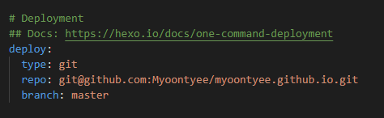
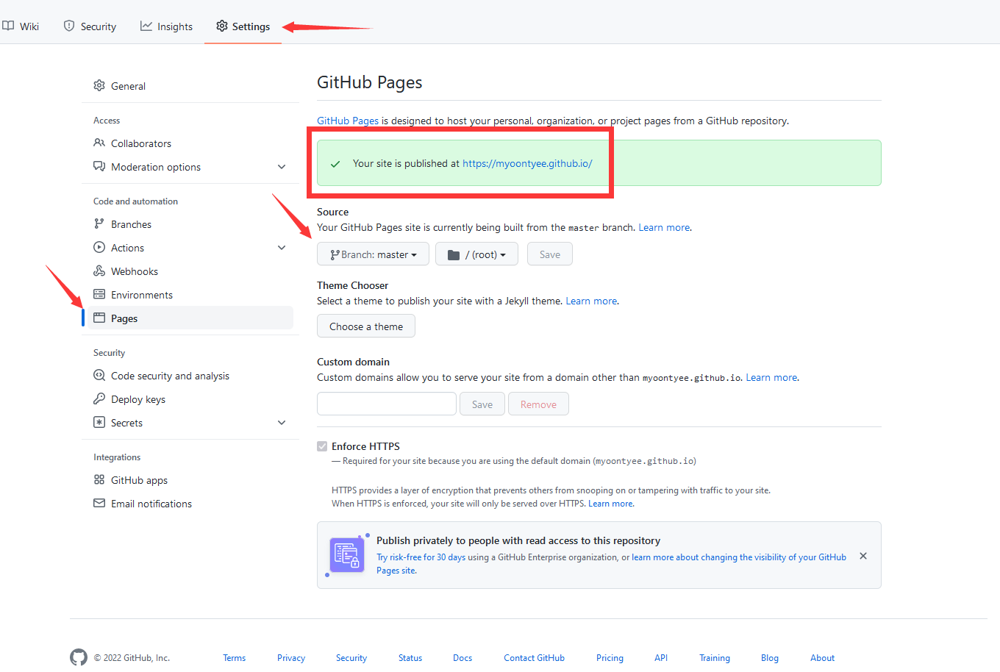

---

**创建时间**：2022年3月29日19:53:25
**最新更新**：2022年3月29日19:53:37

---

**核心思路**：

1.改仓名
2.调**Blog源码根目录**配置文件

---

# 改仓名

* 进入设置页面修改代码仓名，`Settings`→`General`→`Repository name`→`Rename`，修改为对应的`.github.io`路径

# 调整Blog源码根目录下配置文件

* 调配置文件，打开**Blog源码根目录**的配置文件，下图是用`Visual Studio Code`打开整个文件夹，选中`_config.yml`配置文件
	* 修改url后面的地址为上面对应的仓名
	* 修改对应的repo地址为对应仓地址，进入代码仓→`Code`→复制→到**Blog源码目录**下的配置文件里repo后面粘贴

# 确认代码仓Source源
* 回到代码仓，确认Source源，点击`Settings`→`Pages`→`Source`看是否选中了对应的`Branch`
	* 这个主要是因为此处用另外一个`Branch`备份Blog源码
* 点开网址，即可

# 额外的话

* 目前我采用的是公仓放网页部署后的码，另一个私仓放源码，分离开操作更稳
