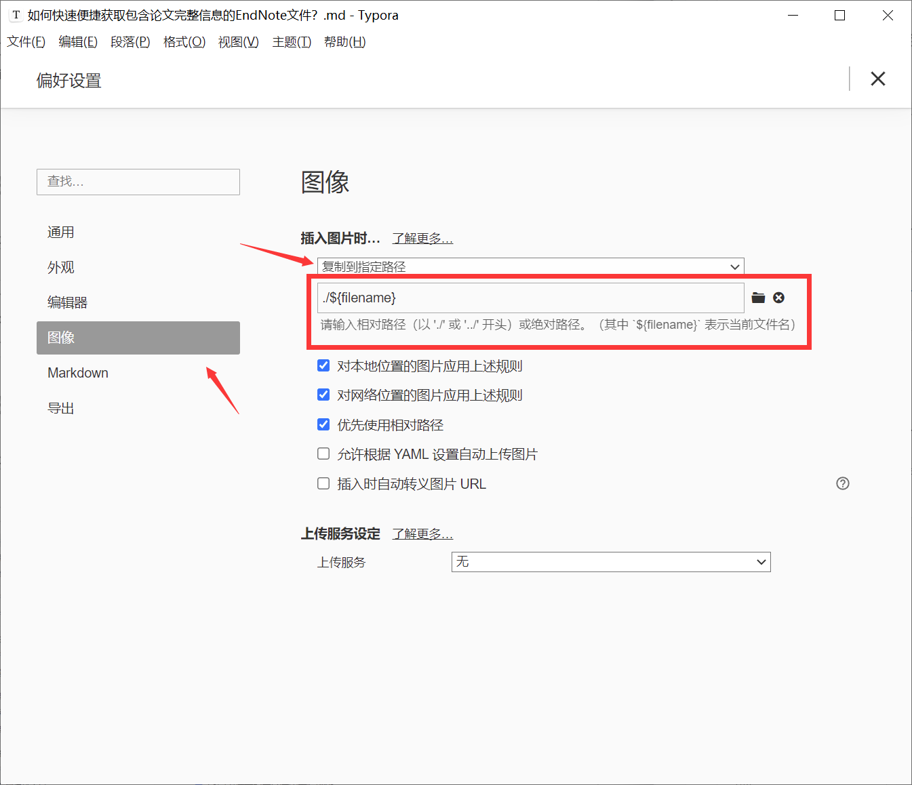
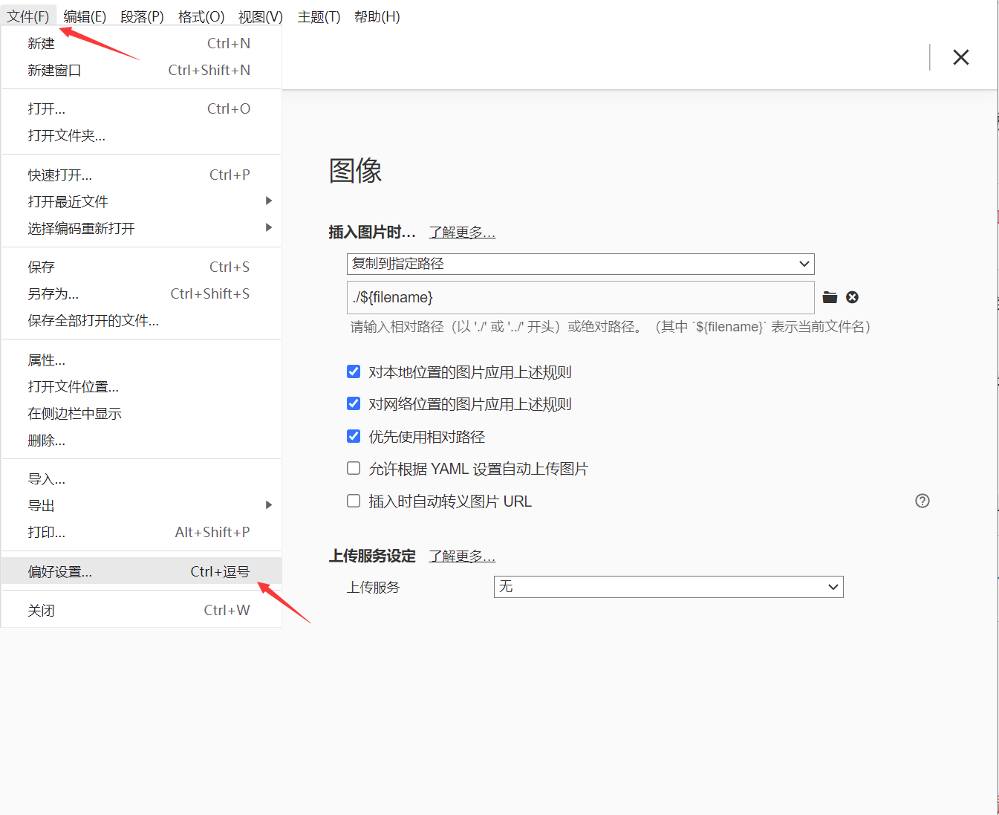
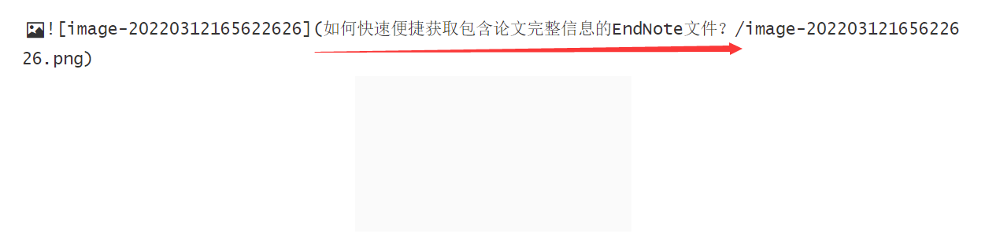
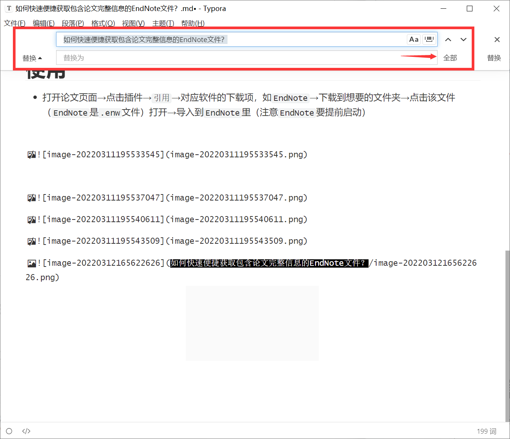

---

**核心思路**：

**区别**：
思路二更麻烦，思路一省个在`Typora`内批量替换图片路径的活儿

**思路一（推荐）**：

* 装`hexo-image-link`
* 改`Hexo`根目录配置`_config.yml`
* 改`Typora`图片配置
* 清理缓存，生成，发布

**思路二**：
* 装`hexo-asset-image`
* 改`Hexo`根目录配置`_config.yml`
* 改`Typora`图片配置
* `Typora`里写好带图片的文章，批量替换路径
* 清理缓存，生成，发布

---

* 图片引用路径检查，见[Hexo deploy部署后的页面图片引用路径如何检查？](./b9c842e3.html)

# 思路一（推荐）
## 装插件
* 打开`Git-Bash`，进入放置Blog源码的根目录，输入以下代码，安装`hexo-image-link`插件

```bash
npm install hexo-image-link --save
```

* 如果`Git-Bash`内在安装后出现如下提示，则在`Git-Bash`内输入`npm install --no-audit`，见[[Hexo安装插件遇上5 vulnerabilities (2 moderate, 2 high, 1 critical)类似的报错，让使用npm fund寻求更多细节，如何解决]]

```bash

run `npm audit fix` to fix them, or `npm audit` for details

```

## 配置Hexo
* 打开`Hexo`根目录下的`_config.yml`，修改`post_asset_folder`为`true

```yml:_config.yml
hexo-asset-folder: true # 图片 for hexo-image-link
```

## 配置Typora
* 打开图片配置，`文件`→`偏好设置`→`图像`，进行设置如下图





# 思路二

## 装插件
* 打开`Git-Bash`，进入放置Blog源码的根目录，输入以下代码，安装`hexo-asset-image`插件

```bash
npm install hexo-asset-image --save
```

* 如果`Git-Bash`内在安装后出现如下提示，则在`Git-Bash`内输入`npm install --no-audit`，见[[Hexo安装插件遇上5 vulnerabilities (2 moderate, 2 high, 1 critical)类似的报错，让使用npm fund寻求更多细节，如何解决]]

```bash

run `npm audit fix` to fix them, or `npm audit` for details

```

## 配置Hexo
* 打开`Hexo`根目录下的`_config.yml`，修改`post_asset_folder`为`true

```yml:_config.yml
post_asset_folder: true # 图片
```

## 配置Typora
* 打开图片配置，`文件`→`偏好设置`→`图像`，进行设置如下图




## Typora内文章批量替换路径

* 直接插入的图片路径如下图，要把红线标注的部分（即文件名）批量去掉，按`Ctrl`+`H`，输入对应内容，按`全部`





* 接下来清理缓存，生成，发布即可


# Ref
* [解决Hexo图片无法显示问题](https://blog.csdn.net/weixin_30734435/article/details/98497054)
* [Hexo不显示图片,不需要插件,超简单](https://blog.csdn.net/as3522/article/details/102972473)
* [How to fix npm vulnerabilities manually?](https://stackoverflow.com/questions/51377148/how-to-fix-npm-vulnerabilities-manually)
