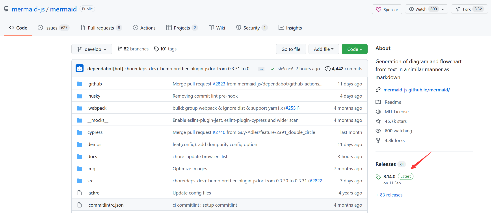
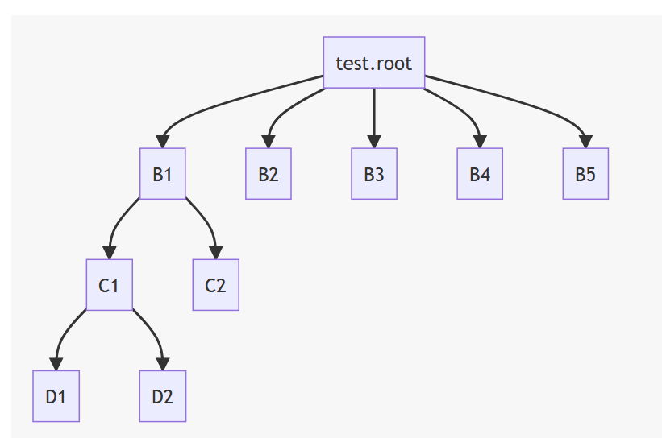

---

**创建时间**：2022年3月23日11:14:10
**最新更新**：2022年3月28日17:42:48


---

**核心思路**：下插件，做配置

---

# 下插件
* 用`Git-Bash`打开Blog源码所在文件夹，输入以下代码安装插件
```bash
npm install hexo-filter-mermaid-diagrams --save
```


# 配置
* 用代码编辑器打开`themes\Chic\_config.yml`，在最下方添加如下代码
	* `version`对应的版本可以去[mermaid官网](https://github.com/mermaid-js/mermaid)找，看看旁边Releases啥版本了

```yml
mermaid:
  version: 8.14.0 
  enable: true # 默认为 True
  # Available themes: default | dark | forest | neutral
  # theme: forest
```



* 添加`mermaid`支持，用代码编辑器打开`themes\Chic\layout\_partial\footer.ejs`，在对应位置添加如下代码，你想要的`mermaid`的`theme`，通过替换`theme`后的`neural`修改，支持的主题有`default | dark | forest | neutral`

```ejs
<% if (theme.mermaid.enable) { %>
	<script src='https://unpkg.com/mermaid@<%= theme.mermaid.version %>/dist/mermaid.min.js'></script>
	<script>
	  if (window.mermaid) {
		mermaid.initialize({
						startOnLoad: true,
						theme: 'neural',
							 });
	  }
	</script>
<% } %>
```

* 即

<div style="overflow:auto;width:100%"> <table width="auto" style="white-space:nowrap">
<tr>
<td> <div align = center> <strong>修改前</strong></div> </td> <td> <div align = center> <strong>修改后</strong></div> </td>
</tr>
<tr>
<td>
```ejs
<footer id="footer" class="footer">
    <div class="copyright">
        <!-- <span>© <%= config.author %> | Powered by <a href="https://hexo.io" target="_blank">Hexo</a> & <a href="https://github.com/Siricee/hexo-theme-Chic" target="_blank">Chic</a> -->
            <span>© <%= config.author %>  
            <!-- 访客数量 -->
            <!-- <div> -->
            <% if (theme.visit_counter) { %>
                <%- partial("../_plugins/site-visitor") %>
            <% } %>
            <!-- </div> -->
        </span>
    </div>
</footer>
```
</td>
<td>
```ejs
<footer id="footer" class="footer">
    <div class="copyright">
        <!-- 2022年3月23日 添加mermaid支持 -->
        <% if (theme.mermaid.enable) { %>
            <script src='https://unpkg.com/mermaid@<%= theme.mermaid.version %>/dist/mermaid.min.js'></script>
            <script>
              if (window.mermaid) {
                mermaid.initialize({
                                startOnLoad: true,
                                theme: 'neural',
                                     });
              }
            </script>
        <% } %>
        <!-- <span>© <%= config.author %> | Powered by <a href="https://hexo.io" target="_blank">Hexo</a> & <a href="https://github.com/Siricee/hexo-theme-Chic" target="_blank">Chic</a> -->
            <span>© <%= config.author %>  
            <!-- 访客数量 -->
            <!-- <div> -->
            <% if (theme.visit_counter) { %>
                <%- partial("../_plugins/site-visitor") %>
            <% } %>
            <!-- </div> -->
        </span>
    </div>
</footer>
```
</td>
</table>
</div>

* 打开`Git-Bash`，通过`hexo clean`，`hexo g`，`hexo d`上传部署Blog代码
			
# 效果

			
# Ref
* [Hexo中增加对mermaid支持](http://computetechnologydaily.com:5000/2021/02/24/020894327eb14852b5ff98dc468835d8/)
* [About Mermaid](https://mermaid-js.github.io/mermaid/#/?id=about-mermaid)
* [Hexo中插入mermaid diagrams](https://blog.csdn.net/Olivia_Vang/article/details/92987859)
* [Hexo中插入mermaid diagrams](https://clarkchen.com/Hexo/Hexo%E4%B8%AD%E6%8F%92%E5%85%A5mermaid-diagrams/)
* [hexo-filter-mermaid-diagrams](https://github.com/webappdevelp/hexo-filter-mermaid-diagrams)
