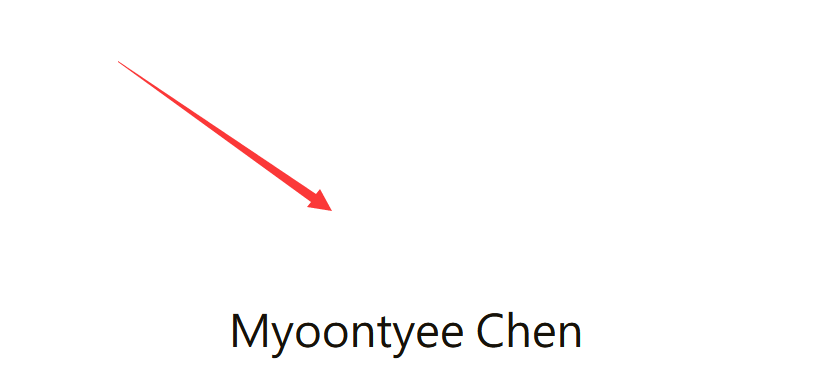

---

**创建时间**：2022年3月28日17:46:33
**最新更新**：2022年3月28日17:52:25


---

**核心思路**：注释掉首页对应的样式

---

# 配置

* 用代码编辑器打开`themes\Chic\layout\_page\profile.ejs`，这个是首页的样式文件，注释掉以下代码
```ejs
<a href="<%- url_for(theme.nav.Posts) %>">"></a>
<a href="<%- url_for(theme.nav.Posts) %>">"></a>
```

* 即

<div style="overflow:auto;width:100%"> <table width="auto" style="white-space:nowrap">
<tr>
<td> <div align = center> <strong>修改前</strong></div> </td> <td> <div align = center> <strong>修改后</strong></div> </td>
</tr>
<tr>
<td>
```ejs
<!-- 这个文件是首页 -->
<!-- 再进行代码编写 -->
<div class="container profile-container">
    <div class="intro">
        <div class="avatar">
            <a href="<%- url_for(theme.nav.Posts) %>">"></a>
            <a href="<%- url_for(theme.nav.Posts) %>">"></a>
        </div>
        <div class="nickname"><%- theme.nickname %></div>
        <div class="description"><%- markdown(theme.description) %></div>
        <div class="links">
            <% if (theme.links !== undefined) { %>
                <% for (var key in theme.links){ %>
                    <a class="link-item" title="<%- key %>" href="<%= theme.links[key] %>">
                        <% if(theme.links_text_enable) { %>
                            <%= key %>
                        <%}%>
                        <%if(theme.links_icon_enable){ %>
                            <i class="iconfont icon-<%- key.toLowerCase() %>"></i>
                        <%}%>
                    </a>
                <% } %>
            <% } %>
        </div>
    </div>
</div>
```
</td>
<td>
```ejs
<!-- 这个文件是首页 -->
<!-- 先要引用这个icon库 -->
<link rel="stylesheet" href="../fonts/iconfont2/iconfont.css"> 
<!-- 再进行代码编写 -->
<div class="container profile-container">
    <div class="intro">
        <!-- <div class="avatar"> -->
            <!-- <a href="<%- url_for(theme.nav.Posts) %>">"></a> -->
            <!-- <a href="<%- url_for(theme.nav.Posts) %>">"></a> -->
        <!-- </div> -->
        <div class="nickname"><%- theme.nickname %></div>
        <div class="description"><%- markdown(theme.description) %></div>
        <div class="links">
            <% if (theme.links !== undefined) { %>
                <% for (var key in theme.links){ %>
                    <a class="link-item" title="<%- key %>" href="<%= theme.links[key] %>">

                        <% if(theme.links_text_enable) { %>
                            <%= key %>
                        <%}%>
                        <%if(theme.links_icon_enable){ %>
                            <i class="iconfont icon-<%- key.toLowerCase() %>"></i>
                        <%}%>
                    </a>
                <% } %>
            <% } %>
        </div>
    </div>
</div>

```
</td>
</table>
</div>
```

* 打开`Git-Bash`，输入`hexo clean`，`hexo g`，`hexo d`或`hexo clean`，`hexo s -g`就能看到对应效果，首页的原型头像Logo没了，如下图


