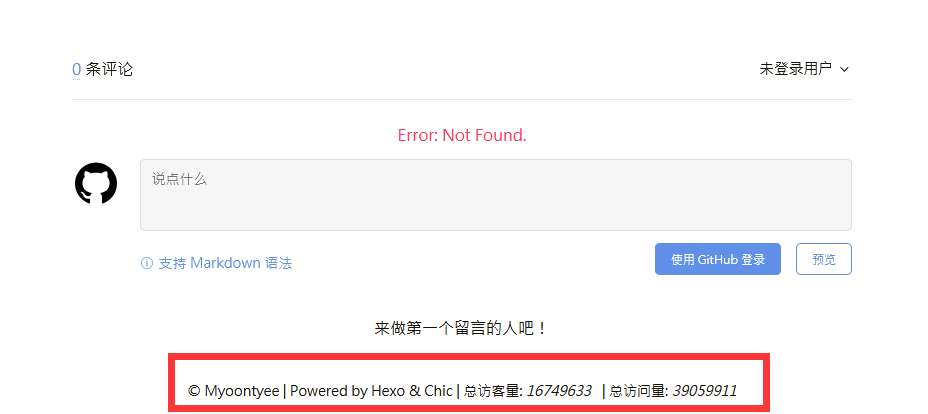

---

**创建时间**：2022年3月30日19:49:49
**最新更新**：2022年3月30日19:49:54


---

**核心思路**：

* 加CSS插件

* 修改页面布局

* 对主题进行配置

---

* 单篇博文阅读量配置见[[Hexo + Chic 增加单篇文章浏览统计]]

* 最终效果如下图



# 添加CSS插件`site-visitor.ejs`
* 用代码编译器（如`Visual Studio Code`）打开`themes\Chic\layout\_plugins\site-visitor.ejs`，输入以下内容

```ejs:themes\Chic\layout\_plugins\site-visitor.ejs

<script async src="//busuanzi.ibruce.info/busuanzi/2.3/busuanzi.pure.mini.js"></script>

<% if (theme.visit_counter.site_uv) { %>

<span class="site-uv">

 总访客量:

 <i class="busuanzi-value" id="busuanzi_value_site_uv"></i>

</span>&nbsp;

<% } %>

<% if (theme.visit_counter.site_pv) { %>

<span class="site-pv">

 | 总访问量:

 <i class="busuanzi-value" id="busuanzi_value_site_pv"></i>

</span>

<% } %>

```

* 其中`<script async src="//busuanzi.ibruce.info/busuanzi/2.3/busuanzi.pure.mini.js"></script>`用于在页面中引入`busuanzi.js`


# 修改页面布局

* 用代码编辑器打开`themes\Chic\layout\_partial\footer.ejs`，在`<span></span>`标签内添加如下代码
```ejs:themes\Chic\layout\_partial\footer.ejs
<% if (theme.visit_counter) { %>  
 <%- partial("../_plugins/site-visitor") %>  
<% } %>
```

即，**修改前**

```ejs:themes\Chic\layout\_partial\footer.ejs

<footer id="footer" class="footer">

 <div class="copyright">

 <span>© <%= config.author %> | Powered by <a href="https://hexo.io" target="_blank">Hexo</a> & <a href="https://github.com/Siricee/hexo-theme-Chic" target="_blank">Chic</a></span>

 </div>

</footer>

```

**修改后**

```ejs:themes\Chic\layout\_partial\footer.ejs

<footer id="footer" class="footer">

 <div class="copyright">

 <span>© <%= config.author %> | Powered by <a href="https://hexo.io" target="_blank">Hexo</a> & <a href="https://github.com/Siricee/hexo-theme-Chic" target="_blank">Chic</a>

 |

 <!-- 访客数量 -->

 <% if (theme.visit_counter) { %>

 <%- partial("../_plugins/site-visitor") %>

 <% } %>

 </span>

 </div>

</footer>

```


# 配置主题

* 用代码编辑器打开`themes\Chic\_config.yml`，在最下方添加以下内容

```yml:themes\Chic\_config.yml

# 站浏览数统计  
visit_counter:   
 site_uv: true # 访客数量  
 site_pv: true # 浏览次数

```

# Ref

* [Chic主题](https://yuanlichenai.cn/2020/02/02/chic/)
