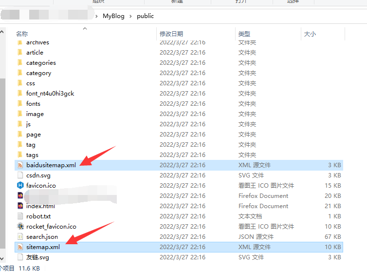
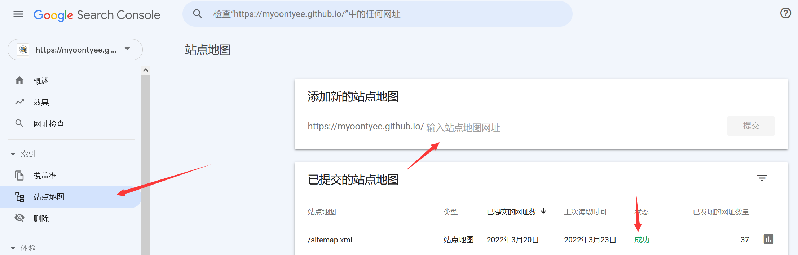
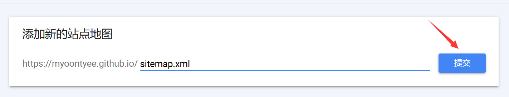
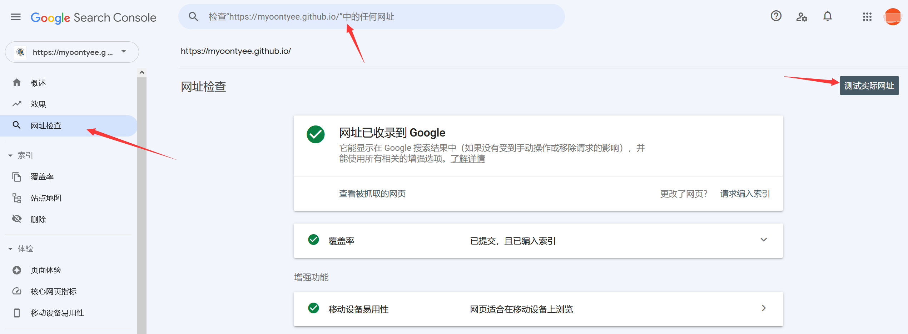
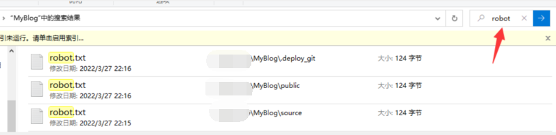
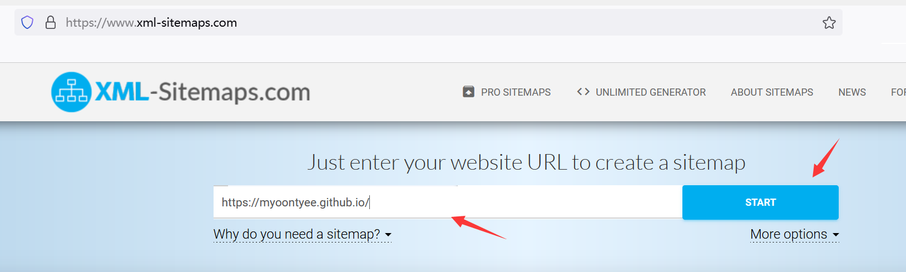
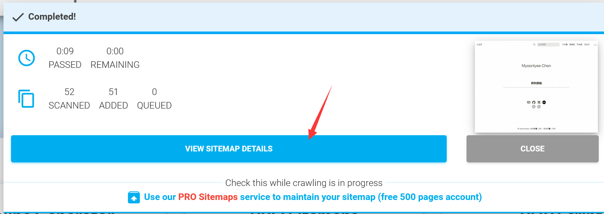
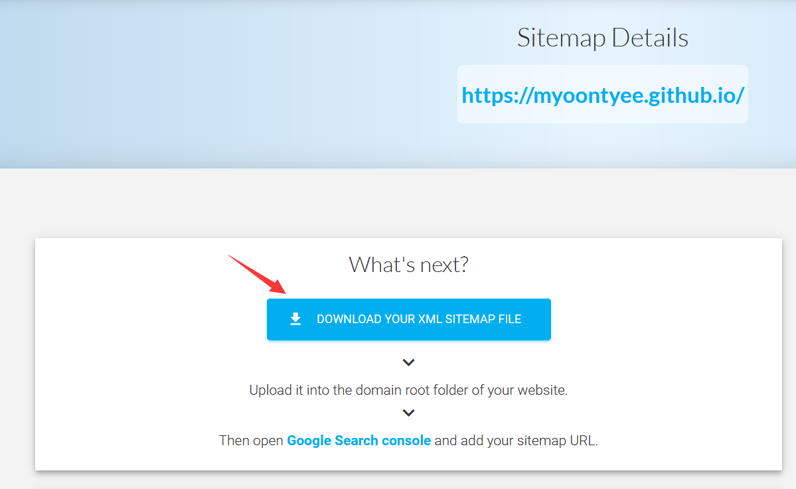
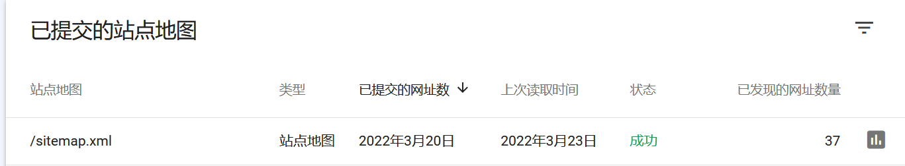

---

**创建时间**：2022年3月27日22:19:18
**最新更新**：2022年3月28日17:09:59


---

**核心思路**：装生成sitemap的插件，谷歌站长控制台提交网站地图，再提示谷歌爬取

---

# 装插件

* 装插件，在`Git-Bash`内进入Blog代码根目录，输入如下指令

```bash
npm install hexo-generator-sitemap --save 
npm install hexo-generator-baidu-sitemap --save
```


* 用代码编辑器打开Blog源码根目录下的配置文件`_config.yml`，在最下方添加如下代码

```yml
sitemap:
  path: sitemap.xml
baidusitemap:
  path: baidusitemap.xml
```

* 在`Git-Bash`内通过`hexo clean`，`hexo g`部署后，在`public`文件夹下能看到这两个文件，就算是配置成功




# 推送至谷歌站长控制台
* 打开[谷歌站长控制台](https://search.google.com/search-console)，点击`站点地图`→在Blog地址后输入`sitemap.xml`，下下图是一个示例→点击提交→过1、2天or1周左右，`状态`会显示`成功`






# 状态出现无法获取、Cloudn't Fetch咋办？

## 网址检查
* 首先要确保提交的网址没有问题，可以通过`网址检查`→输入网址（sitemap的网址，比如`https://myoontyee.github.io/sitemap.xml`）→`测试实际网址`，如果没问题，那就走下面的办法，如果有问题..那就对应调整问题..看看不是大小写啊，`https`打成`http`，或者多打了一个斜杆`/`啥的



## 开始给谷歌邦邦两拳
* 显示这个的原因，是因为目前谷歌的控制台，即便他正在爬取，也给你显示无法获取，所以你不晓得到底是正在爬取，还是网址出了别的啥问题
* 几个方法，先查看一下自己源码目录下的`robot.txt`文件，调整好后，以防万一再通过第三方网站生成`sitemap.xml`，放在`public`文件夹下，然后提示谷歌抓紧爬取，具体方法如下

### 检查robot.txt文件
* 直接在Blog源码所在文件夹里搜索，挨个改



* `robot.txt`是用来定义爬取规则的，所以如果你`robot.txt`里头有以下内容，都要删掉，下面相当于告诉谷歌这些东西不准爬

```txt
User-agent: Googlebot
Disallow: /
```

```txt
User-agent: *
Disallow: /
```


### 第三方网站生成sitemap.xml
* 打开[xml-sitemaps](https://www.xml-sitemaps.com/)→输入网址，如下图，输的是Blog网址，如我的是`https://myoontyee.github.io`→点`START`


* 点`VIEW SITEMAP DETAILS`→点`DOWNLOAD YOUR XML SITEMAP FILE`下载到Blog源码根目录下的`public`文件夹内→在`Git-Bash`内`hexo d`部署到网站上→在[谷歌站长控制台](https://search.google.com/search-console)提交这个sitemap对应的网址试试，比如你下载的名字是`sitemap_gene.xml`，那么此时你提交给谷歌站长控制台的网站地图就`https://myoontyee.github.io/sitemap_gene.xml`，要把我的Blog地址改成你自己的





### 提醒谷歌网站地图更新了，赶紧爬取一下哎

* 在你的浏览器输入以下网址
* `http://www.google.com/ping?sitemap=<完整的网站地图地址>`
	* 比如我的是`https://www.google.com/ping?sitemap=https://myoontyee.github.io/sitemap.xml`，记住修改成对应的sitemap地址


# 结果
* 我隔了2-3天才成功..




# Ref
* [10个让谷歌索引网站的方法（真实可行）](https://ahrefs.com/blog/zh/google-index/)
* [hexo(3)-生成sitemap站点地图](https://www.jianshu.com/p/9c2d6db2f855)
