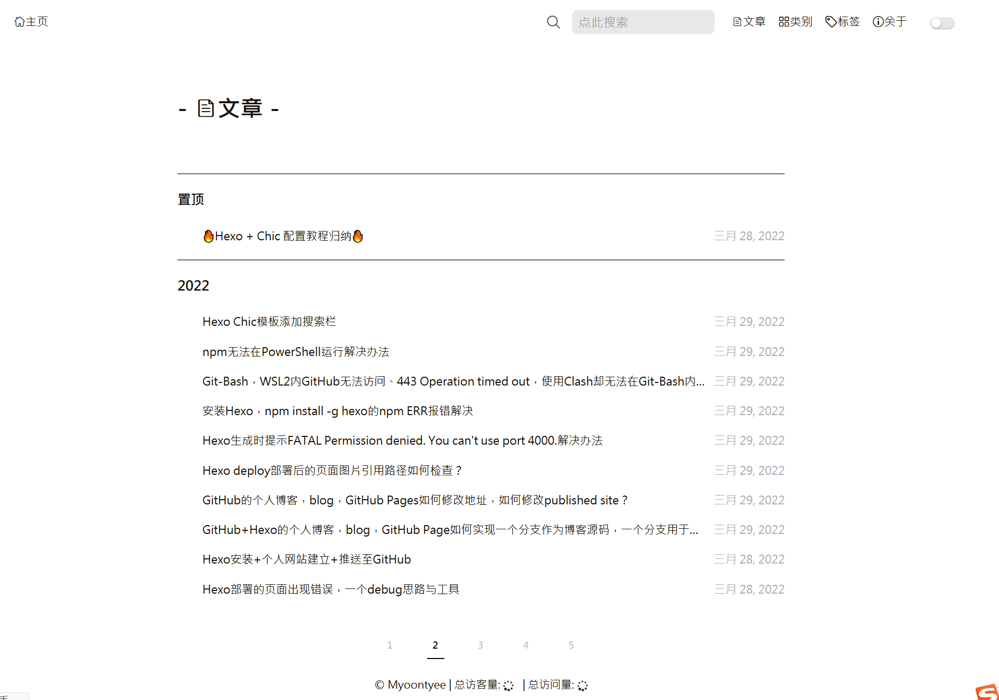

---

**创建时间**：2022年3月31日16:40:43
**最新更新**：2022年3月31日23:10:52

---

**核心思路**：
* 做一个新的Page，这个Page包含
	* 置顶栏
		* 显示含置顶标签，且有top数值的文章
		* 按日期or按top数值排序
	* 排序功能
		* 和默认一样按日期排序
	* 单页最大文章显示数量+分页栏


---


* 最终效果如下，在每一页都会固定显示这些有置顶标签的文章



# 创建新的页面
* 打开`Git-Bash`，进入Blog源码所在目录，输入`hexo new page top`，`top`是页面名，这样创建了一个叫`top`的页面，我们做具体设置
* 用代码编辑器（如`Visual Studio Code`）打开`source\top\index.md`，输入`layout`如下，`title`和`date`不用改，完成后效果如下

## 页面设置

```text
---
title: top
date: 2022-03-29 15:26:17
layout: top
---
```

## 设layout
* 这个代码块内包含排序和基本的样式，包括2个核心块
	* 第一块是判断文章tag是`置顶`，就显示在这里（==按top排列功能待添加==）
	* 第二块是整个网站的文章，排序，按给定量显示
* 用代码编辑器在对应目录创建`themes\Chic\layout\top.ejs`，输入以下内容
```ejs
<%- partial('_page/top', {pagination: config.archive, index: true}) %>
```

* 用代码编辑器在对应目录创建`themes\Chic\layout\_page\top.ejs`，输入以下内容
```ejs
<%# single top page%>
<!-- 引入标签 -->
<link rel="stylesheet" href="../fonts/iconfont3/iconfont.css"> 
<!-- 这个文件是标签页面的布局 -->
<%#

this page will judge whether current page is 'tag.'
url:'http://localhost:4000/tag/' return false.
url:'http://localhost:4000/tags/test/' return true.

if you enter 'tag' page by click link will show all tags.
otherwise if you enter 'tags' by click post header link will show the single tag of this post.

how to add a tag page:

    1. hexo new page "tag"
    2. cd source/tag/index.md
    3. add layout pattern like this:
    ---
    title: '''tag'''
    date: 2019-06-09 09:56:49
    layout: tag
    ---

 %>

    <div class="container top">
        <div class="post-wrap tags top">
            <!-- <h2 class="post-title">-&nbsp;🏷️标签&nbsp;-</h2> -->
            <h2 class="post-title top">-&nbsp;<i class="iconfont icon-wenzhang" style="font-size: 1em;"></i>文章&nbsp;-</h2>
            <br>
            <!-- <div class="tag-cloud-tags top">
                <%site.tags.forEach(item=>{%>
                    <a href="<%-url_for(item.path)%>"><%- item.name%><small>(<%-item.length%>)</small></a>
                <%})%>
            </div> -->
                <!-- 2022年3月29日 添加置顶功能 -->
                <div class ="post top">
                    <hr />
                    <h3>置顶</h3>
                    <!-- 判断有没有 置顶 这个标签的文章 -->
                    <%site.tags.forEach(item=>{%>
                        <% if(item.name == "置顶"){ %>
                            <% item.posts.each(function (post) { %>
                            <!-- 有的情况判断有没有top数值，按top从大到小排列，当然也可以用时间，目前单独写了个top -->
                                <% if(post.top){ %>
                                    <article class="top-item">
                                        <a class="top-item-link" href="<%- url_for(post.path) %>">
                                            <li>
                                                🔥<%= post.title %>🔥
                                            </li>
                                        </a>
                                        <span class="top-item-date"><%- date(post.date, theme.date_format) %></span>
                                    </article>
                                <% ;} %>
                            <% }) %>
                        <% ;} %>
                    <% }) %>
                    <hr />
                </div>
                <!-- 2022年3月29日 添加置顶功能为上 -->

                <!-- 2022年3月31日 添加每页文章数如下 -->
                <!-- 2022年3月30日 每页条数 -->
                <% var perPage = config.top_generator.per_page %>
                <% var currentPage = url.match(/page\/(.*)\//) ? url.match(/page\/(.*)\//)[1] : 1 %>
                <% var last_year = ''; %>
                <% var posts = site.posts %>
                <!-- 按date逆序排序 -->
                <% posts.data = posts.data.sort((a, b) => b.date - a.date) %>
                <% posts.slice((currentPage - 1) * perPage, currentPage * perPage ).each(function (post) { %>
                        <% var cur_year = post.date.year(); %>
                        <% if(last_year !== cur_year){ %>
                            <h3><%- cur_year %></h3>
                        <% last_year = cur_year; } %>
                        <article class="archive-item">
                            
                            <a class="archive-item-link" href="<%- url_for(post.path) %>">
                            <li>
                                <%= post.title %>
                            </li>
                            </a>
                            
                            <span class="archive-item-date"><%- date(post.date, theme.date_format) %></span>
                        </article>
                <% }) %>

                <% if(Math.ceil(posts.length /  perPage) > 1) { %>
                <nav class="pagination">
                    <%- paginator({
                        prev_next: false,
                        end_size: 1,
                        mid_size: 2,
                        total: Math.ceil(posts.length /  perPage)
                    }) %>
                </nav>

                <% } %>
                <!-- 2022年3月31日 添加每页文章数如上 -->
        </div>
    </div>


<style>
    li{
        width: 650px;
        height: 29.5px;
        /*不换行*/
        white-space: nowrap;
        /*溢出的话，隐藏*/
        overflow: hidden;
        /*文本溢出时，是否....*/
        text-overflow: ellipsis;
    }
</style>
```
* 注意如下代码，是引用我页面的标签样式，对应`<i></i>`这样的代码块
`<link rel="stylesheet" href="../fonts/iconfont3/iconfont.css">`
* 如果没有这个需求，`themes\Chic\layout\_page\top.ejs`文件内按下方代码填写即可

```ejs
<%# single top page%>

    <div class="container top">
        <div class="post-wrap tags top">
            <h2 class="post-title top">-&nbsp;文章&nbsp;-</h2>
            <br>
            <!-- <div class="tag-cloud-tags top">
                <%site.tags.forEach(item=>{%>
                    <a href="<%-url_for(item.path)%>"><%- item.name%><small>(<%-item.length%>)</small></a>
                <%})%>
            </div> -->
                <!-- 2022年3月29日 添加置顶功能 -->
                <div class ="post top">
                    <hr />
                    <h3>置顶</h3>
                    <!-- 判断有没有 置顶 这个标签的文章 -->
                    <%site.tags.forEach(item=>{%>
                        <% if(item.name == "置顶"){ %>
                            <% item.posts.each(function (post) { %>
                            <!-- 有的情况判断有没有top数值，按top从大到小排列，当然也可以用时间，目前单独写了个top -->
                                <% if(post.top){ %>
                                    <article class="top-item">
                                        <a class="top-item-link" href="<%- url_for(post.path) %>">
                                            <li>
                                                🔥<%= post.title %>🔥
                                            </li>
                                        </a>
                                        <span class="top-item-date"><%- date(post.date, theme.date_format) %></span>
                                    </article>
                                <% ;} %>
                            <% }) %>
                        <% ;} %>
                    <% }) %>
                    <hr />
                </div>
                <!-- 2022年3月29日 添加置顶功能为上 -->

                <!-- 2022年3月31日 添加每页文章数如下 -->
                <!-- 2022年3月30日 每页条数 -->
                <% var perPage = config.top_generator.per_page %>
                <% var currentPage = url.match(/page\/(.*)\//) ? url.match(/page\/(.*)\//)[1] : 1 %>
                <% var last_year = ''; %>
                <% var posts = site.posts %>
                <!-- 按date逆序排序 -->
                <% posts.data = posts.data.sort((a, b) => b.date - a.date) %>
                <% posts.slice((currentPage - 1) * perPage, currentPage * perPage ).each(function (post) { %>
                        <% var cur_year = post.date.year(); %>
                        <% if(last_year !== cur_year){ %>
                            <h3><%- cur_year %></h3>
                        <% last_year = cur_year; } %>
                        <article class="archive-item">
                            
                            <a class="archive-item-link" href="<%- url_for(post.path) %>">
                            <li>
                                <%= post.title %>
                            </li>
                            </a>
                            
                            <span class="archive-item-date"><%- date(post.date, theme.date_format) %></span>
                        </article>
                <% }) %>

                <% if(Math.ceil(posts.length /  perPage) > 1) { %>
                <nav class="pagination">
                    <%- paginator({
                        prev_next: false,
                        end_size: 1,
                        mid_size: 2,
                        total: Math.ceil(posts.length /  perPage)
                    }) %>
                </nav>

                <% } %>
                <!-- 2022年3月31日 添加每页文章数如上 -->
        </div>
    </div>


<style>
    li{
        width: 650px;
        height: 29.5px;
        /*不换行*/
        white-space: nowrap;
        /*溢出的话，隐藏*/
        overflow: hidden;
        /*文本溢出时，是否....*/
        text-overflow: ellipsis;
    }
</style>
```

# 设逻辑
* 设排序和索引页的
* 用代码编辑器在对应位置创建`themes\Chic\scripts\top.js`，输入以下内容

```js
var pagination = require('hexo-pagination');
hexo.extend.generator.register('top', function(locals){
    let allPost = locals.posts;
   
    return pagination('/top', allPost, {
        perPage: this.config.top_generator.per_page,
        layout: ['top', 'archive', 'index'],
        format: 'page' + '/%d/',
        data: {
            __index: true
        }
    });

});
```

# 填设置
* 这个用来设置单个page内的文章数的
* 用代码编辑器打开`_config.yml`，添加以下内容，设置每个页面的文章数

```yml
top_generator:
  per_page: 10
```

# 部署
* 回到`Git-Bash`，在Blog源码目录下，`hexo clean`，`hexo g`，`hexo deploy`

# Ref
* [Hexo自定义案例](https://zhou-bill.github.io/2020/07/09/hexo%E8%87%AA%E5%AE%9A%E4%B9%89/#)
* [Chic 主题源码1.0.0](https://github.com/Zhou-Bill/Zhou-Bill.github.io/releases/tag/1.0.0)
