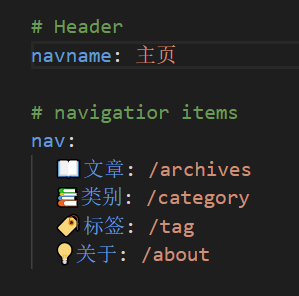

---

**创建时间**：2022年3月30日19:53:34
**最新更新**：2022年3月30日19:53:59


---
**核心思路**：

* 下插件
* 主题配置文件里设置

---

# 下插件
* 在`Git-Bash`内进入到对应文件夹，通过以下代码安装插件

```git

npm install hexo-filter-github-emojis --save

```

# 设置

* 打开`_config.yml`，在最底部输入以下代码

```yml:_config.yml

githubEmojis:  
 enable: true  
 className: github-emoji  
 inject: true  
 styles:  
 customEmojis:

```

# 使用效果
* 可以在文章里通过如`:thinking:`这样的方式使用，也可以直接复制粘贴emoji使用





# emoji查找表
* [✂️ Copy and 📋 Paste Emoji 👍](https://getemoji.com/)
* [emojipedia](https://emojipedia.org/)

# Ref
* [hexo文章中使用emoji表情](https://www.vwkai.com/2020/03/05/hexo-emoji/)
