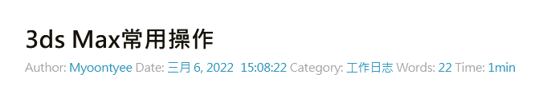
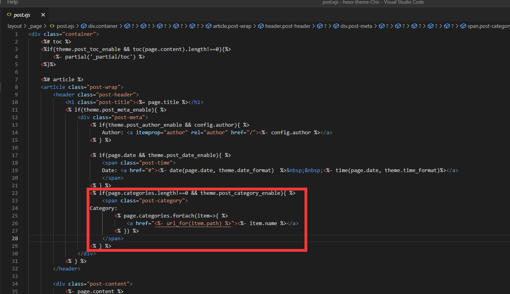

---

**创建时间**：2022年3月30日19:59:04
**最新更新**：2022年3月30日19:59:09

---

**核心思路**：

* 部署`hexo-wordcount`

* 主题下的`_config.yml`配置

* 主题下的post页面配置

---

* 最终效果如下图



# 部署插件

* 文章字数和阅读时长的统计都是借助 `hexo-wordcount` 插件实现，可以使用 `npm`安装

```cmd:Git-Bash

npm i --save hexo-wordcount

```

* `Node` 版本在 7.6.0 之前，需要安装 2.x 版本
	* 查看`Node`版本，需要在`Git-Bash`内输入`Node -v`即可查看
	* 安装2.x版本，需要在`Git-Bash`内输入`npm i --save hexo-wordcount@2`

# 配置文件

* 编译器（如`Visual Stuidio Code`）打开`themes\Chic\_config.yml`，添加如下内容
	* 注意2个`_enable`开关，即`post_wordcount_enable`与`post_min2read_enable`不能放在`post_wordcount:`内

```yml:themes\Chic\_config.yml

# 文章字数和阅读时长

# Post wordcount display settings

# Dependencies: https://github.com/willin/hexo-wordcount

post_wordcount:

 item_text: true

 wordcount: true # 单篇 字数统计

 min2read: true # 单篇 阅读时长

 totalcount: false # 网站 字数统计
 
 

post_wordcount_enable: true # 字数统计

post_min2read_enable: true # 阅读时长

```


# post页面配置

* 编译器打开`themes\Chic\layout\_page\post.ejs`，按如下方式添加修改内容，在下图位置替换对应内容



**修改前**

```ejs:themes\Chic\layout\_page\post.ejs

 <% if(page.categories.length!==0 && theme.post_category_enable){ %>

 <span class="post-category">

 Category:

 <% page.categories.forEach(item=>{ %>

 <a href="<%- url_for(item.path) %>"><%- item.name %></a>

 <% }) %>

 </span>

 <% } %>

```

**修改后**

```ejs:themes\Chic\layout\_page\post.ejs

 <% if(page.categories.length!==0 && theme.post_category_enable){ %>

 <span class="post-category">

 Category:

 <% page.categories.forEach(item=>{ %>

 <a href="<%- url_for(item.path) %>"><%- item.name %></a>

 <% }) %>

 </span>

 <% } %>

  

 <% if(page.content && theme.post_wordcount_enable){ %>

 <span class="post-count">

 Words:

 <a href=""><%= wordcount(page.content) %></a> 

 </span>

 <% } %>

  

 <% if(page.content && theme.post_min2read_enable){ %>

 <span class="post-count">

 Time:

 <a href=""><%= min2read(post.content) %>min</a> 

 </span>

 <% } %>

```


# Ref

* [Hexo 添加文章字数和阅读时长](https://www.foxerlee.top/2020/02/17/wordcount/)
