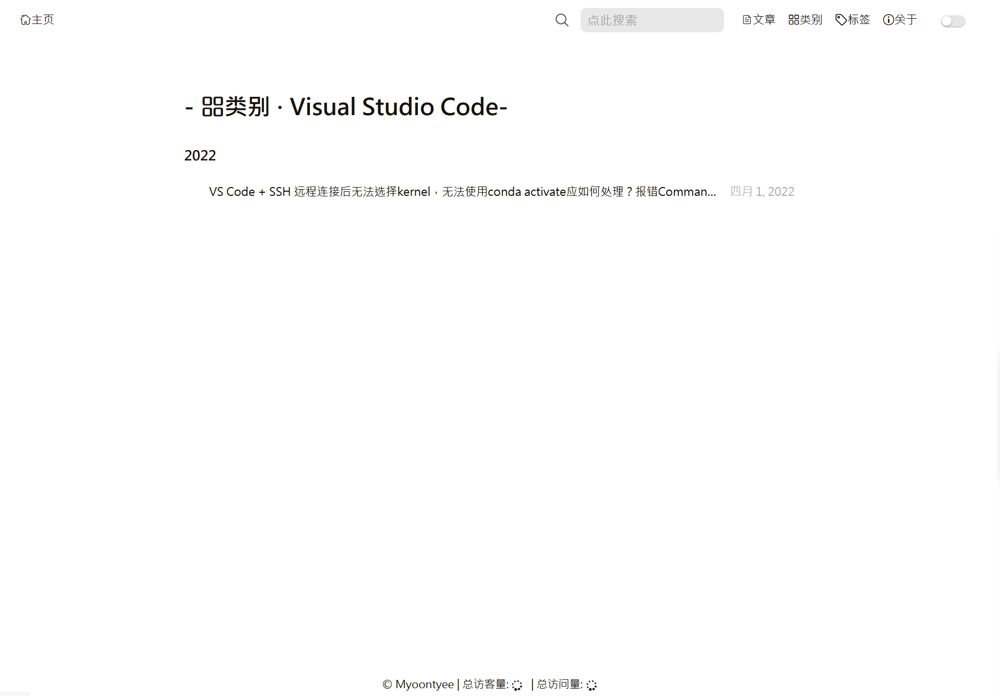

---

**创建时间**：2022年4月4日12:01:09
**最新更新**：2022年4月5日12:36:37

---

**Problem Description**：Hexo + Chic category page three-dot omission scheme for long blog post names

**核心思路**：
* 参考[Hexo + Chic过长博文名如何实现省略，过长博文名，实现三个点省略方案](./321a7025.html)，添加个`<li></li>`样式
* 将`themes\Chic\layout\category.ejs`与`themes\Chic\layout\_page\category.ejs`的显示逻辑分开写
	* `themes\Chic\layout\_page\category.ejs`显示逻辑要重写
* 用`.findOne`函数确认存在这个`category`的博文
    * `var posts = site.categories.findOne({name: page.category}).posts`

---

* 效果如下图，下下图表示打开单个category页面后是显示不同样式




# 修改卡片页样式
* 用代码编辑器打开`themes\Chic\layout\category.ejs`
	* 使用`<li>`
	* 添加`<li>`样式

```ejs:themes\Chic\layout\category.ejs
<li>
   <%- post_item.title %>
</li>
```

```ejs:themes\Chic\layout\category.ejs
<!-- 2022年4月4日 添加过长博文名省略 -->
<style>
    li{
        width: 285px;
        height: 24.2px;
        /*不换行*/
        white-space: nowrap;
        /*溢出的话，隐藏*/
        overflow: hidden;
        /*文本溢出时，是否....*/
        text-overflow: ellipsis;
    }
</style>
```


* 修改前后对比如下


<div style="overflow:auto;width:100%"> <table width="auto" style="white-space:nowrap">
<tr>
<td> <div align = center> <strong>修改前</strong></div> </td> <td> <div align = center> <strong>修改后</strong></div> </td>
</tr>
<tr>
<td>
```ejs
<!-- 引入标签 -->
<link rel="stylesheet" href="../fonts/iconfont3/iconfont.css"> 
<!-- 这个文件是类别页面的布局 -->
<%#
this page will judge whether current page is 'category.'
url:'http://localhost:4000/category/' return false.
url:'http://localhost:4000/categories/test/' return true.
if you enter 'category' page by click link will show all categories.
otherwise if you enter 'categories' by click post header link will show the single category of this post.
how to add a category page:
    1. hexo new page "category"
    2. cd source/category/index.md
    3. add layout pattern like this:
    ---
    title: '''category'''
    date: 2019-06-09 09:56:49
    layout: category
    ---
 %>
<% if(is_category()){ %>
    <%- partial('_page/category', {pagination: config.category, index: true}) %>
<% }else{ %>
    <div class="container">
        <div class="post-wrap categories">
            <!-- <h2 class="post-title">-&nbsp;📚类别&nbsp;-</h2> -->
            <h2 class="post-title">-&nbsp;<i class="iconfont icon-fenlei" style="font-size: 1em;"></i>类别&nbsp;-</h2>
            <div class="categories-card">
                <% site.categories.forEach(category_item=>{ %>
                    <%# console.log("hehe") %>
                    <div class="card-item">
                        <div class="categories">
                            <a href="<%- url_for(category_item.path) %>">
                                <h3>
                                    <i class="iconfont icon-category" style="padding-right:3px"></i>
                                    <%- category_item.name %>
                                </h3>
                            </a>
                            <% category_item.posts.forEach((post_item, index = 0)=>{ %>
                                <%# console.log(index) %>
                                <% if(++index <= 5){ %>
                                    <article class="archive-item">
                                        <a class="archive-item-link"
                                           href="<%- url_for(post_item.path) %>">
                                           <%- post_item.title %>
                                        </a>
                                    </article>
                                <% } %>
                            <% }) %>
                            <% if(category_item.posts.length > 5){ %>
                                <a class="more-post-link" href="<%- url_for(category_item.path) %>">More >></a>
                            <% } %>
                        </div>
                    </div>
                <% }) %>
            </div>
        </div>
    </div>
<% } %>
```
</td>
<td>
```ejs
<!-- 引入标签 -->
<link rel="stylesheet" href="../fonts/iconfont3/iconfont.css"> 
<!-- 这个文件是类别页面的布局 -->
<%#
this page will judge whether current page is 'category.'
url:'http://localhost:4000/category/' return false.
url:'http://localhost:4000/categories/test/' return true.
if you enter 'category' page by click link will show all categories.
otherwise if you enter 'categories' by click post header link will show the single category of this post.
how to add a category page:
    1. hexo new page "category"
    2. cd source/category/index.md
    3. add layout pattern like this:
    ---
    title: '''category'''
    date: 2019-06-09 09:56:49
    layout: category
    ---
 %>
<% if(is_category()){ %>
    <%- partial('_page/category', {pagination: config.category, index: true}) %>
<% }else{ %>
    <div class="container">
        <div class="post-wrap categories">
            <!-- <h2 class="post-title">-&nbsp;📚类别&nbsp;-</h2> -->
            <h2 class="post-title">-&nbsp;<i class="iconfont icon-fenlei" style="font-size: 1em;"></i>类别&nbsp;-</h2>
            <div class="categories-card">
                <% site.categories.forEach(category_item=>{ %>
                    <%# console.log("hehe") %>
                    <div class="card-item">
                        <div class="categories">
                            <a href="<%- url_for(category_item.path) %>">
                                <h3>
                                    <i class="iconfont icon-category" style="padding-right:3px"></i>
                                    <%- category_item.name %>
                                </h3>
                            </a>
                            <% category_item.posts.forEach((post_item, index = 0)=>{ %>
                                <%# console.log(index) %>
                                <% if(++index <= 5){ %>
                                    <article class="archive-item">
                                        <a class="archive-item-link"
                                           href="<%- url_for(post_item.path) %>">
                                           <!-- 2022年4月4日 添加过长博文名省略 -->
                                           <li>
                                           <%- post_item.title %>
                                        </li>
                                        <!-- 2022年4月4日 添加过长博文名省略 -->
                                        </a>
                                    </article>
                                <% } %>
                            <% }) %>
                            <% if(category_item.posts.length > 5){ %>
                                <a class="more-post-link" href="<%- url_for(category_item.path) %>">More >></a>
                            <% } %>
                        </div>
                    </div>
                <% }) %>
            </div>
        </div>
    </div>
<% } %>
<!-- 2022年4月4日 添加过长博文名省略 -->
<style>
    li{
        width: 285px;
        height: 24.2px;
        /*不换行*/
        white-space: nowrap;
        /*溢出的话，隐藏*/
        overflow: hidden;
        /*文本溢出时，是否....*/
        text-overflow: ellipsis;
    }
</style>
```
</td>
</table>
</div>
# 修改单category页面显示逻辑与样式
* 用代码编辑器打开`themes\Chic\layout\_page\category.ejs`
	* 修改显示逻辑
	* 添加对应样式
	
* 添加的显示逻辑如下
```ejs
        <!-- 2022年4月5日 对单页的样式进行单独设置 -->
        <!-- 2022年4月5日 每页条数 -->
        <% var perPage = config.top_generator.per_page %>
        <% var currentPage = url.match(/page\/(.*)\//) ? url.match(/page\/(.*)\//)[1] : 1 %>
        <% var last_year = ''; %>
        <% var posts = site.categories.findOne({name: page.category}).posts %>
        
        <!-- 按date逆序排序 -->
        <% posts.data = posts.data.sort((a, b) => b.date - a.date) %>
        <% posts.slice((currentPage - 1) * perPage, currentPage * perPage ).each(function (post) { %>
                <% var cur_year = post.date.year(); %>
                <% if(last_year !== cur_year){ %>
                    <h3><%- cur_year %></h3>
                <% last_year = cur_year; } %>
                <article class="archive-item">
                    
                    <a class="archive-item-link" href="<%- url_for(post.path) %>">
                    <li class="category-page-post">
                        <%= post.title %>
                    </li>
                    </a>
                    
                    <span class="archive-item-date"><%- date(post.date, theme.date_format) %></span>
                </article>
        <% }) %>

        <% if(Math.ceil(posts.length /  perPage) > 1) { %>
        <nav class="pagination">
            <%- paginator({
                prev_next: false,
                end_size: 1,
                mid_size: 2,
                total: Math.ceil(posts.length /  perPage)
            }) %>
        </nav>

            <% } %>
        <!-- 2022年4月5日 对单页的样式进行单独设置如上 -->				
```

* 添加的样式如下
```ejs
<!-- 2022年4月5日 添加过长博文名省略 -->
<style>
    .category-page-post{
        width: 650px;
        height: 24.2px;
        /*不换行*/
        white-space: nowrap;
        /*溢出的话，隐藏*/
        overflow: hidden;
        /*文本溢出时，是否....*/
        text-overflow: ellipsis;
    }
</style>
```

* `themes\Chic\layout\_page\category.ejs`修改前后对比如下
				
<div style="overflow:auto;width:100%"> <table width="auto" style="white-space:nowrap">
<tr>
<td> <div align = center> <strong>修改前</strong></div> </td> <td> <div align = center> <strong>修改后</strong></div> </td>
</tr>
<tr>
<td>
```ejs
<%# single category page%>
<div class="container">
    <div class="post-wrap categories">
        <!-- <h2 class="post-title">-&nbsp;Categories&nbsp;·&nbsp;<%-page.category%>-</h2> -->
        <h2 class="post-title">-&nbsp;<i class="iconfont icon-fenlei" style="font-size: 1em;"></i>类别&nbsp;·&nbsp;<%-page.category%>-</h2>
        <%- partial('archive', {pagination: config.category, index: true}) %>
    </div>
</div>
<!-- 2022年4月5日 添加过长博文名省略 -->
<style>
    .category-page-post{
        width: 650px;
        height: 24.2px;
        /*不换行*/
        white-space: nowrap;
        /*溢出的话，隐藏*/
        overflow: hidden;
        /*文本溢出时，是否....*/
        text-overflow: ellipsis;
    }
</style>
```
</td>
<td>
```ejs
<%# single category page%>
<div class="container">
    <div class="post-wrap categories">
        <!-- <h2 class="post-title">-&nbsp;Categories&nbsp;·&nbsp;<%-page.category%>-</h2> -->
        <h2 class="post-title">-&nbsp;<i class="iconfont icon-fenlei" style="font-size: 1em;"></i>类别&nbsp;·&nbsp;<%-page.category%>-</h2>
        <!-- 2022年4月5日 下面这句注释掉了 -->
        <%#- partial('archive', {pagination: config.category, index: true}) %>
        <!-- 2022年4月5日 上面这句注释掉了 -->
        <!-- 2022年4月5日 对单页的样式进行单独设置 -->
        <!-- 2022年4月5日 每页条数 -->
        <% var perPage = config.top_generator.per_page %>
        <% var currentPage = url.match(/page\/(.*)\//) ? url.match(/page\/(.*)\//)[1] : 1 %>
        <% var last_year = ''; %>
        <% var posts = site.categories.findOne({name: page.category}).posts %>
        <!-- 按date逆序排序 -->
        <% posts.data = posts.data.sort((a, b) => b.date - a.date) %>
        <% posts.slice((currentPage - 1) * perPage, currentPage * perPage ).each(function (post) { %>
                <% var cur_year = post.date.year(); %>
                <% if(last_year !== cur_year){ %>
                    <h3><%- cur_year %></h3>
                <% last_year = cur_year; } %>
                <article class="archive-item">
                    <a class="archive-item-link" href="<%- url_for(post.path) %>">
                    <li class="category-page-post">
                        <%= post.title %>
                    </li>
                    </a>
                    <span class="archive-item-date"><%- date(post.date, theme.date_format) %></span>
                </article>
        <% }) %>
        <% if(Math.ceil(posts.length /  perPage) > 1) { %>
        <nav class="pagination">
            <%- paginator({
                prev_next: false,
                end_size: 1,
                mid_size: 2,
                total: Math.ceil(posts.length /  perPage)
            }) %>
        </nav>
            <% } %>
        <!-- 2022年4月5日 对单页的样式进行单独设置如上 -->
    </div>
</div>
<!-- 2022年4月5日 添加过长博文名省略 -->
<style>
    .category-page-post{
        width: 650px;
        height: 24.2px;
        /*不换行*/
        white-space: nowrap;
        /*溢出的话，隐藏*/
        overflow: hidden;
        /*文本溢出时，是否....*/
        text-overflow: ellipsis;
    }
</style>
```
</td>
</table>
</div>

# Ref
* [Hexo 获取特定分类或标签下的文章](https://printempw.github.io/get-hexo-posts-by-category-or-tag/)
* [Getting a list of posts in a specific category](https://github.com/hexojs/hexo/issues/2975)
