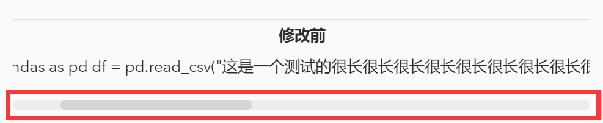

---

**创建时间**：2022年3月20日17:44:45
**最新更新**：2022年3月20日20:50:14


---

**核心思路**：调用`HTML`的`<div><table>`样式

---


* 表格前改为`<div style="overflow:auto;width:100%"> <table width="auto" style="white-space:nowrap">`，表格后添加`</table></div>`

如

```html
<div style="overflow:auto;width:100%"> <table width="auto" style="white-space:nowrap">
<tr>
<td> <div align = center> <strong>修改前</strong></div> </td> <td> <div align = center> <strong>修改后</strong></div> </td>
</tr>
<tr>
<td>
import pandas as pd
df = pd.read_csv("这是一个测试的很长很长很长很长很长很长很长很长很长的文件名.csv")
</td>
<td>
import pandas as pd
df = pd.read_csv("这是一个测试的很长很长很长很长很长很长很长很长很长的文件名.csv")
</td>
</table>
</div>
```

# 效果       

<div style="overflow:auto;width:100%"> <table width="auto" style="white-space:nowrap">
<tr>
<td> <div align = center> <strong>修改前</strong></div> </td> <td> <div align = center> <strong>修改后</strong></div> </td>
</tr>
<tr>
<td>
```Python
import pandas as pd
df = pd.read_csv("这是一个测试的很长很长很长很长很长很长很长很长很长的文件名.csv")
```
</td>
<td>
```Python
import pandas as pd
df = pd.read_csv("这是一个测试的很长很长很长很长很长很长很长很长很长的文件名.csv")
```
</td>
</table>
</div>




# Ref
* [当table列宽过长时设置滚动条](https://blog.csdn.net/weixin_41634885/article/details/102891402)
