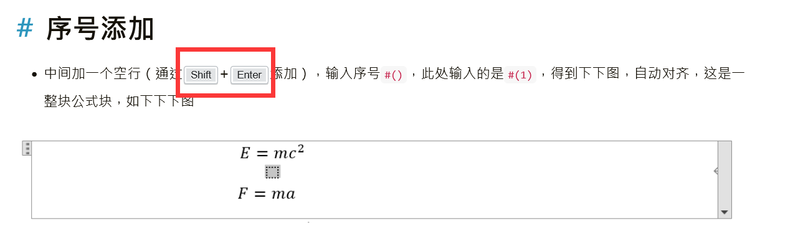

---

**创建时间**：2022年3月28日21:07:27
**最新更新**：2022年4月28日09:29:07

---

**核心思路**：按页面分类教程，其实本质都是调`HTML`和`CSS`

---

# 基本操作

* 创建新的文章，进入对应文件夹，`hexo new` + `"`文章名`"`
	* 如`hexo new "教程 这是一个测试"`，能生成一篇`教程 这是一个测试`的博文页面

* 每次在本地更新好页面以后，在`Git-Bash`内通过如下指令上传
  * 操作1
    * `hexo clean`
    * `hexo s -g`，点开网址开没问题后`Ctrl`+`C`
    * `hexo d`推送上去
  * 操作2
    * `hexo clean`
    * `hexo g`，部署
    * `hexo d`推送上去
* 更新
  * `npm update hexo -g`
* 清理缓存，生成，发布，在`Git-Bash`上输入如下指令
  * `hexo clean && hexo g && hexo d`

---

# 教程总表
| 序号              | 备注                       | 链接                                                         |
| ----------------- | -------------------------- | ------------------------------------------------------------ |
| 基础操作          | -                          | -                                                            |
| 1                 | 部署报错                   | [Hexo部署的页面出现错误，一个debug思路与工具](./17fd3736.html) |
| 2                 | 推送GitHub                 | [Hexo安装+个人网站建立+推送至GitHub](./4f595d21.html)        |
| 3                 | 源码备份                   | [GitHub+Hexo的个人博客，blog，GitHub Page如何实现一个分支作为博客源码，一个分支用于全部源码备份？](./f338e400.html) |
| 4                 | 修改博客路径为`.github.io` | [GitHub的个人博客，blog，GitHub Pages如何修改地址，如何修改published site？](./b3031f8a.html) |
| 5                 | 检查图片路径               | [Hexo deploy部署后的页面图片引用路径如何检查？](./b9c842e3.html) |
| 6                 | 安装插件报错处理           | [Hexo安装插件遇上5 vulnerabilities (2 moderate, 2 high, 1 critical)类似的报错，让使用npm fund寻求更多细节，如何解决](./9762d0c6.html) |
| 7                 | 端口报错处理               | [Hexo生成时提示FATAL Permission denied. You can't use port 4000.解决办法](./9e13174d.html) |
| 8                 | 安装报错处理               | [安装Hexo，npm install -g hexo的npm ERR报错解决](./f63f7dc2.html) |
| 9                 | 443报错处理                | [Git-Bash，WSL2内GitHub无法访问、443 Operation timed out的解决办法](./7faf135d.html) |
| 10                | npm无法运行                | [npm无法在PowerShell运行解决办法](./4add822c.html)           |
|                   |                            |                                                              |
| 首页              |                            |                                                              |
| 1                 | ①搜索                      | [Hexo Chic模板添加搜索栏](./1650c0d7.html)                   |
| 2                 | ②css样式                   | ②样式引用参考[Hexo + Chic，全局引用css样式，从标签、分类or打开文章第二面，icon无法正常显示解决办法](./c2a5d481.html) ②部署见[Hexo + Chic如何在任意位置添加新的icon（svg）图标——以首页添加友链及其logo为例](./32a77ca1.html) |
| 3                 | ③新建页面                  | [Hexo如何新建一个新的页面，page，栏目？](./6376ffa2.html)    |
| 4                 | ④Chic去logo                | [Hexo + Chic 去除首页的圆形头像logo](./ebea8ed0.html)        |
| 5                 | ⑤超链接                    | [Hexo + Chic 首页实现带文字的超链接](./fd9baec8.html)        |
| 6                 | ⑥加icon                    | [Hexo + Chic如何添在link处加新的icon（svg）图标](./9a3fd1d.html) |
| 7                 | ⑦加icon（任意位置）        | ⑦见[Hexo + Chic如何在任意位置添加新的icon（svg）图标——以首页添加友链及其logo为例](./32a77ca1.html) 若⑦涉及样式全局引用问题，见[Hexo + Chic，全局引用css样式，从标签、分类or打开文章第二面，icon无法正常显示解决办法](./c2a5d481.html) |
| 8                 | ⑧站点浏览统计              | ⑧见[Hexo + Chic 增加站点浏览统计](./a976f1c7.html) ⑧数据未加载出来前样式见[Hexo + Chic busuanzi未显示阅读字数、时长等情况下的等待图标添加（旋转菊花等）](./785e20b9.html) |
|                   |                            |                                                              |
| 分栏-文章         |                            |                                                              |
| 1                 | ①                          | ①见[Hexo + Chic如何在任意位置添加新的icon（svg）图标——以首页添加友链及其logo为例](./32a77ca1.html) ①无法正常显示见[Hexo + Chic，全局引用css样式，从标签、分类or打开文章第二面，icon无法正常显示解决办法](./c2a5d481.html) |
| 2                 | ②                          | ②见[Hexo + Chic过长博文名如何实现省略，过长博文名，实现三个点省略方案](./321a7025.html) |
|                   |                            |                                                              |
| 特殊页面-CV       |                            |                                                              |
| 1                 | CV简历页面                 | 基础实现见[Hexo + Chic 在同一行实现左中右内容布局，Markdown（Typora）与Obsidian亦可参考](./46fb7fa8.html) |
| 特殊页面-类别     |                            |                                                              |
| 2                 | 类别页面                   | 类别页面过长博文名省略，见[Hexo + Chic 类别category页面过长博文名的三个点省略方案](./9ff0cec8.html) |
|                   |                            |                                                              |
| 文章-文章头       |                            |                                                              |
| 1                 | ①emoji                     | ①见[Hexo + Chic 添加emoji支持，并使用emoji](./a150dc7d.html) |
| 2                 | ②字数、阅读时长            | ②见[Hexo + Chic 添加文章字数和阅读时长](./11459889.html)     |
| 3                 | ③浏览量                    | ③见[Hexo + Chic 增加单篇文章浏览统计](./a976f1c7.html)       |
| 文章-文章中       |                            |                                                              |
| 1                 | ①引用自己写的别的博文      | ①见[Hexo如何实现对博客内，同一个文件夹下其他文章的引用？](./9d63668d.html) |
| 2                 | ②mermaid                   | ②见[Hexo + Chic + mermaid配置](./751fbb63.html)              |
| 文章-数学公式     |                            |                                                              |
| 1                 | LaTeX                      | 见[Hexo + Chic如何支持数学公式，特别是复杂LaTeX公式，公式会重复显示、LaTeX公式本地预览可以显示deploy上去无法显示解决办法](./3d095f62.html) |
| 文章-kbd样式      |                            |                                                              |
| 1                 | kbd样式                    | 见[Hexo + Chic设置kbd样式，code、samp等样式亦可参考](./96b62d8a.html) |
| 文章-表格与文章尾 |                            |                                                              |
| 1                 | ①表格+代码块               | ①见[Hexo, Obsidian, Typora等如何制作包含代码在内的表格？如果需要有代码行数呢？](./f5721cb9.html) |
| 2                 | ②表格+滚动条               | ②见[Hexo + Chic 过长的表格使用滚动条](./ea970ca1.html)       |
| 3                 | ③插图片                    | ③见[Hexo + Chic + Typora如何实现便捷的文章插入图片方案？Hexo文章图片无法显示问题如何解决？](./d101e67c.html) |
| 4                 | ④修改Tags                  | ④见[Hexo + Chic修改Tag(s)前面的井号](./ccd6f7fe.html)        |
| 5                 | ⑤打赏按钮                  | ⑤见[Hexo + Chic实现打赏按钮，鼠标移动、浮过去会显示对应图片](./cb001f78.html) |
| 6                 | ⑥评论区                    | ⑥见[Chic配置Gitalk，添加评论区](./b1784561.html) ⑥常见错误见[Hexo + Chic配置Gitalk显示error=redirect_uri_mismatch&，点击登录GitHub返回主页解决办法](./eab12f60.html) |
|                   |                            |                                                              |
| 功能-搜索         |                            |                                                              |
| 1                 | 搜索                       | [Hexo + Chic如何部署到搜索引擎如Google上使得其能被搜索到？提交到谷歌搜索（谷歌收录）解决办法](./264c6a00.html) [Hexo + Chic 如何上交网站地图sitemap.xml给Google？如果显示无法获取Couldn't Fetch应该怎么办？](./67414c31.html) |
|                   |                            |                                                              |

# 基础操作

| 序号 | 备注                       | 链接                                                         |
| ---- | -------------------------- | ------------------------------------------------------------ |
| 1    | 部署报错                   | [Hexo部署的页面出现错误，一个debug思路与工具](./17fd3736.html) |
| 2    | 推送GitHub                 | [Hexo安装+个人网站建立+推送至GitHub](./4f595d21.html)        |
| 3    | 源码备份                   | [GitHub+Hexo的个人博客，blog，GitHub Page如何实现一个分支作为博客源码，一个分支用于全部源码备份？](./f338e400.html) |
| 4    | 修改博客路径为`.github.io` | [GitHub的个人博客，blog，GitHub Pages如何修改地址，如何修改published site？](./b3031f8a.html) |
| 5    | 检查图片路径               | [Hexo deploy部署后的页面图片引用路径如何检查？](./b9c842e3.html) |
| 6    | 安装插件报错处理           | [Hexo安装插件遇上5 vulnerabilities (2 moderate, 2 high, 1 critical)类似的报错，让使用npm fund寻求更多细节，如何解决](./9762d0c6.html) |
| 7    | 端口报错处理               | [Hexo生成时提示FATAL Permission denied. You can't use port 4000.解决办法](./9e13174d.html) |
| 8    | 安装报错处理               | [安装Hexo，npm install -g hexo的npm ERR报错解决](./f63f7dc2.html) |
| 9    | 443报错处理                | [Git-Bash，WSL2内GitHub无法访问、443 Operation timed out的解决办法](./7faf135d.html) |
| 10   | npm无法运行                | [npm无法在PowerShell运行解决办法](./4add822c.html)           |
|      |                            |                                                              |

[Hexo部署的页面出现错误，一个debug思路与工具](./17fd3736.html)

[Hexo安装+个人网站建立+推送至GitHub](./4f595d21.html)

[GitHub+Hexo的个人博客，blog，GitHub Page如何实现一个分支作为博客源码，一个分支用于全部源码备份？](./f338e400.html)

[GitHub的个人博客，blog，GitHub Pages如何修改地址，如何修改published site？](./b3031f8a.html)

[Hexo deploy部署后的页面图片引用路径如何检查？](./b9c842e3.html)

[Hexo安装插件遇上5 vulnerabilities (2 moderate, 2 high, 1 critical)类似的报错，让使用npm fund寻求更多细节，如何解决](./9762d0c6.html)

[Hexo生成时提示FATAL Permission denied. You can't use port 4000.解决办法](./9e13174d.html)

[安装Hexo，npm install -g hexo的npm ERR报错解决](./f63f7dc2.html)

[Git-Bash，WSL2内GitHub无法访问、443 Operation timed out的解决办法](./7faf135d.html)

[npm无法在PowerShell运行解决办法](./4add822c.html)

# 首页
* 

| 序号 | 备注 | 链接                                                         |
| ---- | ---- | ------------------------------------------------------------ |
| 1    | ①    | [Hexo Chic模板添加搜索栏](./1650c0d7.html)                   |
| 2    | ②    | ②样式引用参考[Hexo + Chic，全局引用css样式，从标签、分类or打开文章第二面，icon无法正常显示解决办法](./c2a5d481.html) ②部署见[Hexo + Chic如何在任意位置添加新的icon（svg）图标——以首页添加友链及其logo为例](./32a77ca1.html) |
| 3    | ③    | [Hexo如何新建一个新的页面，page，栏目？](./6376ffa2.html)    |
| 4    | ④    | [Hexo + Chic 去除首页的圆形头像logo](./ebea8ed0.html)        |
| 5    | ⑤    | [Hexo + Chic 首页实现带文字的超链接](./fd9baec8.html)        |
| 6    | ⑥    | [Hexo + Chic如何添在link处加新的icon（svg）图标](./9a3fd1d.html) |
| 7    | ⑦    | ⑦见[Hexo + Chic如何在任意位置添加新的icon（svg）图标——以首页添加友链及其logo为例](./32a77ca1.html) 若⑦涉及样式全局引用问题，见[Hexo + Chic，全局引用css样式，从标签、分类or打开文章第二面，icon无法正常显示解决办法](./c2a5d481.html) |
| 8    | ⑧    | ⑧见[Hexo + Chic 增加站点浏览统计](./a976f1c7.html) ⑧数据未加载出来前样式见[Hexo + Chic busuanzi未显示阅读字数、时长等情况下的等待图标添加（旋转菊花等）](./785e20b9.html) |

①见[Hexo Chic模板添加搜索栏](./1650c0d7.html)

②样式引用参考[Hexo + Chic，全局引用css样式，从标签、分类or打开文章第二面，icon无法正常显示解决办法](./c2a5d481.html)
②部署见[Hexo + Chic如何在任意位置添加新的icon（svg）图标——以首页添加友链及其logo为例](./32a77ca1.html)

③见[Hexo如何新建一个新的页面，page，栏目？](./6376ffa2.html)

④见[Hexo + Chic 去除首页的圆形头像logo](./ebea8ed0.html)

⑤见[Hexo + Chic 首页实现带文字的超链接](./fd9baec8.html)

⑥见[Hexo + Chic如何添在link处加新的icon（svg）图标](./9a3fd1d.html)

⑦部署见[Hexo + Chic如何在任意位置添加新的icon（svg）图标——以首页添加友链及其logo为例](./32a77ca1.html)
若⑦涉及样式全局引用问题，见[Hexo + Chic，全局引用css样式，从标签、分类or打开文章第二面，icon无法正常显示解决办法](./c2a5d481.html)

⑧见[Hexo + Chic 增加站点浏览统计](./a976f1c7.html)
⑧数据未加载出来前样式见[Hexo + Chic busuanzi未显示阅读字数、时长等情况下的等待图标添加（旋转菊花等）](./785e20b9.html)

# 分栏-文章

* 

| 序号 | 备注 | 链接                                                         |
| ---- | ---- | ------------------------------------------------------------ |
| 1    | ①    | ①见[Hexo + Chic如何在任意位置添加新的icon（svg）图标——以首页添加友链及其logo为例](./32a77ca1.html) ①无法正常显示见[Hexo + Chic，全局引用css样式，从标签、分类or打开文章第二面，icon无法正常显示解决办法](./c2a5d481.html) |
| 2    | ②    | ②见[Hexo + Chic过长博文名如何实现省略，过长博文名，实现三个点省略方案](./321a7025.html) |
|      |      |                                                              |

①见[Hexo + Chic如何在任意位置添加新的icon（svg）图标——以首页添加友链及其logo为例](./32a77ca1.html)
①无法正常显示见[Hexo + Chic，全局引用css样式，从标签、分类or打开文章第二面，icon无法正常显示解决办法](./c2a5d481.html)

②见[Hexo + Chic过长博文名如何实现省略，过长博文名，实现三个点省略方案](./321a7025.html)

# 特殊页面

| 序号 | 备注       | 链接                                                         |
| ---- | ---------- | ------------------------------------------------------------ |
| 1    | CV简历页面 | 基础实现见[Hexo + Chic 在同一行实现左中右内容布局，Markdown（Typora）与Obsidian亦可参考](./46fb7fa8.html) |
|      |            |                                                              |
| 2    | 类别页面   | 类别页面过长博文名省略，见[Hexo + Chic 类别category页面过长博文名的三个点省略方案](./9ff0cec8.html) |
|      |            |                                                              |

## CV简历页面
* 基础实现见[Hexo + Chic 在同一行实现左中右内容布局，Markdown（Typora）与Obsidian亦可参考](./46fb7fa8.html)

## 类别

* 

* 类别页面过长博文名省略，见[Hexo + Chic 类别category页面过长博文名的三个点省略方案](./9ff0cec8.html)

## 置顶

| 序号 | 备注     | 链接                                                        |
| ---- | -------- | ----------------------------------------------------------- |
| 1    | 置顶页面 | [Hexo + Chic 实现文章置顶栏、文章置顶功能](./fee5a0e2.html) |
|      |          |                                                             |

[Hexo + Chic 实现文章置顶栏、文章置顶功能](./fee5a0e2.html)

# 文章

## 文章头
* 

| 序号 | 备注            | 链接                                                         |
| ---- | --------------- | ------------------------------------------------------------ |
| 1    | ①emoji          | ①见[Hexo + Chic 添加emoji支持，并使用emoji](./a150dc7d.html) |
| 2    | ②字数、阅读时长 | ②见[Hexo + Chic 添加文章字数和阅读时长](./11459889.html)     |
| 3    | ③浏览量         | ③见[Hexo + Chic 增加单篇文章浏览统计](./a976f1c7.html)       |
|      |                 |                                                              |

①见[Hexo + Chic 添加emoji支持，并使用emoji](./a150dc7d.html)

②见[Hexo + Chic 添加文章字数和阅读时长](./11459889.html)

③见[Hexo + Chic 增加单篇文章浏览统计](./a976f1c7.html)

## 文章中

* 

| 序号 | 备注                  | 链接                                                         |
| ---- | --------------------- | ------------------------------------------------------------ |
| 1    | ①引用自己写的别的博文 | ①见[Hexo如何实现对博客内，同一个文件夹下其他文章的引用？](./9d63668d.html) |
| 2    | ②mermaid              | ②见[Hexo + Chic + mermaid配置](./751fbb63.html)              |
|      |                       |                                                              |

①见[Hexo如何实现对博客内，同一个文件夹下其他文章的引用？](./9d63668d.html)

②见[Hexo + Chic + mermaid配置](./751fbb63.html)

## 数学公式

| 序号 | 备注  | 链接                                                         |
| ---- | ----- | ------------------------------------------------------------ |
| 1    | LaTeX | 见[Hexo + Chic如何支持数学公式，特别是复杂LaTeX公式，公式会重复显示、LaTeX公式本地预览可以显示deploy上去无法显示解决办法](./3d095f62.html) |
|      |       |                                                              |

* 见[Hexo + Chic如何支持数学公式，特别是复杂LaTeX公式，公式会重复显示、LaTeX公式本地预览可以显示deploy上去无法显示解决办法](./3d095f62.html)

## kbd样式
* 
  

| 序号 | 备注    | 链接                                                         |
| ---- | ------- | ------------------------------------------------------------ |
| 1    | kbd样式 | 见[Hexo + Chic设置kbd样式，code、samp等样式亦可参考](./96b62d8a.html) |
|      |         |                                                              |

* 见[Hexo + Chic设置kbd样式，code、samp等样式亦可参考](./96b62d8a.html)

## 表格及文章尾

* 

  

| 序号 | 备注         | 链接                                                         |
| ---- | ------------ | ------------------------------------------------------------ |
| 1    | ①表格+代码块 | ①见[Hexo, Obsidian, Typora等如何制作包含代码在内的表格？如果需要有代码行数呢？](./f5721cb9.html) |
| 2    | ②表格+滚动条 | ②见[Hexo + Chic 过长的表格使用滚动条](./ea970ca1.html)       |
| 3    | ③插图片      | ③见[Hexo + Chic + Typora如何实现便捷的文章插入图片方案？Hexo文章图片无法显示问题如何解决？](./d101e67c.html) |
| 4    | ④修改Tags    | ④见[Hexo + Chic修改Tag(s)前面的井号](./ccd6f7fe.html)        |
| 5    | ⑤打赏按钮    | ⑤见[Hexo + Chic实现打赏按钮，鼠标移动、浮过去会显示对应图片](./cb001f78.html) |
| 6    | ⑥评论区      | ⑥见[Chic配置Gitalk，添加评论区](./b1784561.html) ⑥常见错误见[Hexo + Chic配置Gitalk显示error=redirect_uri_mismatch&，点击登录GitHub返回主页解决办法](./eab12f60.html) |

* ①见[Hexo, Obsidian, Typora等如何制作包含代码在内的表格？如果需要有代码行数呢？](./f5721cb9.html)
* ②见[Hexo + Chic 过长的表格使用滚动条](./ea970ca1.html)
* ③见[Hexo + Chic + Typora如何实现便捷的文章插入图片方案？Hexo文章图片无法显示问题如何解决？](./d101e67c.html)
* ④见[Hexo + Chic修改Tag(s)前面的井号](./ccd6f7fe.html)
* ⑤见[Hexo + Chic实现打赏按钮，鼠标移动、浮过去会显示对应图片](./cb001f78.html)
* ⑥见[Chic配置Gitalk，添加评论区](./b1784561.html)
  * ⑥常见错误见[Hexo + Chic配置Gitalk显示error=redirect_uri_mismatch&，点击登录GitHub返回主页解决办法](./eab12f60.html)

# 功能
## 搜索

| 序号 | 备注 | 链接                                                         |
| ---- | ---- | ------------------------------------------------------------ |
| 1    | 搜索 | [Hexo + Chic如何部署到搜索引擎如Google上使得其能被搜索到？提交到谷歌搜索（谷歌收录）解决办法](./264c6a00.html) [Hexo + Chic 如何上交网站地图sitemap.xml给Google？如果显示无法获取Couldn't Fetch应该怎么办？](./67414c31.html) |
|      |      |                                                              |

* [Hexo + Chic如何部署到搜索引擎如Google上使得其能被搜索到？提交到谷歌搜索（谷歌收录）解决办法](./264c6a00.html)
* [Hexo + Chic 如何上交网站地图sitemap.xml给Google？如果显示无法获取Couldn't Fetch应该怎么办？](./67414c31.html)
