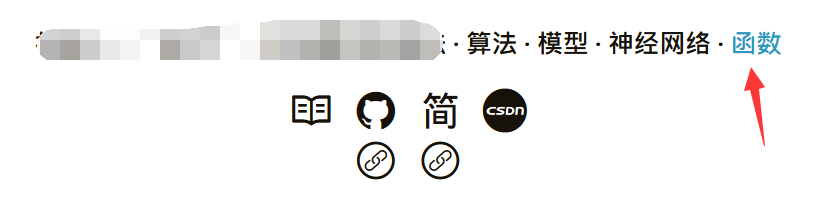

---

**创建时间**：2022年3月26日22:55:19
**最新更新**：2022年3月28日17:42:42

---

**核心思路**：HTML语法

---

# 配置文件直接写
* 用代码编辑器打开`themes\Chic\_config.yml`，使用`<a href="">文字</a>`的语法结构添加超链接，如`<a href="categories/函数/">函数</a>`
* 打开`Git-Bash`，进入Blog源码所在目录，`hexo clean`，`hexo g`，`hexo d`部署源码，也可以通过`hexo clean`，`hexo s -g`在本地预览
* 效果如下图，变为可点击的超链接

# Ref
* [SVG添加链接](https://blog.csdn.net/fengda2870/article/details/78109610)
