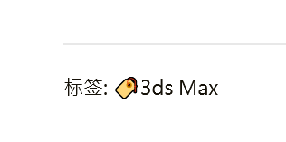

---

**创建时间**：2022年3月30日20:06:36
**最新更新**：2022年3月30日20:06:40


---

**核心思路**：

* 找到定义的代码，#改成别的

---

# 改标签

* 用代码编辑器（如`Visual Stuidio Code`）打开`themes\Chic\layout\_page\post.ejs`，找到如下代码

```ejs:themes\Chic\layout\_page\post.ejs

<a href="<%- url_for(item.path) %>"># <%- item.name %></a>
```

* 把#改成别的，如🏷️

```ejs:themes\Chic\layout\_page\post.ejs

<a href="<%- url_for(item.path) %>">🏷️<%- item.name %></a>
```

* 得到如下图效果



# Ref
* [Hexo 搭建个人博客系列：主题美化篇](http://yearito.cn/posts/hexo-theme-beautify.html)
