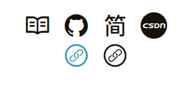

---

**创建时间**：2022年3月20日23:42:21
**最新更新**：2022年3月28日22:12:55


---

**核心思路**：下`icon`，全局调样式

---

* 参考[Hexo + Chic如何添在link处加新的icon（svg）图标](./9a3fd1d.html)，完成下述步骤
	* 挑icon，下载并放到对应文件夹
	* 看iconfont代码，挑选需要的icon


# icon配置

* 用代码编辑器（如`Visual Studio Code`）打开`themes\Chic\_config.yml`，添加对应的样式文件如`../fonts/iconfont3/iconfont.css`

```yml
stylesheets:
  - /css/style.css
  - ../fonts/iconfont2/iconfont.css
  - ../fonts/iconfont3/iconfont.css
  - //cdn.bootcss.com/font-awesome/4.3.0/css/font-awesome.min.css # 访客量的旋转等待logo
```

# 首页布局
* 用代码编辑器打开`themes\Chic\layout\_page\profile.ejs`，添加以下样式

```ejs
<div class="friends_link">
<a href="https://www.github.com/"><i class="iconfont icon-youlian"></i></a>
</div>
```

* `themes\Chic\layout\_page\profile.ejs`修改前后对比见下

<div style="overflow:auto;width:100%"> <table width="auto" style="white-space:nowrap">
<tr>
<td> <div align = center> <strong>修改前</strong></div> </td> <td> <div align = center> <strong>修改后</strong></div> </td>
</tr>
<tr>
<td>
```ejs
<!-- 这个文件是首页 -->
<!-- 先要引用这个icon库 -->
<link rel="stylesheet" href="../fonts/iconfont2/iconfont.css"> 
<!-- 再进行代码编写 -->
<div class="container profile-container">
    <div class="intro">
        <!-- <div class="avatar"> -->
            <!-- <a href="<%- url_for(theme.nav.Posts) %>">"></a> -->
            <!-- <a href="<%- url_for(theme.nav.Posts) %>">"></a> -->
        <!-- </div> -->
        <div class="nickname"><%- theme.nickname %></div>
        <div class="description"><%- markdown(theme.description) %></div>
        <div class="links">
            <% if (theme.links !== undefined) { %>
                <% for (var key in theme.links){ %>
                    <a class="link-item" title="<%- key %>" href="<%= theme.links[key] %>">
                        <% if(theme.links_text_enable) { %>
                            <%= key %>
                        <%}%>
                        <%if(theme.links_icon_enable){ %>
                            <i class="iconfont icon-<%- key.toLowerCase() %>"></i>
                        <%}%>
                    </a>
                <% } %>
            <% } %>
        </div>
    </div>
</div>
```
</td>
<td>
```ejs
<!-- 这个文件是首页 -->
<!-- 先要引用这个icon库 -->
<link rel="stylesheet" href="../fonts/iconfont2/iconfont.css"> 
<!-- 再进行代码编写 -->
<div class="container profile-container">
    <div class="intro">
        <!-- <div class="avatar"> -->
            <!-- <a href="<%- url_for(theme.nav.Posts) %>">"></a> -->
            <!-- <a href="<%- url_for(theme.nav.Posts) %>">"></a> -->
        <!-- </div> -->
        <div class="nickname"><%- theme.nickname %></div>
        <div class="description"><%- markdown(theme.description) %></div>
        <div class="links">
            <% if (theme.links !== undefined) { %>
                <% for (var key in theme.links){ %>
                    <a class="link-item" title="<%- key %>" href="<%= theme.links[key] %>">
                        <% if(theme.links_text_enable) { %>
                            <%= key %>
                        <%}%>
                        <%if(theme.links_icon_enable){ %>
                            <i class="iconfont icon-<%- key.toLowerCase() %>"></i>
                        <%}%>
                    </a>
                <% } %>
            <% } %>
        </div>

        <div class="friends_link">
            <!-- 友链: -->
        <a href="https://www.github.com/"><i class="iconfont icon-youlian"></i></a>
        </div>
    </div>
</div>

```
</td>
</table>
</div>
						
						

						
# 定义样式
* 用代码编辑器打开`themes\Chic\source\css\_page\profile.styl`，添加`friends_link`样式如下（可以直接复制`links`的样式）
						
```styl
.friends_link
  a
    padding: 0 5px
    &:hover
      background-color: transparent
  .iconfont
    font-size: 2em				
```

* `themes\Chic\source\css\_page\profile.styl`修改前后对比见下
						
<div style="overflow:auto;width:100%"> <table width="auto" style="white-space:nowrap">
<tr>
<td> <div align = center> <strong>修改前</strong></div> </td> <td> <div align = center> <strong>修改后</strong></div> </td>
</tr>
<tr>
<td>
```ejs
/** Profile **/
.profile-container
  justify-content center
  align-items center
.intro
  text-align center
  .avatar
    padding 10px
    img
      width 128px
      height auto
      display inline-block
      -webkit-border-radius 100%
      border-radius 100%
      -webkit-box-shadow 0 0 0 0.3618em rgba(0, 0, 0, 0.05)
      box-shadow 0 0 0 0.3618em rgba(0, 0, 0, 0.05)
      margin 0 auto
      -webkit-transition all ease 0.4s
      -moz-transition all ease 0.4s
      -o-transition all ease 0.4s
      transition all ease 0.4s
      cursor pointer
      &:hover
        position relative
        -webkit-transform translateY(-0.75em)
        -moz-transform translateY(-0.75em)
        -ms-transform translateY(-0.75em)
        -o-transform translateY(-0.75em)
        transform translateY(-0.75em)
        cursor pointer
.nickname
  font-size 2em
  font-weight normal
.links
  a
    padding: 0 5px
    &:hover
      background-color: transparent
  .iconfont
    font-size: 2em
```
</td>
<td>
```ejs
/** Profile **/
.profile-container
  justify-content center
  align-items center
.intro
  text-align center
  .avatar
    padding 10px
    img
      width 128px
      height auto
      display inline-block
      -webkit-border-radius 100%
      border-radius 100%
      -webkit-box-shadow 0 0 0 0.3618em rgba(0, 0, 0, 0.05)
      box-shadow 0 0 0 0.3618em rgba(0, 0, 0, 0.05)
      margin 0 auto
      -webkit-transition all ease 0.4s
      -moz-transition all ease 0.4s
      -o-transition all ease 0.4s
      transition all ease 0.4s
      cursor pointer
      &:hover
        position relative
        -webkit-transform translateY(-0.75em)
        -moz-transform translateY(-0.75em)
        -ms-transform translateY(-0.75em)
        -o-transform translateY(-0.75em)
        transform translateY(-0.75em)
        cursor pointer
.nickname
  font-size 2em
  font-weight normal
.links
  a
    padding: 0 5px
    &:hover
      background-color: transparent
  .iconfont
    font-size: 2em
.friends_link
  a
    padding: 0 5px
    &:hover
      background-color: transparent
  .iconfont
    font-size: 2em
```
</td>
</table>
</div>

# 部署，预览
* 效果如下，蓝色是鼠标移动上去的效果


