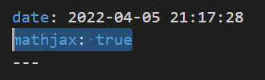

---

**创建时间**：2022年4月8日10:26:23
**最新更新**：2022年4月8日21:24:31

---

**Problem Description**：How does Hexo + Chic support mathematical formulas, especially complex LaTeX formulas, the formulas will be displayed repeatedly, the local preview of LaTeX formulas can display the deploy and cannot display the solution

**核心思路**：
* 装插件`npm install hexo-renderer-markdown-it-plus`
* 注意写法，多加空格

---

# 装插件
* 打开`Git-Bash`，进入Blog源码对应目录，输入以下指令
```Bash
npm uninstall hexo-renderer-marked
npm install hexo-renderer-markdown-it-plus
```

* 配置不用动

# 文件头启用mathjax
* 文件头记得启用`mathjax: true`




# LaTeX公式写法

## 重复显示咋搞？
* `0范数$L_{0}$`这么写会重复显示，如下
0范数$L_{0}$
放个图：
* 要改成`0范数 $ L_{ 0 } $ `，即尽可能的加空格，特别是多个`}`，如`}}`，要写成`} }`，显示效果如下
 0范数 $ L_{ 0 } $ 


## 复杂公式咋搞？
* 前面加个`\begin{equation}`，末尾加个`\end{equation}$$`
	* 想定义具体序号就在`\begin{equation}`后加`\label{eq1}`，不然会自动按序生成序号
	* 注意花式加空格

```LaTeX
$$ \begin{equation}\label{eq1}

\| \mathbf{ x } \|_{0} = \lim _{ p \rightarrow 0 } \| \mathbf{ x } \|_{ p }^{ p } = \lim_{ p \rightarrow 0 } \sum_{ k=1 }^{ m}\left| x_{ k }\right|^{ p } = \#\left\{ i: x _{ i } \neq 0 \right\}

\end{equation} $$
```

* 显示如下

$$ \begin{equation} \label{eq1}
\| \mathbf{ x } \|_{0} = \lim _{ p \rightarrow 0 } \| \mathbf{ x } \|_{ p }^{ p } = \lim_{ p \rightarrow 0 } \sum_{ k=1 }^{ m } \left | x_{ k } \right |^{ p } = \# \left\{ i: x _{ i } \neq 0 \right\}
\end{equation} $$


# Ref
* [数学公式](https://github.com/theme-next/hexo-theme-next/blob/master/docs/zh-CN/MATH.md)
* [关于数学公式](https://github.com/Siricee/hexo-theme-Chic/issues/79)
