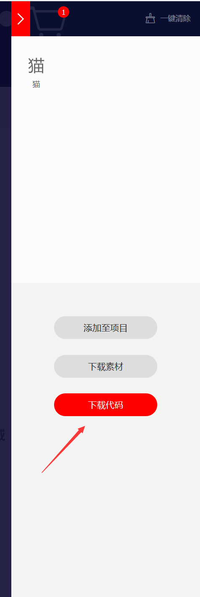

---

**核心思路**：
* 在iconfont+挑icon并下载，放到对应文件夹
* 看iconfont的代码，设置对应内容
* 引用iconfont
* 运行，预览

---

# 挑icon，下载并放到对应文件夹

* 打开[iconfont+](https://www.iconfont.cn)，登录后搜索想要的icon→选中喜欢的→`添加入库`→去购物车→`下载代码`





* 进入`themes\Chic\source\fonts`，解压上面下载的压缩包至该路径下，可以起名为`iconfont2`


# 看iconfont代码，进行配置

* `iconfont2`文件夹下有个文件，`demo_index.html`，相对路径是`themes\Chic\source\fonts\iconfont2\demo_index.html`，双击打开这个文件→在浏览器中打开→点击`Font class`→查看代码，为下下图画红色箭头的部分
	* 此处代码指的是`icon-`后面的字母，如`youlian`、`jianshu`、`csdn`，要注意大小写


* 接下来，比如要在`themes\Chic\_config.yml`的`links`内添加并使用`jianshu`这个icon，我们需要配置如下文件
	* `themes\Chic\source\css\style.styl`引用`iconfont2`的`iconfont.css`
	* `themes\Chic\layout\_page\profile.ejs`引用`iconfont2`的`iconfont.css`
	* `themes\Chic\_config.yml`的`links`

* 一步一步来，打开`themes\Chic\source\css\style.styl`，输入如下代码，注意是`iconfont2`

```css:themes\Chic\source\css\style.styl
@import "../fonts/iconfont2/iconfont.css"  // CSDN、简书、友链
```

* 打开`themes\Chic\layout\_page\profile.ejs`，在最上方添加如下代码，注意是`iconfont2`
```css:themes\Chic\layout\_page\profile.ejs
<!-- 先要引用这个icon库 -->
<link rel="stylesheet" href="../fonts/iconfont2/iconfont.css"> 
<!-- 再进行代码编写 -->
```

* 打开`themes\Chic\_config.yml`，在`links`内添加对应的内容，比如下面内容

```css:themes\Chic\_config.yml
links:
  jianshu: https://github.com/
  csdn: https://github.com/
```

# 部署预览
* 打开`Git-Bash`，输入`hexo clean`，`hexo s -g`，进入`localhost:4000`看一下页面，可以正常使用这些新添加的icon了


# Ref
* [关于文章标题 markdown语法 “##”关键字创建的标题，为什么渲染后的页面还会出现“#”？](https://github.com/Siricee/hexo-theme-Chic/issues/5)
* [关于图标iconfont的疑惑](https://github.com/Siricee/hexo-theme-Chic/issues/69)
