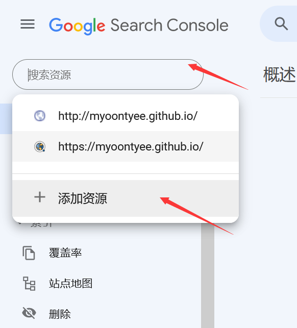
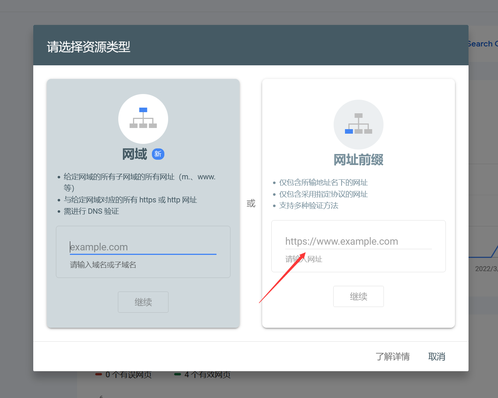
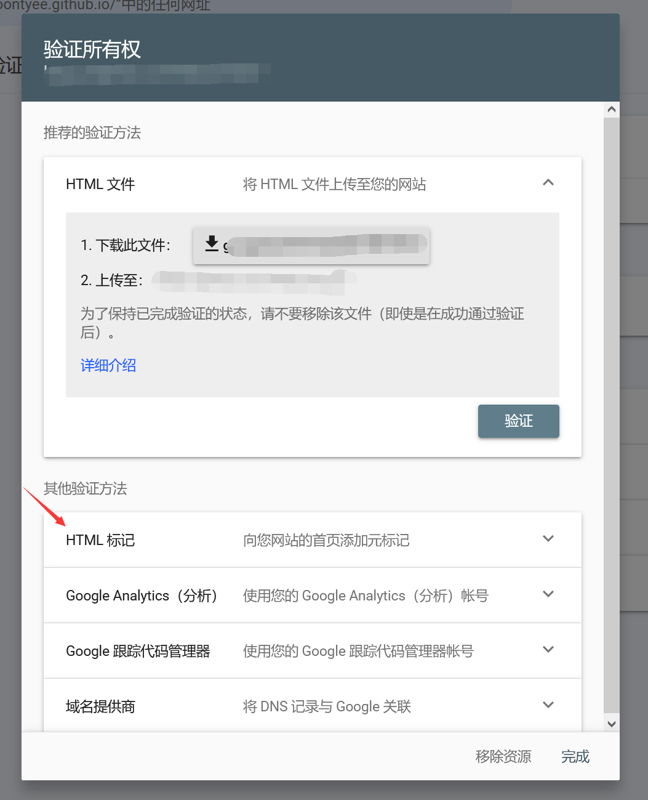
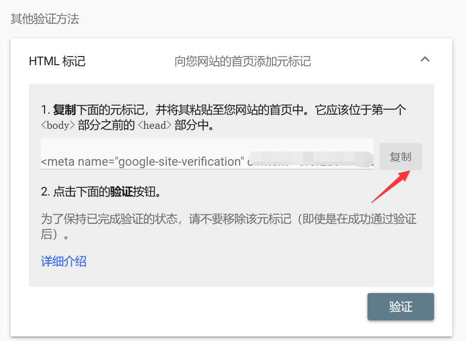
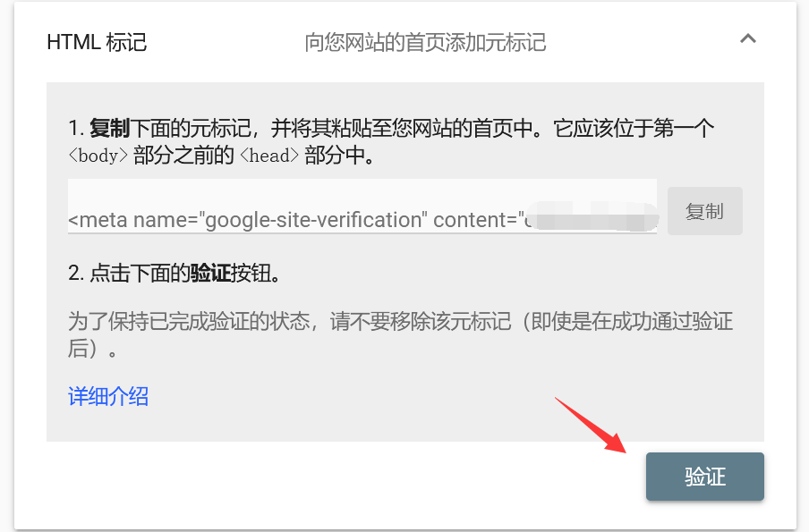
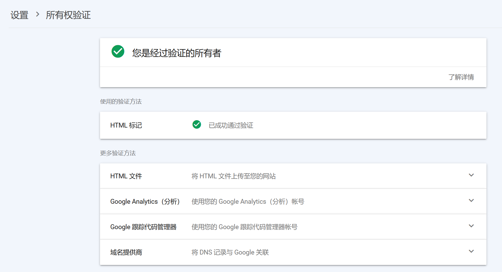
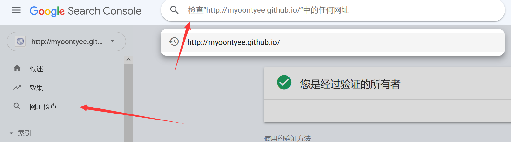
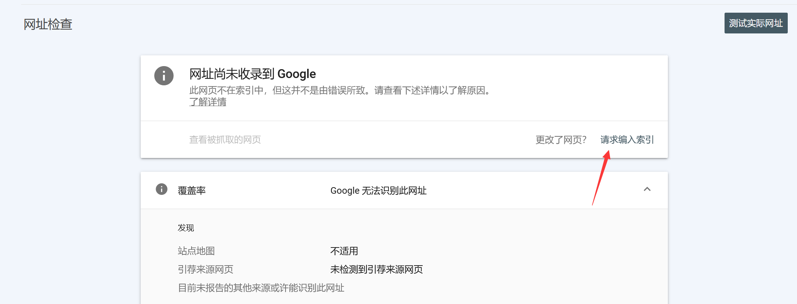
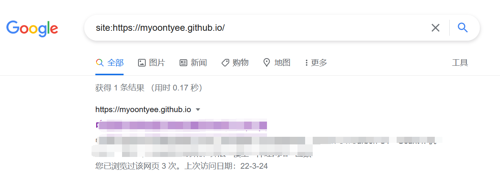

---

**创建时间**：2022年3月20日23:41:34
**最新更新**：2022年3月27日22:09:51

---

**核心思路**：谷歌站长控制台，使用`HTML标记`验证所有权，避免每次`hexo clean`删掉`HTML文件`

---

# 网址验证所有权
* 打开[谷歌站长控制台](https://search.google.com/search-console)，点击`搜索资源`→`添加资源`→在`网址前缀`输入你的Blog地址，如`https://myoontyee.github.io/`→点击继续

* 验证方式选择`HTML标记`→`复制`→用代码编辑器（如`Visual Studio Code`打开`themes\Chic\layout\_partial\head.ejs`），在`<meta charset="UTF-8">`下面一行粘贴这个`HTML标记`的代码

* 打开`Git-Bash`，进入Blog源码根目录，输入`hexo clean`，回车，输入`hexo g`回车，输入`hexo d`

* 待博客部署成功后，回到以下页面，点击`验证`，成功后如下下图

* 点击`网址检查`→输入Blog网址，如`https://myoontyee.github.io/`，注意是`https`还是`http`，要填写正确，下图里头`http`就是错误的

* 点击`请求编入索引`，然后等待即可

* 我是等到第二天，在谷歌搜`site:https://myoontyee.github.io/`就能搜到自己的Blog了

---

# Ref
* [提交到谷歌搜索（谷歌收录）](https://www.hansion.win/2020/04/13/hexo-bo-ke-deng-jing-tai-wang-ye-ti-jiao-bai-du-he-google-gu-ge-shou-lu/)
