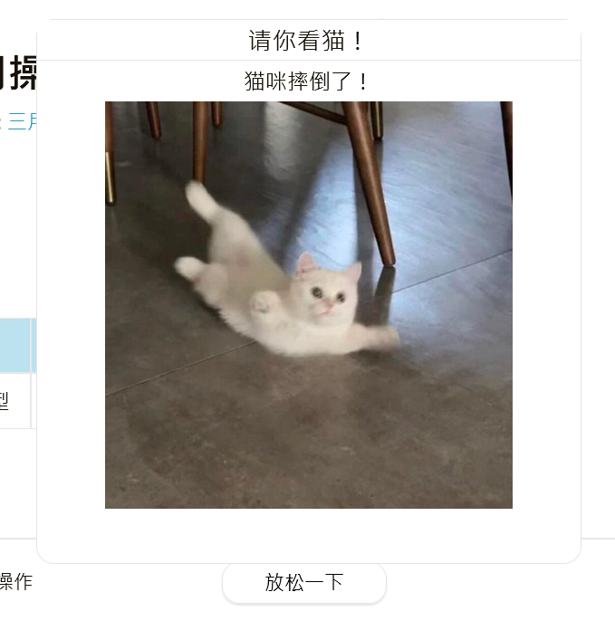

---

**创建时间**：2022年3月30日20:09:00
**最新更新**：2022年3月30日20:09:07


---
**核心思路**：

* 设样式

* 设逻辑

* 引用样式

---


# 设置样式
* 在`themes\Chic\layout\_page\post.ejs`内的对应位置，如`<section class="post-tags">`的如下代码块下方

```ejs:themes\Chic\layout\_page\post.ejs
 <div>

 <span>标签:</span>

 <span class="tag">

 <% if(page.tags.length!==0){%>

 <% page.tags.forEach(item=>{ %>

 <!-- <a href="<%- url_for(item.path) %>"># <%- item.name %></a> -->

 <a href="<%- url_for(item.path) %>">🏷️<%- item.name %></a>

 <% }) %>

 <% } %>

 </span>

 </div>
```

* 添加如下代码

```ejs:themes\Chic\layout\_page\post.ejs

 <!-- 支持一下的按钮与图片 -->

 <div class="reward" id="reward">

 <div class="sponser">

 <div class="sponser_btn">放松一下</div>

 <div class="sponser_img">

 <div class="sponser_container">

 <div class="sponser_header">请你看猫！</div>

 <div class="sponser_body">

 <div class="alipay">

 <span class="sponser_alipay_title">猫咪摔倒了！</span>

 <div>

 

 </div>

 </div>

 </div>

 </div>

 </div>

 </div>

 </div>

```

* 完成设置后，整块`<section class="post-tags">`代码如下
```ejs:themes\Chic\layout\_page\post.ejs

 <section class="post-tags">

 <div>

 <span>标签:</span>

 <span class="tag">

 <% if(page.tags.length!==0){%>

 <% page.tags.forEach(item=>{ %>

 <!-- <a href="<%- url_for(item.path) %>"># <%- item.name %></a> -->

 <a href="<%- url_for(item.path) %>">🏷️<%- item.name %></a>

 <% }) %>

 <% } %>

 </span>

 </div>

 <!-- 支持一下的按钮与图片 -->

 <div class="reward" id="reward">

 <div class="sponser">

 <div class="sponser_btn">放松一下</div>

 <div class="sponser_img">

 <div class="sponser_container">

 <div class="sponser_header">请你看猫！</div>

 <div class="sponser_body">

 <div class="alipay">

 <span class="sponser_alipay_title">猫咪摔倒了！</span>

 <div>

 

 </div>

 </div>

 </div>

 </div>

 </div>

 </div>

 </div>

  

 <div>

 <a href="javascript:window.history.back();">返回</a>

 <span>· </span>

 <a href="<%- config.root %>">主页</a>

 </div>

 </section>

```


* 记得要在`themes\Chic\source\image`文件夹下放置对应的图片

# 设置CSS样式

* 打开`themes\Chic\source\css\_lib\`，创建`reward.css`，写入以下内容
	* 其中`/* border-style: solid; */ `这一句要注释掉，因为会影响别的布局，并最终导致无法对齐

```css:themes\Chic\source\css\_lib\reward.css

.sponser_btn{

 width: 120px;

 height: 30px;

 color:#000000;

 background: rgb(255, 255, 255);

 border-radius:13px;

 border-color: rgb(228, 228, 228);

 border-width: 1.2px;

 border-style: solid;

 box-shadow: 0 1px 1px 0px rgba(0,0,0,0.1);

 text-align: center;

 position: absolute;

 top: auto;

 left: 43%;

} 

  

.sponser_img{

 display: none;

 width: 0px;

 height: 0px;

 /* border-style: solid; */

 float: none;

 position: relative;

 top: -380px;

  
  

}

  
  
  

.sponser_container{

 text-align: center;

 background: rgb(255, 255, 255);

 width: 380px;

 height: 380px;

 border-radius:13px;

 border-color: rgb(228, 228, 228);

 border-width: 1.2px;

 border-style: solid;

 position: absolute;

 float: none;

 left: 210px;

  

}

  

/* 用于鼠标移过以后显示窗口 */

.sponser_btn:hover + .sponser_img{

 display: block;

}

  

.sponser_header{

 width: auto;

 height: auto;

 text-align: center;

 font-size: large;

 border-bottom: solid rgb(228, 228, 228) 1.2px;

 background: rgb(255, 255, 255);

}

.sponser_body{

 width: auto;

 height: auto;

 text-align: center;

 background: rgb(255, 255, 255);

}

.alipay{

 width: auto;

 height: auto;

 text-align: center;

 background: rgb(255, 255, 255);

}

.sponser_alipay_title{

 width: auto;

 height: auto;

 text-align: center;

 font-size: medium;

 background: rgb(255, 255, 255);

}

.sponser_alipay{

 width: 300px;

 height: 300px;

 text-align: center;

 background: rgb(255, 255, 255);

}

```

* 其中用于唤出新窗口的操作在于如下两点，默认`display:none;`不显示，鼠标移过`.sponser_btn:hover + .sponser_img`，给你显示一下`display: block;`
```css

.sponser_img{

 display: none;

 width: 0px;

 height: 0px;

 background: rgb(255, 255, 255);

 border-radius:13px;

 border-color: rgb(228, 228, 228);

 border-width: 1.2px;

 border-style: solid;

 float: none;

 position: relative;

 top: -400px;

 /* left: -250px; */

  

}
```


```css
/* 用于鼠标移过以后显示窗口 */

.sponser_btn:hover + .sponser_img{

 display: block;

}
```

# 调用样式

* 打开`themes\Chic\source\css\style.styl`，在最下方添加

```styl:themes\Chic\source\css\style.styl

// 赞助
@import "_lib/reward.css"

```


# 效果



# Ref

* [CSS 画一条横线/竖线](https://blog.csdn.net/qq_31878883/article/details/83418447)
* [Css 详细解读定位属性 position 以及参数](https://blog.csdn.net/FungLeo/article/details/50056111)
* [CSS浮动一：div基本介绍（背景色，大小，坐标位置，溢出处理，outline，border边框）](https://blog.csdn.net/csucsgoat/article/details/111466354)
* [css图片居中(水平居中和垂直居中)](https://www.cnblogs.com/yiven/p/9645686.html)
* [css图片大小怎么设置](https://www.yisu.com/zixun/452287.html)
* [Css实现鼠标滑过文字时显示隐藏的图片](https://www.codeleading.com/article/88334532360/)
* [CSS浮动一：div基本介绍（背景色，大小，坐标位置，溢出处理，outline，border边框）](https://blog.csdn.net/csucsgoat/article/details/111466354)
