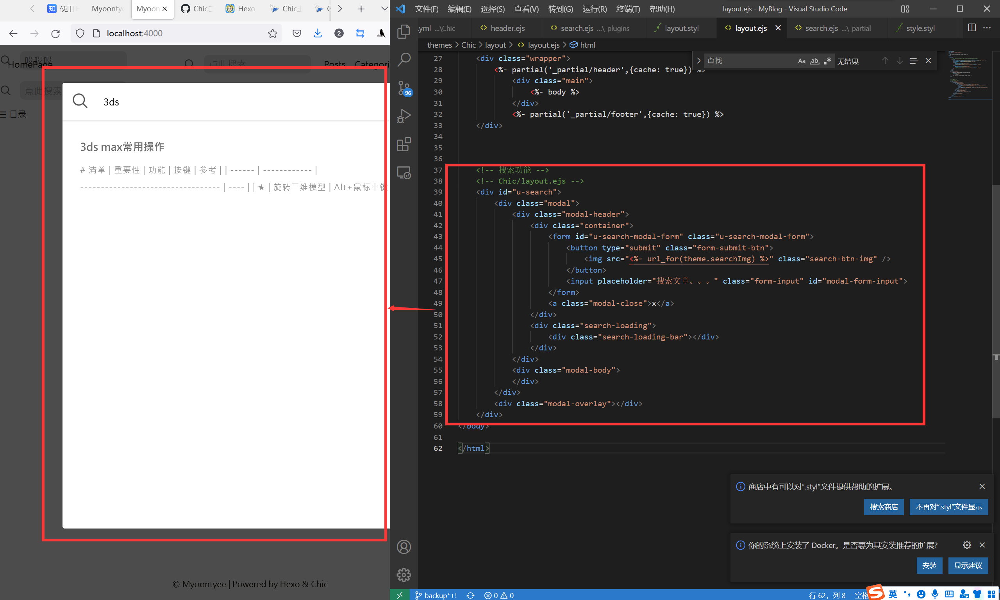

---

**创建时间**：2022年3月29日23:17:12
**最新更新**：2022年4月1日19:34:18


---

**Todo**：

- [x] 部署搜索栏
- [ ] 添加内容预览

---

* 效果如下图


---

**核心思路**：

1.  search.json 
    Git Bash里执行npm install hexo-generator-search生成search.json以包含是文章的基本信息。
2.  html & css 
    使用模态框，根据form表单提交后唤出modal，然后进行ajax对search.json进行查询。
3.  匹配内容和highlight 
    根据关键字对文章内容进行匹配，匹配有的加入数组，然后对匹配成功的那些数据进行字符截取并highlight关键字。

---

# 依赖部署

## search.json

* `hexo-generator-search`安装，生成`search.json`，在`Git-Bash`内，进入到博客代码所在目录的根目录，通过以下指令安装`npm install hexo-generator-search`
	* `search.json`在目录`.\node_modules\hexo-generator-search\demo_output\search.json`

## jquery
* 配置`jquery`，进入[下载页面](https://jquery.com/download/)，可以下载`Production version`，放入`./themes/Chic/source/js/`下
	* `Production version` - 用于实际的网站中，是已经被精简和压缩过的jQuery文件
	* `Development version` - 用于测试和开发中，是未压缩的jQuery文件，可以方便阅读源码
		* 如果点击下图链接打开是一个源码页面
			* 那么可以在对应文件夹下创建一个记事本，改为`jquery-3.6.0.min.js`，将源码页面的源码复制粘贴进去
			* 或直接右键点击下面链接，选择另存为即可


* 在`./themes/Chic/`下的`_config.yml`文件里`script`段添加如下内容
	* `- /js/jquery.min.js`

## 搜索的Logo
* 选一个Logo，比如[这个放大镜](https://raw.githubusercontent.com/maojinyuan/hexo_repository/main/%E9%9B%B6%E6%95%A3%E7%9A%84%E6%96%87%E4%BB%B6/search.png)，放入`./themes/Chic/source/image/`
* 在`./themes/Chic`下的`_config.yml`文件尾行写入`searchImg: /image/search.png`

# 配置Blog源码根目录下的`_config.yml`

* 打开`./_config.yml`，在最下方写入如下代码

```yml
# search//please insert in the end of the body  
search:  
 enable: true  
 path: search.json  
 field: post  
 content: true
```

# 添加modal（包含html和css）

## html

* 打开`./themes/Chic/layout/layout.ejs`底部，在`</html>`添加以下代码，这段代码控制的内容如下

```ejs
<!-- 搜索功能 -->
<!-- Chic/layout.ejs -->
<div id="u-search">
    <div class="modal">
        <div class="modal-header">
            <div class="container">
                <form id="u-search-modal-form" class="u-search-modal-form">
                    <button type="submit" class="form-submit-btn">
                        " class="search-btn-img" />
                    </button>
                    <input placeholder="搜索内容..." class="form-input" id="modal-form-input">
                </form>
                <a class="modal-close">x</a>
            </div>
            <div class="search-loading">
                <div class="search-loading-bar"></div>
            </div>
        </div>
        <div class="modal-body">
        </div>
    </div>
    <div class="modal-overlay"></div>
</div>


```




## css
* 在`./themes/Chic/source/css/_lib/`下新建文件`search.css`，写入以下代码
```css
#u-search {
    display: none;
    position: fixed;
    top: 0;
    left: 0;
    width: 100%;
    height: 100%;
    padding: 60px 20px;
    z-index: 1001;
}


#u-search .modal {
    position: fixed;
    height: 80%;
    width: 100%;
    max-width: 640px;
    left: 50%;
    top: 0;
    margin: 64px 0px 0px -320px;
    background: #fff;
    z-index: 3;
    border-radius: 4px;
    overflow: hidden;
}

#u-search .modal-header {
    position: relative;
    width: 100%;
    height: 64px;
    z-index: 3;
    border-top-left-radius: 4px;
    border-top-right-radius: 4px;
    font-size: 16px;
    box-shadow: 0 1px 2px 0px rgba(0,0,0,0.1);
    background: #fff;
    transition: all 0.28s ease;
    -moz-transition: all 0.28s ease;
    -webkit-transition: all 0.28s ease;
    -o-transition: all 0.28s ease;
}

#u-search .modal-header .container{
    display: flex;
    flex-direction: row;
    align-items: center;
    padding: 0px;
}

#u-search .modal-header .container .u-search-modal-form {
    display: flex;
    flex-direction: row;
    align-items: center;
    flex: 1;
}

#u-search .u-search-modal-form .form-submit-btn {
    width: 50px;
    height: 64px;
    background: none;
    border: none;
    outline: none;
    margin:  0 5px 0 5px ;
}

#u-search .u-search-modal-form .form-submit-btn img {
    width: 33px;
    height: 33px;
}

#u-search .modal-header .container .u-search-modal-form .form-input {
    flex: 1;
    margin-right: 15px;
    border: none;
    padding: 10px 10px;
    outline: none;
}


#u-search .modal-header .modal-close {
    display: block;
    width: 55px;
    height: 64px;
    top: 0;
    right: 0;
    color: #2196f3;
    cursor: pointer;
    text-align: center;
    line-height: 64px;
    vertical-align: middle;
    transition: all 0.28s ease;
    -moz-transition: all 0.28s ease;
    -webkit-transition: all 0.28s ease;
    -o-transition: all 0.28s ease;
    z-index: 2;
    font-size: 22px;
}

#u-search .modal-header .search-loading {
    position: absolute;
    bottom: 0;
    left: 0;
    width: 100%;
    height: 2px;
    background: transparent;
    z-index: 1;

}

#u-search .modal-header .search-loading .search-loading-bar {
    transition: all 0.28s ease;
    -moz-transition: all 0.28s ease;
    -webkit-transition: all 0.28s ease;
    -o-transition: all 0.28s ease;
    position: relative;
    display: none;
    width: 0%;
    height: 100%;
    background: #2196f3;

}

#u-search .modal .modal-body {
    padding: 15px;
    height: calc(100% - 85px);
    overflow: auto;

}

#u-search .modal .modal-body::-webkit-scrollbar{
    width: 5px;
    height: 5px;
    /**/
}
#u-search .modal .modal-body::-webkit-scrollbar-track{
    background: rgb(239, 239, 239);
    border-radius:2px;
}
#u-search .modal .modal-body::-webkit-scrollbar-thumb{
    background: #bfbfbf;
    border-radius:10px;
}
#u-search .modal .modal-body::-webkit-scrollbar-thumb:hover{
    background: #333;
}
#u-search .modal .modal-body::-webkit-scrollbar-corner{
    background: #179a16;
}

#u-search .modal .modal-body .modal-results {
    list-style: none;
    padding-left: 0;
    margin: 0px;
}

#u-search .modal .modal-body .modal-results .result-item {
    padding: 15px;
}

#u-search .modal .modal-body .modal-results .result-item:hover {
    background: #e8f4fd;
}

#u-search .modal .modal-body .modal-results .result-item .result-item-detail {
    display: flex;
    flex-direction: column;
}

#u-search .modal .modal-body .modal-results .result-item .result-item-detail .title {
    color: #6e6e6e;
    font-weight: 700;
    font-size: 18px;
    margin-bottom: 10px;
}

#u-search .modal .modal-body .modal-results .result-item .result-item-detail .content {
    display: block;
    white-space: inherit;
    word-break: break-all;
    text-overflow: ellipsis;
    font-size: 14px;
    color: rgba(85,85,85,0.65);
    letter-spacing: 1px;
    user-select: none;
}

#u-search .search-keyword {
    color: #0c7cd5;
    text-decoration: underline;
    font-weight: bold;
    font-style:normal
}

#u-search .modal-body .no-result {
    display: flex;
    flex-direction: column;
    align-items: center;
    justify-content: center;
}

#u-search .modal-overlay {
    position: absolute;
    top: 0;
    left: 0;
    width: 100%;
    height: 100%;
    background: rgba(0,0,0,0.7);
    z-index: 1;
}

@media screen and (max-width: 680px) {
    #u-search {
        padding: 0px;
        display: none;
    }

    #u-search .modal {
        box-shadow: none;
        max-width: none;
        top: 0;
        left: 0;
        margin: 0;
        height: 100%;
        border-radius: 0;
    }
    #u-search .modal-header {
        border-radius: 0;
        padding: 0px;
    }
} 

.modal-active {
    position: fixed;
    top: 0;
    left: 0;
    right: 0;
    bottom: 0;
}


/* 以下是搜索框 */
.search {
    margin-right: 6px;
    display: flex;
    flex-direction: row;
    align-items: center;
}

.search .form-search {
    padding: 10px 8px;
}

.search .form-search .input {
    display: block;
    line-height: 1.3;
    color: #555;
    background: #e8e8e8;
    padding: 5px 8px;
    box-shadow: none;
    box-sizing: border-box;
    font-size: 1rem;
    border-radius: 8px;
    border: none;
    outline: none;
}        

.search .search-btn {
    width: 22px;
    height: 22px;
    line-height: 22px;
    margin-right: 5px;
}

.search .search-btn .search-btn-img {
    height: 100%;
    width: 100%;
}


/* 搜索框修改 */
@media screen and (max-width: 479px) {
    /* 此处添加了内容 */
     .mobile-title-hidden {
         transition: all 0.5s;
         transform: translateX(-300%);
     }
     /* 上面的是添加的内容 */
     .navbar-mobile-right {
         display: flex;
         flex-direction: row;
         align-items: center;
     }
     .search .search-btn {
         cursor: pointer;
     }
     .search .form-search {
         display: none;
     }
     .mobile-search {
         transition: width 0.3s;
         position: absolute;
         top: 0px;
         left: 0px;
         right: 50px;
         padding-left: 15px;
         background: transparent;
         height: 80px;
         display: flex;
         flex-direction: row;
         margin-right: 15px;
         box-sizing: border-box;
     }
     .mobile-search .form-search {
         display: block; 
         flex: 1;
     }
     .mobile-search .input {
         width: 100%;
     } 
    /* 此处添加了内容 */
     .open-search {
         position: absolute;
         top: 0;
         right: 15px;
     }
 }


/* 原始内容 */
/* @media screen and (max-width: 479px) {

    .navbar-mobile-right {
        display: flex;
        flex-direction: row;
        align-items: center;
    }

    .search .search-btn {
        cursor: pointer;
    }

    .search .form-search {
        display: none;
    }

    .mobile-search {
        position: absolute;
        top: 0px;
        left: 0px;
        right: 50px;
        padding-left: 15px;
        background: #fff;
        height: 80px;
        display: flex;
        flex-direction: row;
        margin-right: 15px;
    }

    .mobile-search .form-search {
        display: block; 
        flex: 1;
    }

    .mobile-search .input {
        width: 100%;
    } 
} */
/* 以上是搜索框 */
```

> * p.s. 由于css需要被style.styl引用，故需在/themes/Chic/source/css/style.styl文件首行加入@import "_lib/search.css"


# 创建搜索栏
* 在`./themes/Chic/layout/_partial/`下新建文件`search.ejs`，写入以下代码：
```ejs
<% if(config.search && config.search.enable ) { %>
    <div class="search ">
        <div class="search-btn" onClick="searchToggle()">
            " class="search-btn-img" />
        </div>
        <form class="form-search">
            <input class="input" placeholder="点此搜索" autocomplete="off" id="<%= name %>-search-input"/>
        </form>
    </div>
<% } %>
```

> * p.s. 这里还要提一点，该增加的搜索框会与原页面的排版有冲突，故在此步我们还需要对/themes/Chic/source/css/中的layout.styl修改如下（注意只对.navbar-right进行了修改）：
> * Before
```styl
.navbar   
    height 4rem  
    line-height 4rem  
    width 100%  
    .container   
        width auto  
        max-width 1200px  
        text-align center  
        margin 0 auto  
        display flex  
        justify-content space-between
```

> * After
```styl
.navbar 
  height 4rem
  line-height 4rem
  width 100%
  .container 
    width auto
    max-width 1200px
    text-align center
    padding-left 1em
    padding-right 1em
    margin 0 auto
    display flex
    justify-content space-between
    .navbar-right
      display flex
      flex-direction row
      align-items center
```

# header内添加搜索框
打开`/themes/Chic/layout/_partial/header.ejs`，将下面代码的5-6行，23-27行分别添加到相应位置完成pc和mobile搜索框的添加。
```ejs
<nav class="navbar">
    <div class="container">
        <!-- <div class="navbar-header header-logo"><a href="<%- config.root %>"><%= theme.navname %></a></div> -->
        <div class="navbar-header header-logo"><a href="<%- config.root %>"><i class="iconfont icon-zhuye" style="font-size: 1em;"></i><%= theme.navname %></a></div>
        <div class="menu navbar-right">
            <!-- 这里表示的是pc端搜索框 -->
            <% var defaultName = 'pc' %>
            <%- partial('_partial/search', { name: defaultName }) %>
            <% for (var i in theme.nav){ %>
            <a class="menu-item" href="<%- url_for(theme.nav[i]) %>"><%= i %></a>
            <% } %>
            <input id="switch_default" type="checkbox" class="switch_default">
            <label for="switch_default" class="toggleBtn"></label>
        </div>
    </div>
</nav>

<%# mobile %>
<nav class="navbar-mobile" id="nav-mobile">
    <div class="container">
        <div class="navbar-header">
            <div>
                <a href="<%- config.root %>"><%= theme.navname %></a><a id="mobile-toggle-theme">·&nbsp;Light</a>
            </div>
            <div class="navbar-mobile-right">
                <% var type = 'mobile' %>
                <%- partial('_partial/search', { name: type }) %>
                <div class="menu-toggle" onclick="mobileBtn()">&#9776; 目录</div>
            </div>

        </div>
        <div class="menu" id="mobile-menu">
            <% for (var i in theme.nav){ %>
            <a class="menu-item" href="<%- url_for(theme.nav[i]) %>"><%= i %></a>
            <% } %>
        </div>
    </div>
</nav>
```

# 添加搜索框的js
* 在`./themes/Chic/layout/_plugin/`下新建文件`search.ejs`，并写入以下代码：
```ejs
<script>
    // function searchToggle() {
    //     const width = $(document.body).width()
    //     if(width > 479) {
    //         return;
    //     }
    //     const search = $('.search');
    //     const searchForm = $('.form-search')

    //     if(!search.hasClass("mobile-search")) {
    //         search.addClass("mobile-search");
    //     } else {
    //         search.removeClass("mobile-search");
    //     } 
    // }

    function searchToggle() {
        const width = $(document.body).width()
        if(width > 479) {
            return;
        }
        const search = $('.search');
        const searchForm = $('.form-search');
        const menuToggle = $('.menu-toggle');
        const title = $('.navbar-header-title ');

        if(!search.hasClass("mobile-search")) {
            search.addClass("mobile-search");
            menuToggle.addClass("open-search")
            title.addClass("mobile-title-hidden")
        } else {
            search.removeClass("mobile-search");
            menuToggle.removeClass("open-search")
            // title.css({visibility: 'visible'})
            title.removeClass("mobile-title-hidden")
        } 
    }


    function search(searchInputEl, formEl, flag) {
        const path = "<%= config.root %>" + "<%= config.search.path %>"; // 可以在public 下查看这个search.json
        $(formEl).submit(function(e){
            e.preventDefault();
            let target = null
            if(searchInputEl == null) {
                const screenWidth = $(document.body).width();
                target = screenWidth > 479 ? $('#pc-search-input') : $('#mobile-search-input');
                console.log(target);
            } else {
                target = $(searchInputEl)
            }

            if(!flag && target.val() === '') {
                return ;
            }

            $("#u-search").fadeIn(500, function() {
                $("body > .wrapper").addClass("modal-active");

                $.ajax({
                    url: path,
                    dataType: "json",
                    beforeSend: function (xhr) {
                        $input = target.val();
                        $(".form-input").val($input);
                        const loadingBar = $('.search-loading-bar') 
                        loadingBar.css({
                            width:'100%',
                            display: 'block'
                        });
                    },
                    success: function( datas ) {
                        console.log(datas);
                        const $resultPanel = $(".modal-body")[0];
                        let str = `<ul class="modal-results">`;
                        var keywords = $(".form-input").val().trim().toLowerCase().split(/[\s\-]+/);
                        $resultPanel.innerHTML = "";
                        let hasResult = false
                        let text = `<div class="no-result">找不到与关键词相关的内容....</div>`;

                        if ($(".form-input").val().trim().length <= 0) {
                            // 没有结果
                            $resultPanel.innerHTML = text;
                            return;
                        }
                        datas.forEach(function (data, index) {
                            var isMatch = true;
                            if (!data.title || data.title.trim() === '') {
                                data.title = "Untitled";
                            }
                            var data_title = data.title.trim().toLowerCase();
                            var data_content = data.content && data.content.trim().replace(/<[^>]+>/g, "").toLowerCase() || '';
                            var data_url = data.url;
                            var index_title = -1;
                            var index_content = -1;
                            var first_occur = -1;
                            // only match artiles with not empty contents
                            if (data_content !== '') {
                                keywords.forEach(function (keyword, i) {
                                    index_title = data_title.indexOf(keyword);
                                    index_content = data_content.indexOf(keyword);

                                    if (index_title < 0 && index_content < 0) {
                                        isMatch = false;
                                    } else {
                                        hasResult = true
                                        if (index_content < 0) {
                                            index_content = 0;
                                        }
                                        if (i == 0) {
                                            first_occur = index_content;
                                        }
                                    }
                                });
                            } else {
                                isMatch = false;
                            }
                            // show search results
                            if (isMatch) {
                                str += `<li class='result-item'><a href='${data_url}' class='result-item-detail'> <span class="title">${data_title}</span>`;
                                var content = data.content.trim().replace(/<[^>]+>/g, "");
                                if (first_occur >= 0) {
                                    // cut out 200 characters
                                    var start = first_occur - 40;
                                    var end = first_occur + 160;

                                    if (start < 0) {
                                        start = 0;
                                    }

                                    if (start == 0) {
                                        end = 200;
                                    }

                                    if (end > content.length) {
                                        end = content.length;
                                    }

                                    var match_content = content.substring(start, end);

                                    // highlight all keywords
                                    keywords.forEach(function (keyword) {
                                        var regS = new RegExp(keyword, "gi");
                                        match_content = match_content.replace(regS, `<em class="search-keyword">${keyword}</em>`);
                                    });

                                    str += `<span class="content"> ${match_content} ...</span></a>`;
                                }
                                str += "</li>";
                            }
                        });
                        str += "</ul>";
                        if(hasResult) {
                            $resultPanel.innerHTML = str;
                        } else {
                            $resultPanel.innerHTML = text;
                        }

                    },
                    complete: function() {
                        setTimeout(() => {
                                const loadingBar = $('.search-loading-bar') 
                                loadingBar.css({
                                    width:'0%',
                                    display: 'none'
                                });
                        }, 300)
                    }
                });
            })

        });
    }

    $(document).ready(function() {
        $('.modal-close').click(function () { 
            $("#u-search").fadeOut();
            $("body > .wrapper").removeClass("modal-active")
        })

        $('.modal-overlay').click(function() {
            $("#u-search").fadeOut();
            $("body > .wrapper").removeClass("modal-active")
        })
        search(null, ".form-search", false)
        search("#u-search-modal-form .form-input", ".u-search-modal-form", true)
    })
</script>
```

# 启动搜索框的js
* 注意此部分会最终决定显示效果，若产生了错误的配置，会产生如下图的错误，解决思路见[[Hexo部署的页面出现错误，一个debug思路与工具]]
* 打开`./themes/Chic/layout/_partial/head.ejs`，尾行添加以下代码：

```ejs
<!-- 搜索的部分 -->
<%# search %>

<% if(config.search && config.search.enable ) { %>
    <%- partial('_plugins/search.ejs') %>
<% } %>

```


# 手机端源码调整

* 打开`themes\Chic\layout\_plugins\search.ejs`，进行修改

**修改前**

```ejs
 function searchToggle() {
 	const width = $(document.body).width()
 	if(width > 479) {
 		return;
 	}

	const search = $('.search');
 	const searchForm = $('.form-search')

 	if(!search.hasClass("mobile-search")) {
 	search.addClass("mobile-search");
	 } else {
	search.removeClass("mobile-search");
        }
     }

```


**修改后**
```ejs:search.ejs

    function searchToggle() {
        const width = $(document.body).width()
        if(width > 479) {
            return;
        }
        const search = $('.search');
        const searchForm = $('.form-search');
        const menuToggle = $('.menu-toggle');
        const title = $('.navbar-header-title ');

        if(!search.hasClass("mobile-search")) {
            search.addClass("mobile-search");
            menuToggle.addClass("open-search")
            title.addClass("mobile-title-hidden")
        } else {
            search.removeClass("mobile-search");
            menuToggle.removeClass("open-search")
            // title.css({visibility: 'visible'})
            title.removeClass("mobile-title-hidden")
        } 
    }

```


* 修改 `Chic\source\css\_lib\search.css` 样式文件

**修改前**

```css:search.css
/* 搜索框修改 */
@media screen and (max-width: 479px) {
     .navbar-mobile-right {
         display: flex;
         flex-direction: row;
         align-items: center;
     }
     .search .search-btn {
         cursor: pointer;
     }
     .search .form-search {
         display: none;
     }
     .mobile-search {
         transition: width 0.3s;
         position: absolute;
         top: 0px;
         left: 0px;
         right: 50px;
         padding-left: 15px;
         background: transparent;
         height: 80px;
         display: flex;
         flex-direction: row;
         margin-right: 15px;
         box-sizing: border-box;
     }
     .mobile-search .form-search {
         display: block; 
         flex: 1;
     }
     .mobile-search .input {
         width: 100%;
     } 
 }
```

**修改后**
```css:search.css
/* 搜索框修改 */
@media screen and (max-width: 479px) {
    /* 此处添加了内容 */
     .mobile-title-hidden {
         transition: all 0.5s;
         transform: translateX(-300%);
     }
     /* 上面的是添加的内容 */
     .navbar-mobile-right {
         display: flex;
         flex-direction: row;
         align-items: center;
     }
     .search .search-btn {
         cursor: pointer;
     }
     .search .form-search {
         display: none;
     }
     .mobile-search {
         transition: width 0.3s;
         position: absolute;
         top: 0px;
         left: 0px;
         right: 50px;
         padding-left: 15px;
         background: transparent;
         height: 80px;
         display: flex;
         flex-direction: row;
         margin-right: 15px;
         box-sizing: border-box;
     }
     .mobile-search .form-search {
         display: block; 
         flex: 1;
     }
     .mobile-search .input {
         width: 100%;
     } 
    /* 此处添加了内容 */
     .open-search {
         position: absolute;
         top: 0;
         right: 15px;
     }
 }

```


# Ref

* [Hexo建站工具贴3_Chow Bill搜索功能](https://maojinyuan.github.io/2020/07/25/20200725Hexo%E5%BB%BA%E7%AB%99%E5%B7%A5%E5%85%B7%E8%B4%B43_Chow%20Bill%E6%90%9C%E7%B4%A2%E5%8A%9F%E8%83%BD/)
* [jQuery下载和安装详细教程](https://blog.csdn.net/p445098355/article/details/103995541)
