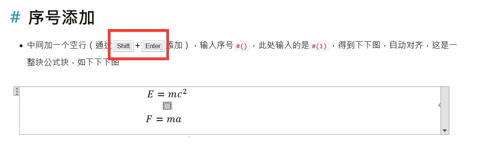

---

**创建时间**：2022年4月9日19:57:17
**最新更新**：2022年4月9日20:00:35

---

**Problem Description**：Hexo + Chic sets the kbd style, code, samp and other styles can also refer to this post

**核心思路**：调`themes\Chic\source\css\normalize.styl`的`kbd`部分

---

# 设置样式
* 用代码编辑器打开`themes\Chic\source\css\normalize.styl`，找到`kbd`，添加修改内容如下

```css
code
  font-family monospace, monospace /* 1 */
  font-size 1em /* 2 */
kbd 
  display: inline-block;
  margin: 0 .1em;
  padding: .1em .6em;
  font-family: Arial,"Helvetica Neue",Helvetica,sans-serif;
  font-size: 11px;
  line-height: 1.4;
  color: #242729;
  text-shadow: 0 1px 0 #FFF;
  background-color: #e1e3e5;
  border: 1px solid #adb3b9;
  border-radius: 3px;
  box-shadow: 0 1px 0 rgba(12,13,14,0.2), 0 0 0 2px #FFF inset;
  white-space: nowrap;
samp
  font-family monospace, monospace /* 1 */
  font-size 1em /* 2 */
```

* 修改前后代码对比如下

<div style="overflow:auto;width:100%"> <table width="auto" style="white-space:nowrap">
<tr>
<td> <div align = center> <strong>修改前</strong></div> </td> <td> <div align = center> <strong>修改后</strong></div> </td>
</tr>
<tr>
<td>
```css
code,
kbd,
samp
  font-family monospace, monospace /* 1 */
  font-size 1em /* 2 */
```
</td>
<td>
```css
code
  font-family monospace, monospace /* 1 */
  font-size 1em /* 2 */
kbd 
  display: inline-block;
  margin: 0 .1em;
  padding: .1em .6em;
  font-family: Arial,"Helvetica Neue",Helvetica,sans-serif;
  font-size: 11px;
  line-height: 1.4;
  color: #242729;
  text-shadow: 0 1px 0 #FFF;
  background-color: #e1e3e5;
  border: 1px solid #adb3b9;
  border-radius: 3px;
  box-shadow: 0 1px 0 rgba(12,13,14,0.2), 0 0 0 2px #FFF inset;
  white-space: nowrap;
samp
  font-family monospace, monospace /* 1 */
  font-size 1em /* 2 */
```
</td>
</table>
</div>

# 部署
* 保存，去`Git-Bash`，进入Blog源码所在根目录，`hexo clean`，`hexo g`，`hexo s`就能看到效果，`hexo d`部署上去，效果如下图
  * 下图的源码是`<kbd>Shift</kbd>+<kbd>Enter</kbd>`




# Ref
* [HEXO × 样式实践笔记](http://techoffee.me/hexo/advance/)
