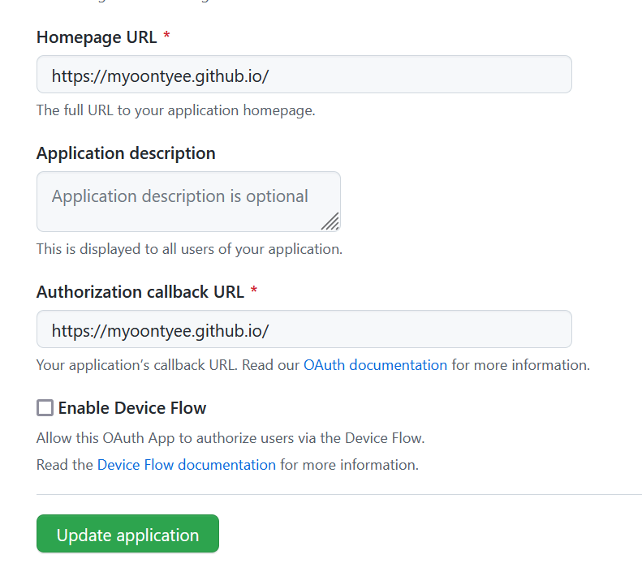
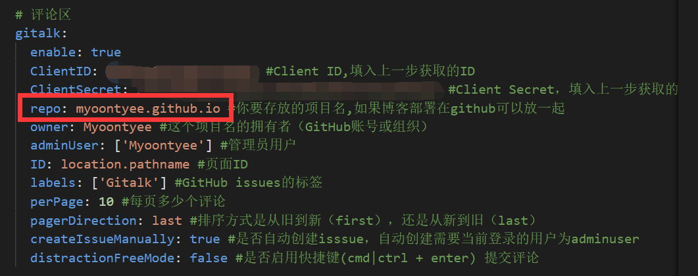

---

**创建时间**：2022年3月30日20:15:06
**最新更新**：2022年3月30日20:15:12


---


* 思路
	* `OAuth`的页面上，`Homepage URL`要和`Authorization callback URL`一样，直接从blog首页页面地址栏复制粘贴过去
	* 配置文件里，`repo`得是仓库名
	* 打开博文地址不能有中文


* 配置`Gitalk`，见[[Chic配置Gitalk，添加评论区]]

# OAuth APP设置

* [页面](https://github.com/settings/applications/1848830)内确保`Homepage URL`和`Authorization callback URL`一致，直接从blog首页复制粘贴过来



# 主题配置
* 用代码编辑器，如`Visual Studio Code`打开`themes\Chic\_config.yml`，找到`gitalk`，其中`repo`得配置仓库名，如此处是`myoontyee.github.io`




# 博文地址配置

* 博文链接地址如果是`https:://xxx.xxx.xx/中文`这样的，在点击`使用GitHub登录`后会返回blog首页，需要修改博文地址，最好没有空格
* 可以使用`abbrlink`解决
	* 如使用后文章生成了`abbrlink`为`60762`
	* 则对应博文地址会变为`https://[你的网站域名]/article/60762.html`，即可正常登录Gitalk与评论
* 进入blog源码根目录，在`Git-Bash`内输入以下指令安装插件

```bash
npm install hexo-abbrlink --save
```

* 用代码编辑器打开根目录下的`_config.yml`，修改并添加如下配置
```yml:_config.yml


# permalink: :year/:month/:day/:title/
# permalink: article/:title/
permalink: article/:abbrlink.html
abbrlink:
  alg: crc32  # 算法：crc16(default) and crc32
  rep: hex    # 进制：dec(default) and hex
permalink_defaults:


```

* 现在再通过`hexo new`生成新的文章，如`hexo new test`时，生成的`test.md`博文会在头部自带一个`abbrlink`，对应部署后的`abbrlink`

# 初次评论初始化

* 初次评论需要先登录管理员账号，点击初始化即可

# Ref
* [登录报错/?error=redirect_uri_mismatch&](https://github.com/gitalk/gitalk/issues/162)
* [Hexo：修改永久链接的默认格式](https://blog.csdn.net/qq_42780289/article/details/102662091)
