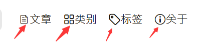
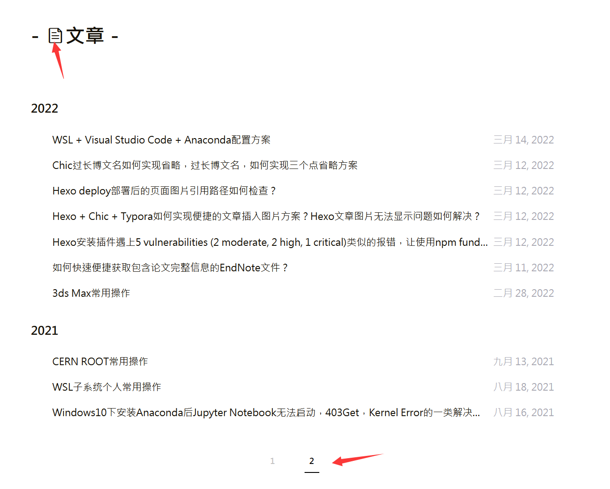
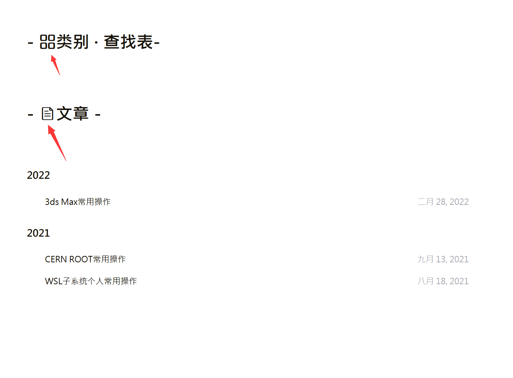

---

**创建时间**：2022年3月20日23:41:53
**最新更新**：2022年3月28日17:30:16


---

**核心思路**：全局引用对应`.css`文件


---

* 原因是打开新的页面，初始化的时候没有初始化调用这些样式，全局引用这些样式就好

# 全局引用

* 用代码编辑器打开`themes\Chic\_config.yml`，在`stylesheets:`下添加对应的样式文件，如

```yml
stylesheets:
  - /css/style.css
  - ../fonts/iconfont2/iconfont.css
  - ../fonts/iconfont3/iconfont.css
  - //cdn.bootcss.com/font-awesome/4.3.0/css/font-awesome.min.css # 访客量的旋转等待logo
```

* 上面的`../fonts/iconfont3/iconfont.css`就是我下面这些icon的样式对应的`.css`文件




# 效果
* 打开第2页等、通过类别与标签等打开就能正常显示了



