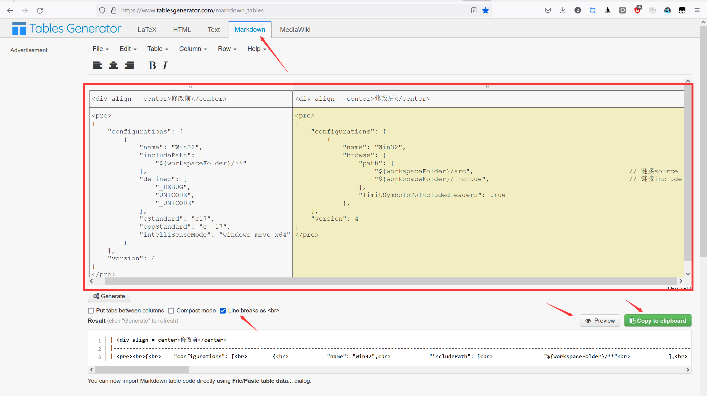
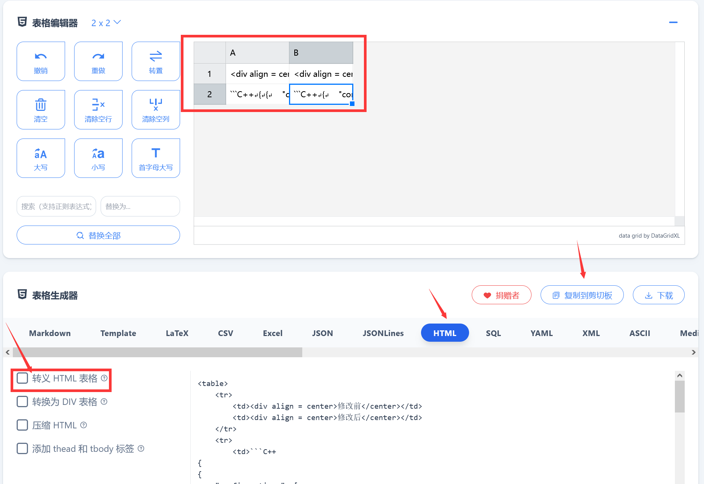
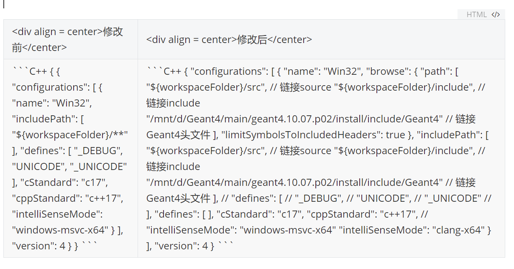
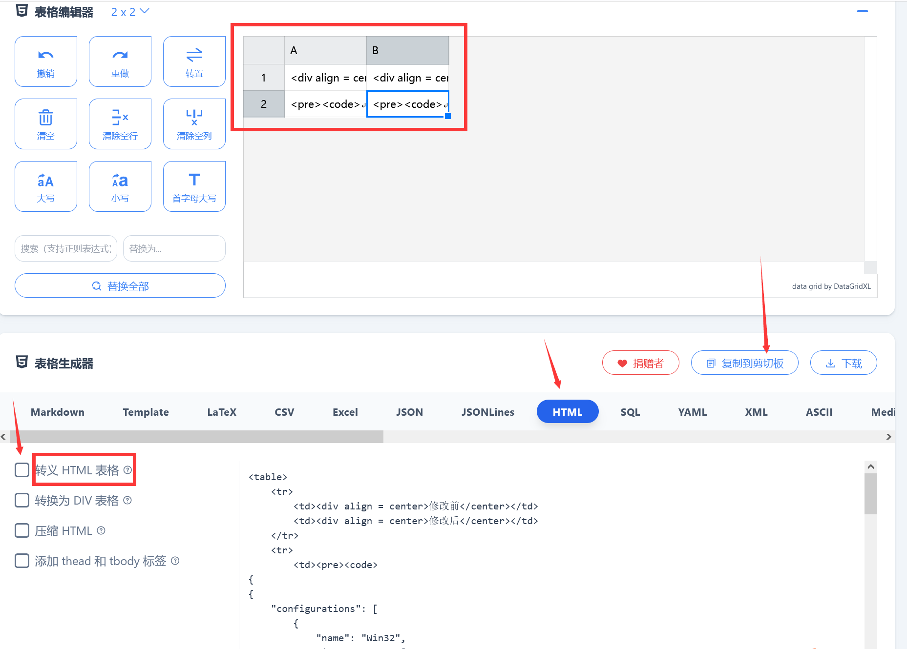
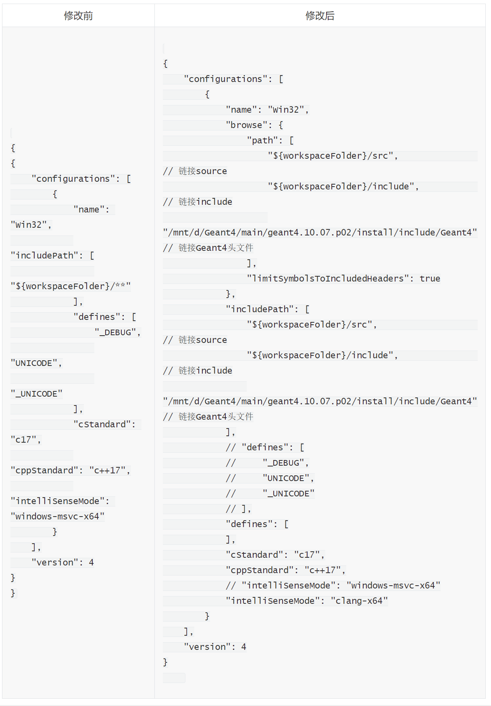

---

**创建时间**：2022年3月19日12:10:56
**最新更新**：2022年3月20日17:32:35


---

**核心思路**：
* 法1，基于`|`，使用`<pre>`与`<code>`
	* 用`HTML`的`<pre>`样式，表头居中用`HTML`的`<center>`样式
	* 再通过[tablesgenerator在线网站](https://www.tablesgenerator.com/markdown_tables)生成markdown样式
	
* 法2，基于`<table>`，使用三个点语法
	* 使用`HTML`的`<table>`样式
	* 通过[HTML 表格 转换为 HTML 表格](https://tableconvert.com/zh-CN/HTML-to-HTML)生成`HTML`样式
* 法3，基于`<table>`，使用`<pre>`与`<code>`
	* 使用`HTML`的`<table>`样式
	* 通过[HTML 表格 转换为 HTML 表格](https://tableconvert.com/zh-CN/HTML-to-HTML)生成`HTML`样式
* 推送到blog过长的表格若需要滚动条见[Hexo + Chic 过长的表格使用滚动条](./ea970ca1.html)

---

**方法特点**：
* 法1属于便捷方法，Obsidian、Typora与Hexo都可以顺利显示代码块，但无法显示代码行号
* 法2在Hexo可以顺利显示代码块与行号，在Obsidian、Typora内需去除所有空行回车才能显示代码块，但无法显示代码行号
* 法3在Hexo未测试过，在Obsidian内可以显示代码块与行号

---

# 法1
## 生成表格
* 在[tablesgenerator在线网站](https://www.tablesgenerator.com/markdown_tables)按照要求绘制表格，如下图，勾选`Line breaks as <br>`
	* 表头居中用`HTML`的`<center>`样式，如`<div align = center>修改前</center>`
	* 代码写法，表格内显示代码用`HTML`的`<pre>`与`<code>`样式，如`<pre><code>coding here</code></pre>`



* 填写完成后点`Preview`预览一下表格效果，符合要求点`Copy to clipboard`，并粘贴到`Obsidian`内

## 最终样式


| <div align = center>修改前</center>                          | <div align = center>修改后</center> |
| ------------------------------------------------------------ | ----------------------------------- |
| <pre><br>import pandas as pd<br>pd.read_csv('.')<br><br></pre> | <pre><br>aaa<br>bbb<br><br></pre>   |

# 法2
## 生成表格

* 在[HTML 表格 转换为 HTML 表格](https://tableconvert.com/zh-CN/HTML-to-HTML)按照要求绘制表格，如下图
	* 表头写法，为了居中，使用`<div>`语法，如`<div align = center>修改前</center>`
	* 代码写法，直接使用三个点+代码类型，如下
	* 取消勾选`转移HTML表格`

```C++
coding here
```




* 填写完成点`复制到剪切版`，粘贴到对应位置即可

## 最终样式

<div style="overflow:auto;width:100%"> <table width="auto" style="white-space:nowrap">
<tr>
		<td><div align = center>修改前</center></td>
        <td><div align = center>修改后</center></td>
</tr>
<tr>
<td>
```C++
{
{
    "configurations": [
        {
            "name": "Win32",
            "includePath": [
                "${workspaceFolder}/**"
            ],
            "defines": [
                "_DEBUG",
                "UNICODE",
                "_UNICODE"
            ],
            "cStandard": "c17",
            "cppStandard": "c++17",
            "intelliSenseMode": "windows-msvc-x64"
        }
    ],
    "version": 4
}
}
```
</td>
<td>
```C++
{
    "configurations": [
        {
            "name": "Win32",
            "browse": {
                "path": [
                    "${workspaceFolder}/src",                                       // 链接source
                    "${workspaceFolder}/include",                                   // 链接include
                    "/mnt/d/Geant4/main/geant4.10.07.p02/install/include/Geant4"    // 链接Geant4头文件
                ],
                "limitSymbolsToIncludedHeaders": true
            },
            "includePath": [
                "${workspaceFolder}/src",                                       // 链接source
                "${workspaceFolder}/include",                                   // 链接include
                "/mnt/d/Geant4/main/geant4.10.07.p02/install/include/Geant4"    // 链接Geant4头文件
            ],
            // "defines": [
            //     "_DEBUG",
            //     "UNICODE",
            //     "_UNICODE"
            // ],
            "defines": [
            ],
            "cStandard": "c17",
            "cppStandard": "c++17",
            // "intelliSenseMode": "windows-msvc-x64"
            "intelliSenseMode": "clang-x64"
        }
    ],
    "version": 4
}
```
</td>
</tr>
</table>
</div>

* `Typora`内效果如下图



# 法3
## 生成表格
* 在[HTML 表格 转换为 HTML 表格](https://tableconvert.com/zh-CN/HTML-to-HTML)按照要求绘制表格，如下图
	* 表头写法，为了居中，使用`<div>`语法，如`<div align = center>修改前</center>`
	* 代码写法，表格内显示代码用`HTML`的`<pre>`与`<code>`样式，如`<pre><code>coding here</code></pre>`
	* 取消勾选`转移HTML表格`




* 填写完成点`复制到剪切版`，粘贴到对应位置即可

## 最终样式

<div style="overflow:auto;width:100%"> <table width="auto" style="white-space:nowrap">
    <tr>
		<td><div align = center>修改前</center></td>
        <td><div align = center>修改后</center></td>
    </tr>
    <tr>
        <td><pre><code>
{
{
    "configurations": [
        {
            "name": "Win32",
            "includePath": [
                "${workspaceFolder}/**"
            ],
            "defines": [
                "_DEBUG",
                "UNICODE",
                "_UNICODE"
            ],
            "cStandard": "c17",
            "cppStandard": "c++17",
            "intelliSenseMode": "windows-msvc-x64"
        }
    ],
    "version": 4
}
}
</code></pre>
		</td>
        <td>
			<pre><code>
{
    "configurations": [
        {
            "name": "Win32",
            "browse": {
                "path": [
                    "${workspaceFolder}/src",                                       // 链接source
                    "${workspaceFolder}/include",                                   // 链接include
                    "/mnt/d/Geant4/main/geant4.10.07.p02/install/include/Geant4"    // 链接Geant4头文件
                ],
                "limitSymbolsToIncludedHeaders": true
            },
            "includePath": [
                "${workspaceFolder}/src",                                       // 链接source
                "${workspaceFolder}/include",                                   // 链接include
                "/mnt/d/Geant4/main/geant4.10.07.p02/install/include/Geant4"    // 链接Geant4头文件
            ],
            // "defines": [
            //     "_DEBUG",
            //     "UNICODE",
            //     "_UNICODE"
            // ],
            "defines": [
            ],
            "cStandard": "c17",
            "cppStandard": "c++17",
            // "intelliSenseMode": "windows-msvc-x64"
            "intelliSenseMode": "clang-x64"
        }
    ],
    "version": 4
}
	</code></pre></td>
    </tr>
</table>
</div>

* `Typora`内样式如下图




# Ref
* [MarkDown怎么设置表格的表头居中？](https://bbs.csdn.net/topics/392215863)
* [tablesgenerator](https://www.tablesgenerator.com/markdown_tables)
* [HTML怎么插入一段代码](https://blog.csdn.net/Morris_/article/details/105681040)
* [code block inside table row in Markdown](https://stackoverflow.com/questions/28508141/code-block-inside-table-row-in-markdown)
