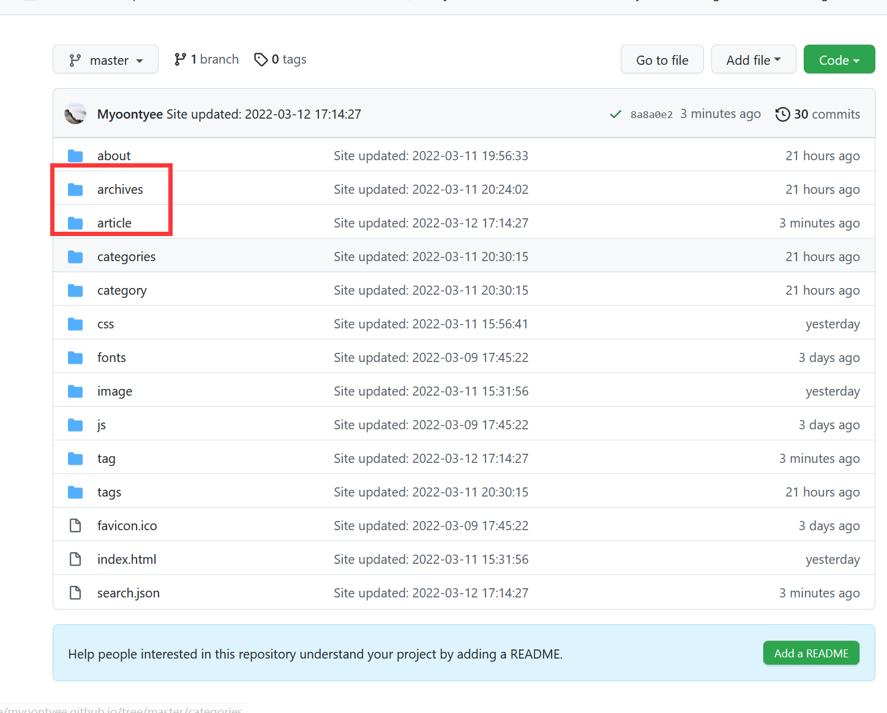
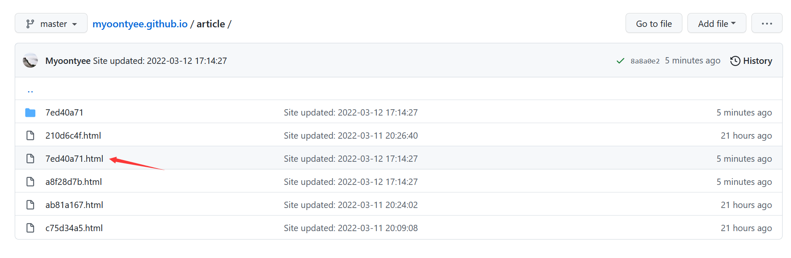
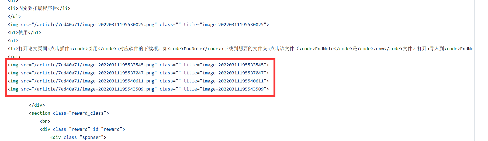

---

**创建时间**：2022年3月29日20:00:47
**最新更新**：2022年3月29日20:00:55

---

**核心思路**：

* 打开`GitHub`对应代码仓
* 打开对应页面生成的`.html`文件
* 根据正文找到对应代码内容

---

# 打开页面.html文件
* 打开对应代码仓，打开对应文件夹，默认是`archives`，我设置成了`article`→打开对应页面`.html`文件→根据自己写的内容找到图片引用的对应代码句，可对图片引用路径进行检测
	* 这个是在根目录下的配置文件`_config.yml`中的`permalink: article/:abbrlink.html`这一句处修改，具体见

