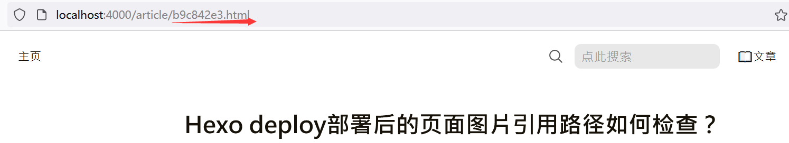
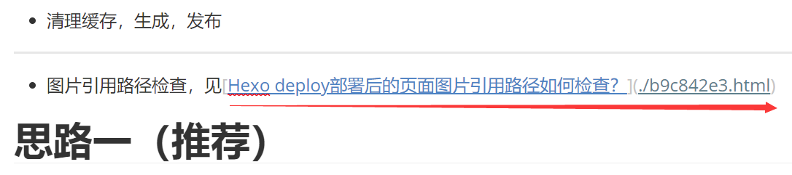
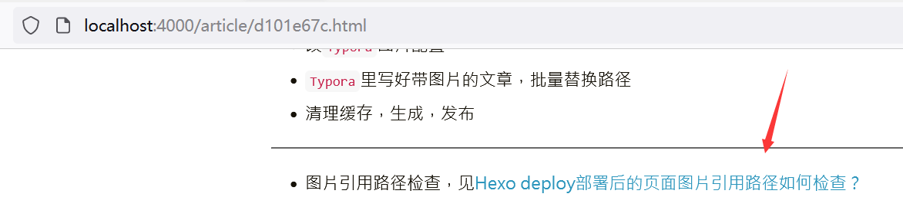
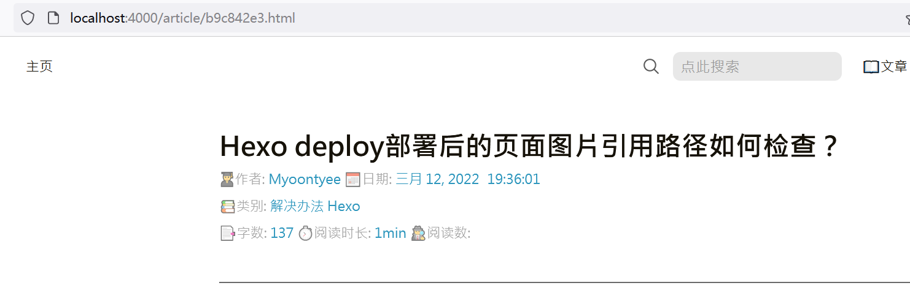

---

**创建时间**：2022年3月30日20:01:37
**最新更新**：2022年3月30日20:01:41

---

**核心思路**：
* 因为在同一个文件夹，可以用链接网页的方式，如`[想显示的内容](./+对应页面名)`

---

# 内容配置
* 填入`[想显示的内容](./+对应页面名)`

* 清理缓存，生成，预览，在`Git-Bash`上输入如下指令
	* `hexo clean && hexo s -g`

# 效果
* 按下图点击这个链接，得到下下图，跳转过来了

