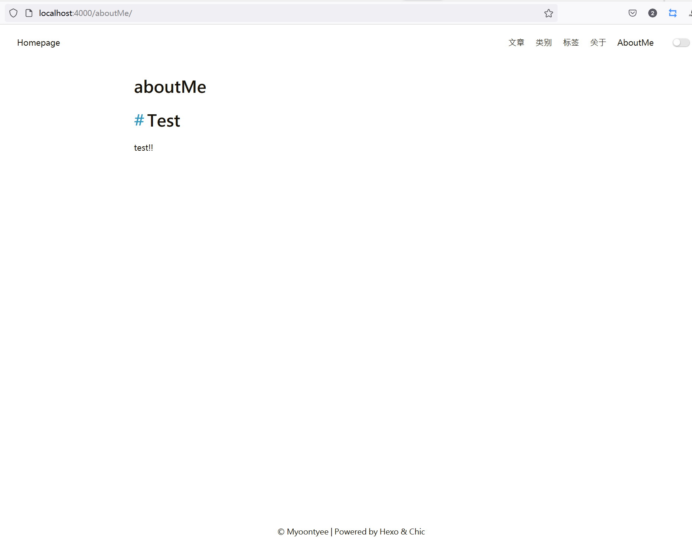

---

**创建时间**：2022年3月29日23:27:31
**最新更新**：2022年3月29日23:27:37

---

**核心思路**：

* hexo new page`+页面名
  * 如`hexo new page about`

* 配置Blog源码根目录下`_config.yml`文件

* 配置Blog使用的模板目录下的`_config.yml`文件

* 配置对应页面内容

---

# 新建页面

* 以管理员模式打开`Git-Bash`，进入到存放Blog源码文件的根目录，输入`hexo new page`+页面名
	* 如`hexo new page aboutMe`

* 用代码编辑器打开对应的文件夹，此处以`Chic`主题为例，打开`./themes/Chic/_config.yml`（注意**不是**根目录下的`_config.yml`），按下图方式配置，`nav: `后添加`AboutMe: /aboutMe`
	* 前面那个`AboutMe`代表首页可以看到的栏目名，也就是下下图右上角那个
	* 后面那个`aboutMe`代表对应文件存放的路径，我们要做具体修改，**要注意大小写**

# 配置页面内容

* 在代码编译器内，打开`./source/aboutMe/index.md`，添加`type: `行，如此处`type: about`，当然也可以有别的`type`，比如`tag`，按你希望的来。添加部分内容，保存，本地效果如下图

* 可以推送到对应的代码仓了

# 参考

* [Hexo 框架 Next 主题添加自定义 Page](https://www.playpi.org/2017050701.html)
