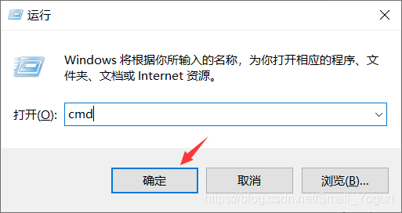
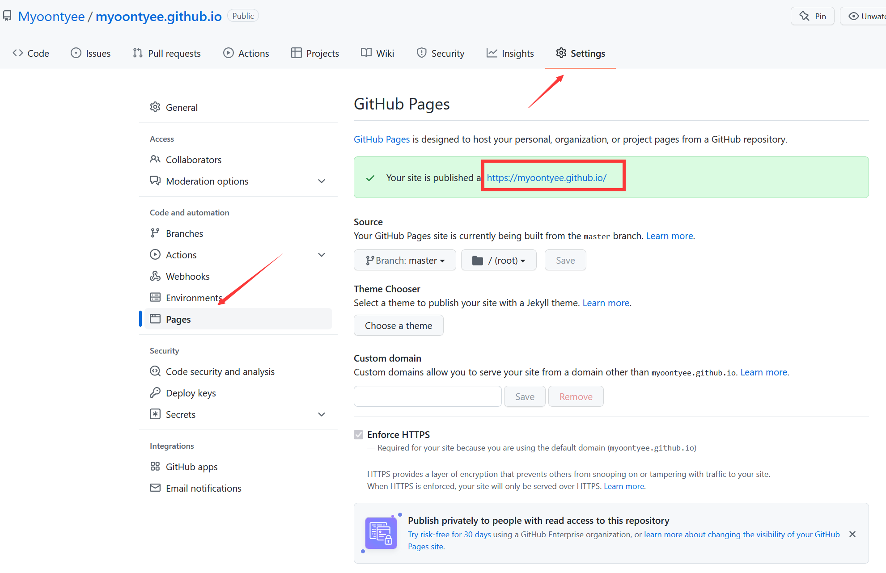

---

**创建时间**：2022年3月28日22:30:41
**最新更新**：2022年3月29日20:13:53


---

**报错信息**：GitHub无法访问，报403错误

解决方法见[Git-Bash，WSL2内GitHub无法访问、443 Operation timed out的解决办法](./7faf135d.html)

---

# 在Windows下部署Git
* [Git下载地址](https://git-scm.com/)
* 或可以在下载GitHub-Desktop时，会一并安装

> 本节内的下部分内容，来自`学为所用（博客园）`，链接见Ref

* 下载软件，见[下载页面](https://git-scm.com/downloads)


* 安装，记得修改路径


> * 下图红框内的选项是默认勾选的，建议不要动。绿色框1是决定是否在桌面创建快捷方式的。绿色框2是决定在所有控制台窗口中使用TrueType字体和是否每天检查Git是否有Windows更新的。这些根据自己需要选择。

> * 点击“Next”按钮进入下图界面


* 选择开始菜单


* 选择默认编译器


* 配置PATH环境

> * 这个界面是调整您的PATH环境。
> * 第一种配置是“仅从Git Bash使用Git”。这是最安全的选择，因为您的PATH根本不会被修改。您只能使用 Git Bash 的 Git 命令行工具。但是这将不能通过第三方软件使用。
> * 第二种配置是“从命令行以及第三方软件进行Git”。该选项被认为是安全的，因为它仅向PATH添加了一些最小的Git包装器，以避免使用可选的Unix工具造成环境混乱。  
> * 您将能够从Git Bash，命令提示符和Windows PowerShell以及在PATH中寻找Git的任何第三方软件中使用Git。这也是推荐的选项。
> * 第三种配置是“从命令提示符使用Git和可选的Unix工具”。警告：这将覆盖Windows工具，如 “ find 和 sort ”。只有在了解其含义后才使用此选项。
> * 建议选择推荐的选项第二种配置


* 选择HTTPS后端传输

> * 这个界面是选择HTTPS后端传输。
> * 第一个选项是“使用 OpenSSL 库”。服务器证书将使用ca-bundle.crt文件进行验证。这也是我们常用的选项。
> * 第二个选项是“使用本地 Windows 安全通道库”。服务器证书将使用Windows证书存储验证。此选项还允许您使用公司的内部根CA证书，例如通过Active Directory Domain Services 。
> * 建议使用默认选项第一项


* 配置行尾符号转换

> * 这个界面是配置行尾符号转换。
> * 第一个选项是“签出Windows风格，提交Unix风格的行尾”。签出文本文件时，Git会将LF转换为CRLF。提交文本文件时，CRLF将转换为LF。对于跨平台项目，这是Windows上的推荐设置（“ core.autocrlf”设置为“ true”）
> * 第二个选项是“按原样签出，提交Unix样式的行尾”。签出文本文件时，Git不会执行任何转换。 提交文本文件时，CRLF将转换为LF。对于跨平台项目，这是Unix上的建议设置（“ core.autocrlf”设置为“ input”）
> * 第三种选项是“按原样签出，按原样提交”。当签出或提交文本文件时，Git不会执行任何转换。不建议跨平台项目选择此选项（“ core.autocrlf”设置为“ false”）
> * 建议选择第一种选项


* 配置终端模拟器以与Git Bash一起使用

> * 这个界面是配置终端模拟器以与Git Bash一起使用。
> * 第一个选项是“使用MinTTY（MSYS2的默认终端）”。Git Bash将使用MinTTY作为终端模拟器，该模拟器具有可调整大小的窗口，非矩形选择和Unicode字体。Windows控制台程序（例如交互式Python）必须通过“ winpty”启动才能在MinTTY中运行。
> * 第二个选项是“使用Windows的默认控制台窗口”。Git将使用Windows的默认控制台窗口（“cmd.exe”），该窗口可以与Win32控制台程序（如交互式Python或node.js）一起使用，但默认的回滚非常有限，需要配置为使用unicode 字体以正确显示非ASCII字符，并且在Windows 10之前，其窗口不能自由调整大小，并且只允许矩形文本选择。
> * 建议选择默认的第一种选项


* 配置配置额外的选项

> * 这个界面是配置配置额外的选项。
> * 第一个选项是“启用文件系统缓存”。文件系统数据将被批量读取并缓存在内存中用于某些操作（“core.fscache”设置为“true”）。 这提供了显著的性能提升。
> * 第二个选项是“启用Git凭证管理器”。Windows的Git凭证管理器为Windows提供安全的Git凭证存储，最显着的是对Visual Studio Team Services和GitHub的多因素身份验证支持。 （需要.NET Framework v4.5.1或更高版本）。
> * 第三个选项是“启用符号链接”。启用符号链接（需要SeCreateSymbolicLink权限）。请注意，现有存储库不受此设置的影响。
> * 建议勾选默认的第一、第二选项


* 配置实验选项，点击`Next`，等待安装完成

> * 这个界面是配置实验选项。
> * 启用实验性的内置添加 -i / -p。（新！）使用实验性的内置交互式add（“ git add -i”或“ git add -p”）。这使其速度更快（尤其是启动！），但尚未被认为是可靠的。
> * 默认不勾选


# 在Windows下部署Node.js

> 此部分内容，部分图片来自`蜡笔小柯南（CSDN）`，链接见Ref


* 下载并安装node.js，[node.js下载页面](https://nodejs.org/en/)，记得修改安装目录


* 安装选择默认选项即可


* 检查一下环境变量是否写入，`win`+`R`打开运行→输入`cmd`→回车→`node -v`与`npm -v`查看对应版本
  * 若无报错信息，意味着配置完成




# Hexo部署

* 先做好这两步
	* [npm无法在PowerShell运行解决办法](./4add822c.html)
	* [[Windows Terminal如何以管理员模式打开对应的Bash？]]


* 如果在管理员模式下的`Windows Terminal`内输入`node -v`与`npm -v`如下正常显示后，意味着环境变量配置完成


* 安装Hexo，在管理员模式下的PowerShell内，进入到对应路径，输入如下指令

```PowerShell
npm install -g hexo
```

* 为了在下面步骤中顺利使用`hexo d`指令，需要安装`hexo-deployer-git`，在管理员模式下的PowerShell内，输入如下指令
	* [[ERROR Deployer not found报错解决]]


```PowerShell
npm install hexo-deployer-git --save
```

# GitHub新建含GitHub Pages的代码仓
[[如何使用GitHub搭建个人网站，博客，blog？]]

* 创建一个新的代码仓，必须选用`Public`
	* 
* 创建代码仓后，进入`Settings`→`Options`→`GitHub Pages`→`Check it out here!`或者直接`Settings`→`Pages`
	* 
	* 
* 选择一个`Theme`，另外页面的访问网址也在此
	* 
	* 


* 通过`Git-Bash`进入空文件夹，将上述代码仓`git clone`到本地对应路径

# 本地创建个人blog环境
* 记得要完成这个[[Windows Terminal如何以管理员模式打开对应的Bash？]]

* 以管理员模式打开`Git-Bash`，进入你想要存放blog源码的文件夹，输入`hexo init`，然后将上一步里头，`git clone`下来的`GitHub Pages`源码内的`.git`文件夹，复制粘贴到你进行`hexo init`的文件夹，这一步是为了实现blog源码的备份
	* 具体见[GitHub+Hexo的个人博客，blog，GitHub Page如何实现一个分支作为博客源码，一个分支用于全部源码备份？](./f338e400.html)


* 在[Themes | Hexo](https://hexo.io/themes/)内挑选喜欢的Theme，左键点击对应Theme→进入对应GitHub页面→进入一个空文件夹→输入`hexo init`→在`Git-Bash`内`cd blog文件夹/themes`→`git clone 对应模板`
	* 例如`git clone https://github.com/Siricee/hexo-theme-Chic.git Chic`


* 进行配置，此时你有2类`_config.yml`
	* 一类在你存放blog源码的根目录下
	* 一类存放在`./themes/对应主题`下，如`./themes/Chic/`下
* 对根目录下配置文件`_config.yml`进行配置，此处仅讲必要的设置，`title`等个性化设置可以自行摸索，设置完记得`Ctrl`+`S`保存
	* `url: `后填写`GitHub Pages`的`publish site`，见GitHub代码仓→`Settings`→`Pages`，记住此处的`Source`要正确选择`branch`
	* `theme: `后填写你选中的主题的项目名，比如此处是`Chic`
	* `deploy: `后新建3行
		* `type: `填写`git`
		* `repo: `填写你代码仓的地址
		* `branch: `填写对应的分支，这个分支用于`hexo`上传网页源码用
			* 注意我们这边有2种上传，一种是`hexo d`，一种是`git push`
				* `hexo d`用于提供网页显示的源码，通常在代码仓默认分支
				* `git push`用于保存全部blog源码，通常在代码仓非默认分支




* 回到管理员模式打开的`Git-Bash`，准备部署blog，cd到存放Blog源码的根目录→输入`hexo clean`→`hexo s -g`部署并启动本地预览→在浏览器里打开`https://localhost:4000`即可看到部署的个人页面→回到`Git-Bash`→`Ctrl`+`C`停止预览→`hexo d`将源码上传到对应代码仓

* 点开代码仓右下角可以查看编译进度，等`pending`变为`Active`即可，点击右侧`View deployment`即可进入自己的blog查看


# 分支备份源码思路
[GitHub+Hexo的个人博客，blog，GitHub Page如何实现一个分支作为博客源码，一个分支用于全部源码备份？](./f338e400.html)


# Ref
* [Windows系统Git安装教程（详解Git安装过程）](https://www.cnblogs.com/xueweisuoyong/p/11914045.html)
* [Node.js最新最详细安装教程（2020）](https://blog.csdn.net/Small_Yogurt/article/details/104968169)
* [hexo:ERROR Deployer not found: github](https://stackoverflow.com/questions/34452547/hexoerror-deployer-not-found-github)
