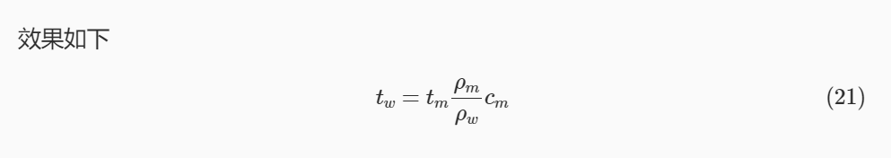

---

**创建时间**：2022年4月12日10:00:13
**最新更新**：2022年4月12日10:01:45

---

**Problem Description**：Obsidian adds formula serial number

**核心思路**：`\tag`的使用，注意和`Hexo`不同


---


# 加序号
* 语法是`\tag {`+序号+`}`
```markdown
$$
\begin{equation} \tag{21}
t_{w}=t_{m} \frac{\rho_{m}}{\rho_{w}} c_{m}
\end{equation}
$$
```

* 效果如下



# Ref
* [Automatic equation numbering (Latex Math)](https://forum.obsidian.md/t/automatic-equation-numbering-latex-math/1325)
