---

**创建时间**：2022年4月30日14:16:55
**最新更新**：2022年5月1日13:10:21

---

**Problem Description**：Overleaf + Docker local configuration tutorial

**核心思路**：
* 拉镜像，环境配置
* 调整配置文件，使用测试一下
* 安装完整环境
* 添加中文样式支持

---

# 拉镜像，配环境
* 启动`Docker`服务（我就直接打开他GUI端，因为我平常禁止他自启动）
	* 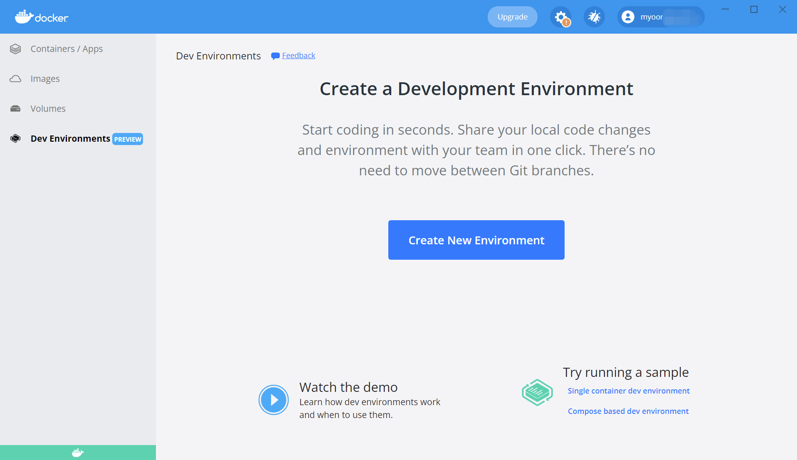
* 打开`WSL`的`Bash`，输入`docker pull sharelatex/sharelatex`，等待`pull`完成
	* 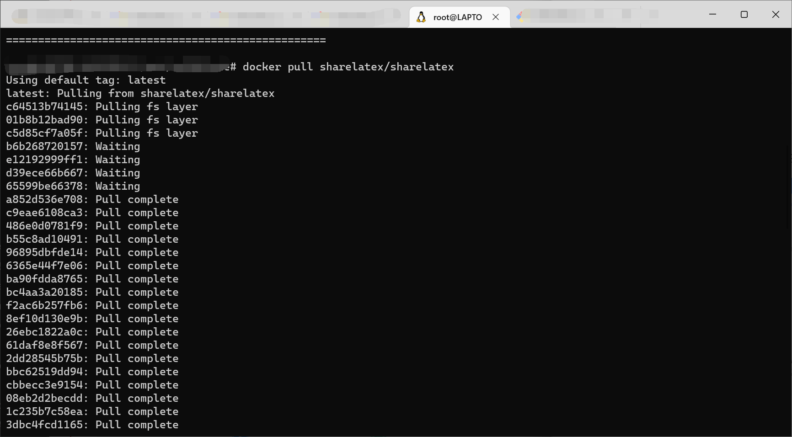
* 在`Bash`内输入`mkdir ~/sharelatex/ ~/sharelatex_data/ ~/mongo_data/ ~/redis_data/`创建4个文件夹到`\\wsl$\Ubuntu-20.04\root`下头
	* 这一步据说是为了根据官网创建了文件夹来挂载容器中的文件夹
* 下载这个`docker-compose.yml`到`~/sharelatex`里头，就上面创建的那个
	* 修改`~/sharelatex`里头第15行，改为不冲突的端口，我改为`8080`，即如下表，记得保存

<div style="overflow:auto;width:100%"> <table width="auto" style="white-space:nowrap">
<tr>
<td> <div align = center> <strong>修改前</strong></div> </td> <td> <div align = center> <strong>修改后</strong></div> </td>
</tr>
<tr>
<td>
```yml
ports:
            - 80:80
```
</td>
<td>
```yml
ports:
            - 8080:80
```
</td>
</table>
</div>

* 在`bash`内进入到`\\wsl$\Ubuntu-20.04\root\sharelatex`这个文件夹
* 输入`docker-compose up -d`下载对应的东西
	* 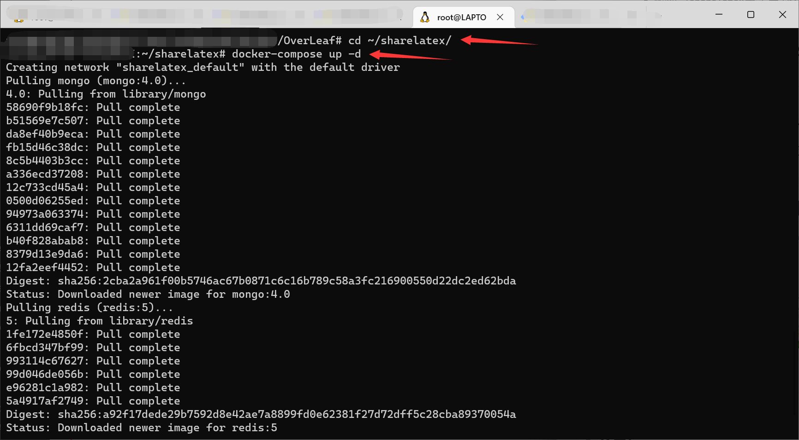

# 试着用一下！

* 在浏览器里打开`http://127.0.0.1:8080/launchpad`注册管理员账号
	* 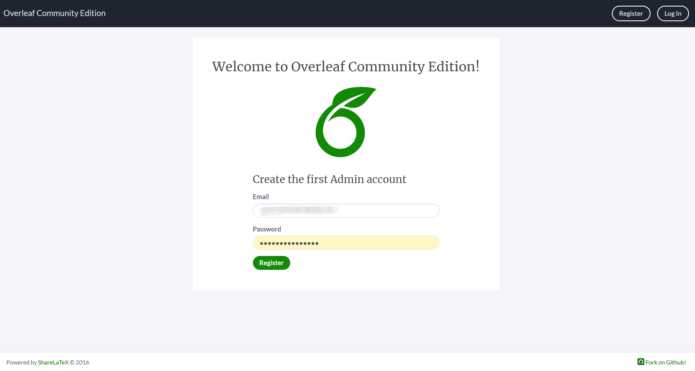
* 然后可以先开个项目试试看，点`Start Using Overleaf Community Edition`→`New Project`→`Example Project`→起个你喜欢的名儿→`Create`
	* 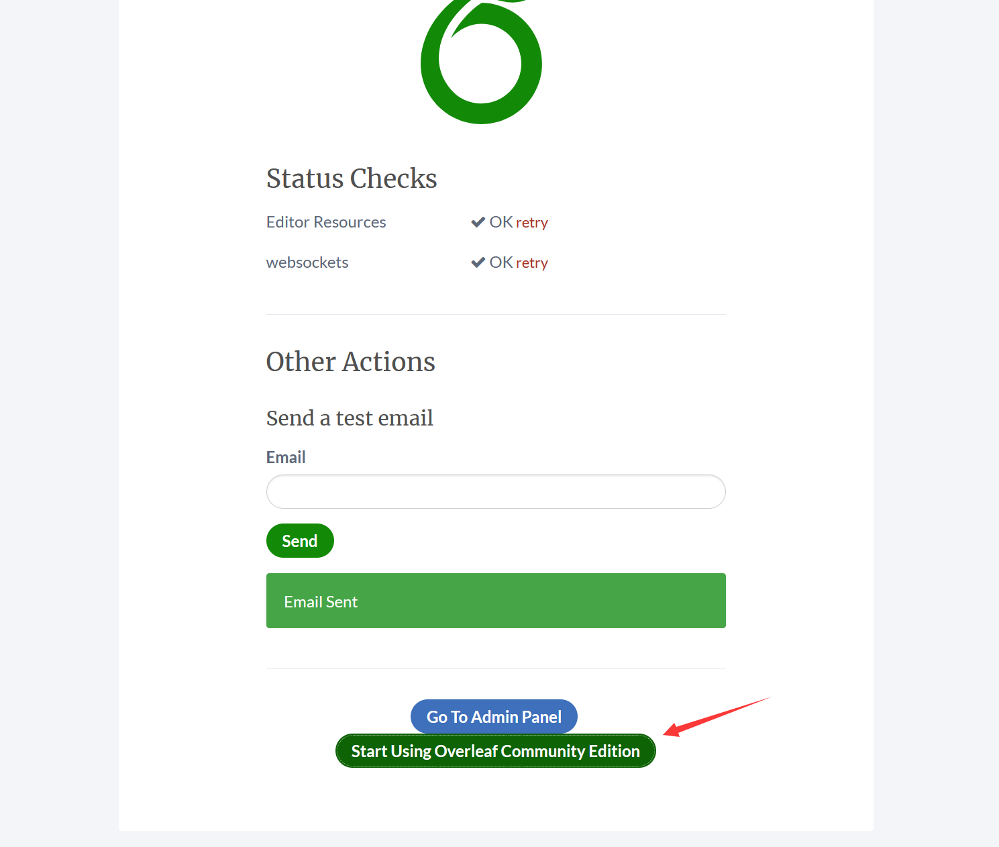
	* 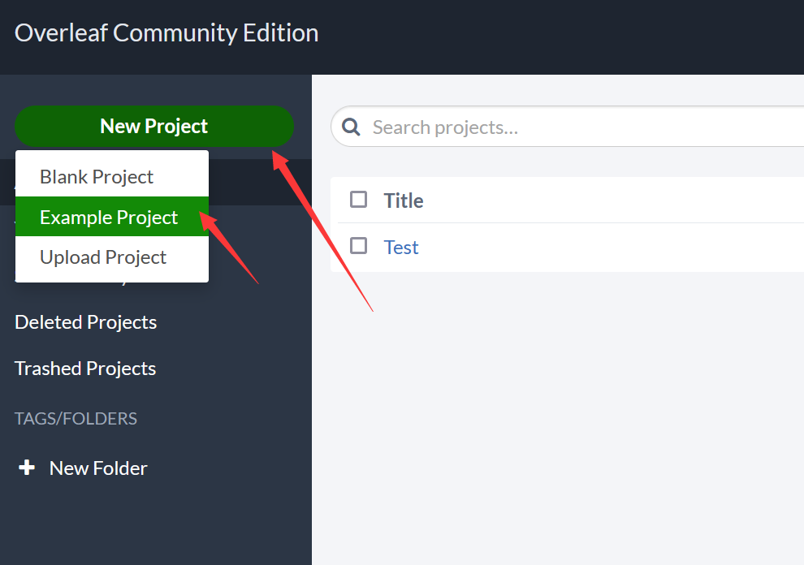
	* 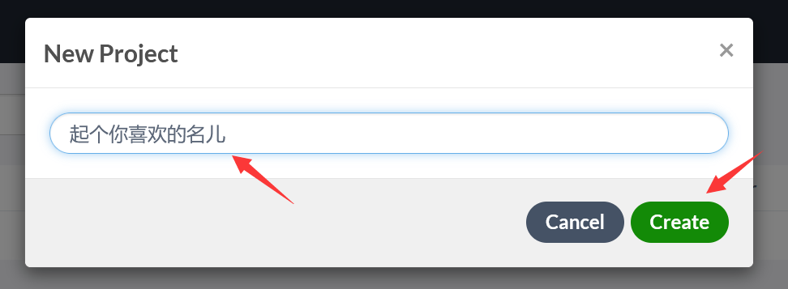
* 如下图，看着很棒，那么我们进一步配置，安装更完整的环境
	* 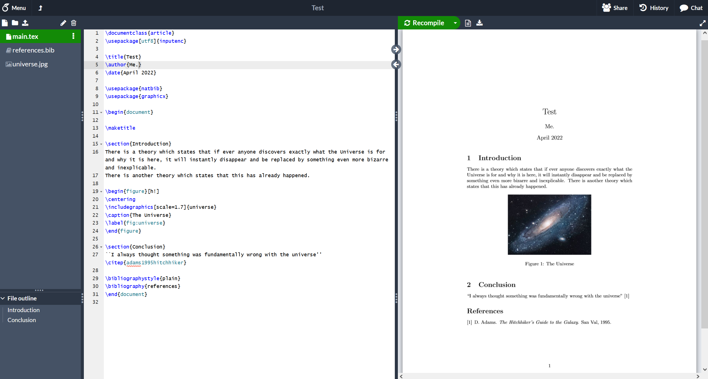

# 进一步配置

## 完善你的环境，完整宏包支持（完整版TexLive）

* 这一步我们要先进入容器的`Bash`
	* 在`WSL`的`Bash`内输入

```bash
docker exec -it sharelatex bash
```

* 进完容器的`Bash`，再进入容器的`TexLive`所在文件夹
	* 在`Bash`内输入

```bash
cd /usr/local/texlive
```
* 上2步操作如下图
	* 
	* 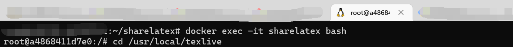
* 执行以下命令，开始更新
	* 下面这些命令我直接搬运的[这个小伙子的](https://www.zhang-hb.com/2022/01/01/%E5%9C%A8%E8%87%AA%E5%B7%B1%E7%9A%84%E6%9C%8D%E5%8A%A1%E5%99%A8%E4%B8%8A%E9%85%8Doverleaf/)

```bash
# 下载并运行升级脚本
wget http://mirror.ctan.org/systems/texlive/tlnet/update-tlmgr-latest.sh
sh update-tlmgr-latest.sh -- --upgrade

# 更换texlive的下载源
tlmgr option repository https://mirrors.sustech.edu.cn/CTAN/systems/texlive/tlnet/

# 升级tlmgr
tlmgr update --self --all

# 安装完整版texlive（漫长的等待，不要让shell断开）
tlmgr install scheme-full

# 退出sharelatex的命令行界面
exit
```
* 如下图，要蛮久的，特别那个装`TexLive`，可以睡一觉！
	* 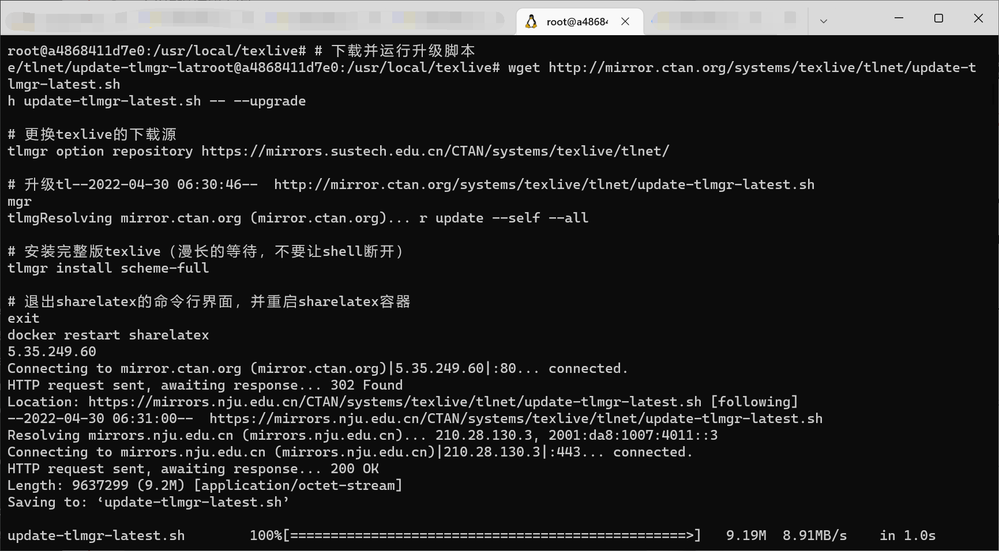

* 在`Bash`内输入如下指令重启`sharelatex`容器
```bash
docker restart sharelatex
```

## 支持中文字体，省的学位论文哭爹喊娘
### 创建文件夹
* 先进入`sharelatex`这个容器，创建一个文件夹`/usr/share/fonts/windows`
	* 在`WSL`的`Bash`内输入如下指令，进入`sharelatex`这个容器的`bash`
		* 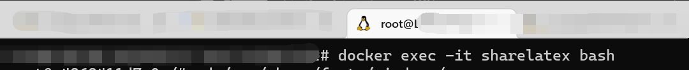

```bash
docker exec -it sharelatex bash
```

* 创建文件夹，在`sharelatex`这个容器的`bash`内输入

```bash
cd /usr/share/fonts
mkdir windows
```

### 复制字体样式
* 在`Bash`内输入如下指令退出容器
	* 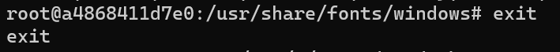

```bash
exit
```
* 在`Bash`内输入如下指令看一下`sharelatex/sharelatex`对应的`CONTAINER ID`
	* 比如我对应的`CONTAINER ID`是`a4868411d7e0`
	* 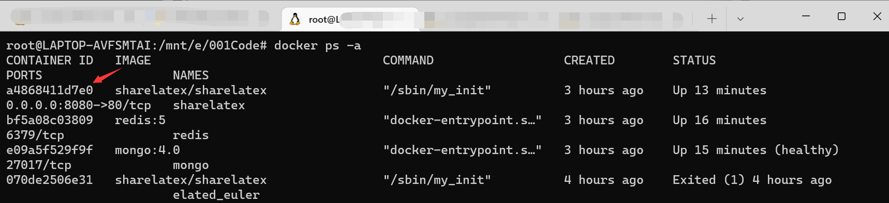

```bash
docker ps -a
```
* 在`Bash`内继续输入如下指令，复制字体

```bash
sudo docker cp /mnt/c/Windows/Fonts 你的sharelatex的CONTAINER ID:/usr/share/fonts/windows
```

* 比如我的是

```bash
sudo docker cp /mnt/c/Windows/Fonts a4868411d7e0:/usr/share/fonts/windows
```

### 安装并检查
* 在`Bash`内输入如下指令，进入`sharelatex`这个容器的`bash`，安装字体文件

```bash
docker exec -it sharelatex bash 
cd /usr/share/fonts/windows
fc-cache
```

* 检查有没有安装成功，在`Bash`内输入以下指令，像下图这样就成了，可以上`Overleaf`里头冲浪了
	* 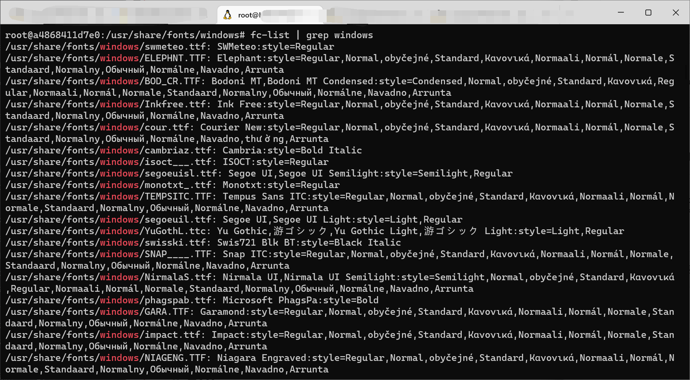
```bash
fc-list | grep windows
```


# 关了重开咋整

* 在`Docker`的`Containers/Apps`页面，如下图，平常不用关掉，下次要用时候这4个挨个`START`就行
	* 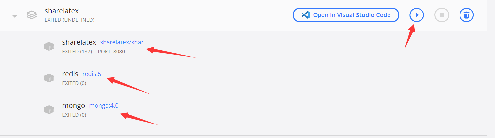


# Ref

* [在自己的服务器上配overleaf](https://www.zhang-hb.com/2022/01/01/%E5%9C%A8%E8%87%AA%E5%B7%B1%E7%9A%84%E6%9C%8D%E5%8A%A1%E5%99%A8%E4%B8%8A%E9%85%8Doverleaf/)
* [如何在docker和宿主机之间复制文件](https://blog.csdn.net/xtfge0915/article/details/52169445)
