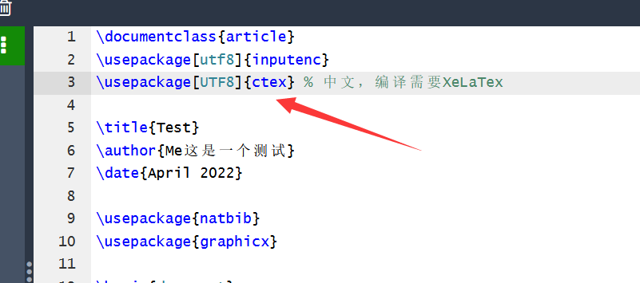
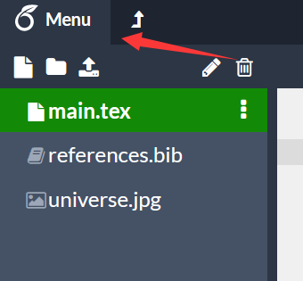
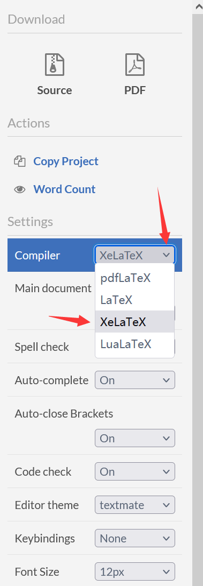
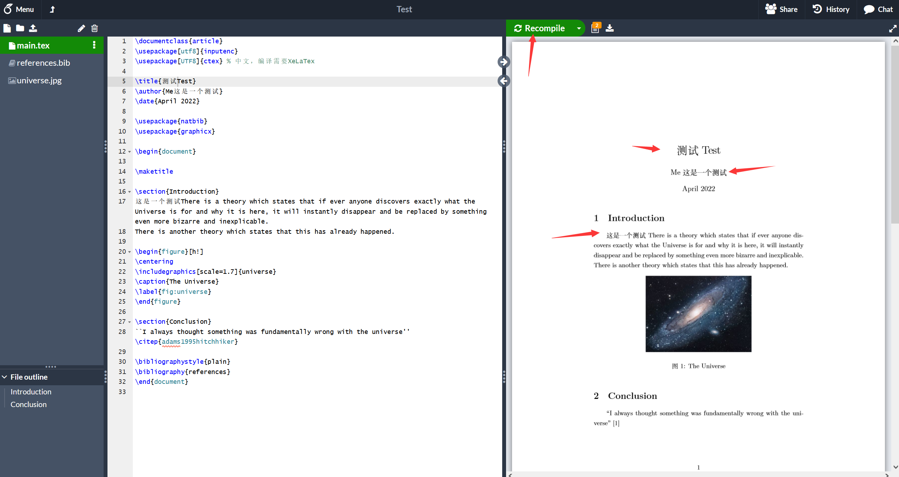

---

**创建时间**：2022年4月30日17:47:37
**最新更新**：2022年4月30日17:54:00

---

**Problem Description**：How does Overleaf use Chinese?

**核心思路**：
* 添加`\usepackage[UTF8]{ctex}`
* 在菜单设置编辑器为`XeLaTex`

---

# 配置
## 调用库
* 调用库`\usepackage[UTF8]{ctex}`
	* 

## 配置编译器
* 配置编译器，点击`Menu`→`∨`→`XeLaTeX`
	* 
	* 

# 编译一下试试
* 点一下`Recompile`，如下图，可以使用中文了
	* 
# Ref
* [overleaf使用问题 - 导入本地模板 、中文的使用](https://blog.csdn.net/FrankAx/article/details/107519135)
