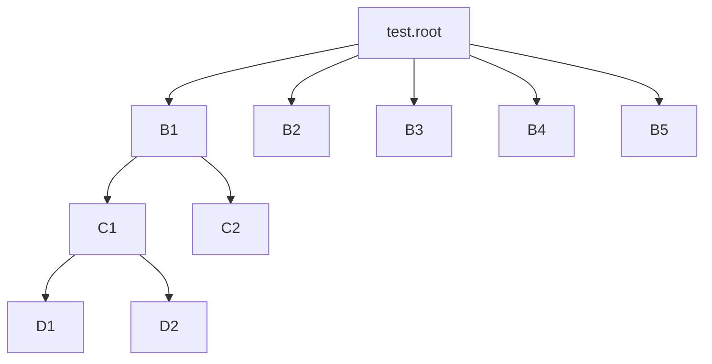

---

**创建时间**：2022年3月23日10:09:53
**最新更新**：2022年3月23日10:28:35


---

**核心思路**：`uproot`和`uproot3`是两个库，`uproot`库好用点，用`uproot`库读一下数据，转换成`DataFrame`

---

# 导入库
```Python
import uproot
import numpy as np
import pandas as pd
```

# 读取.root文件
```Python
file = uproot.open('./test.root')
```

# 查看索引
* 查看索引与你设计的数据存储形式有关
* 假设的文件结构如下




## 查看根级索引
* 查看根层级下的索引
```Python
file.keys()
```
* 示例的返回
```bash
['B1;1',
 'B2;1',
 'B3;1',
 'B4;1',
 'B5;1',]
```


## 查看子级索引
* 类似`pandas`的用法
```Python
file['B1;1'].keys()
```
* 示例的返回
```bash
['C1;1',
 'C2;1',]
```

* 更下一级的查看，可以使用以下形式

```Python
file['B1;1']['C1;1']
```
* 示例的返回
```bash
['D1;1',
 'D2;1',]
```

# 查看对应目录下的数据
* 两种方法


## 法1
```Python
file['B2;1'].arrays()
```
* 示例的返回

```Bash
<Array [{Energy: 10}] type='1 * {"Energy": float64}'>
```

## 法2
```Python
file['B2;1'].array()
```

* 示例的返回
```Bash
<Array [10] type='1 * float64'>
```


# 批量转换为DataFrame格式
* 下述代码将根层级下的`B2`，`B3`，`B4`，`B5`批量导出转换为`DataFrame`形式
```Python
df = pd.DataFrame(file.arrays(   
        ['B2;1',
         'B3;1',
         'B4;1',
         'B5;1',],
      		library="pd"))
```

* 下述代码将`B1`子层级下的`C1`，`C2`批量导出转换为`DataFrame`格式
```Python
df = pd.DataFrame(file['B1;1'].arrays(   
        ['C1;1',
         'C2;1',],
      		library="pd"))
```


# 整体代码
```Python
import uproot
import numpy as np
import pandas as pd

file.keys()

df = pd.DataFrame()
df = pd.DataFrame(file.arrays(   
        ['B2;1',
         'B3;1',
         'B4;1',
         'B5;1',],
      		library="pd"))

df.to_csv('./test.csv')
```


# Ref

* [uproot document](https://uproot.readthedocs.io/en/latest/basic.html)
