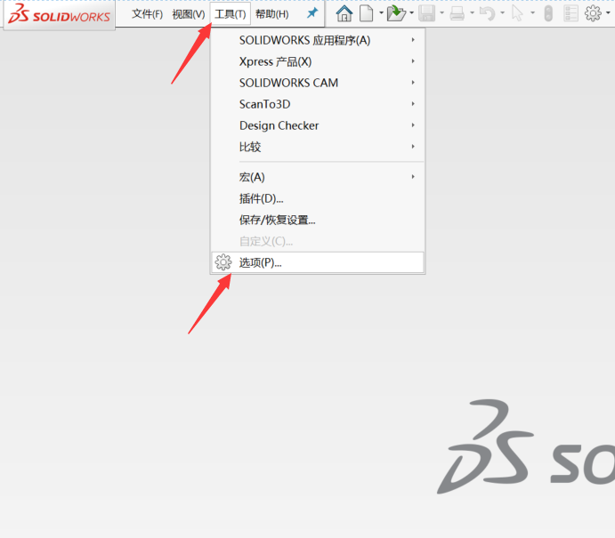
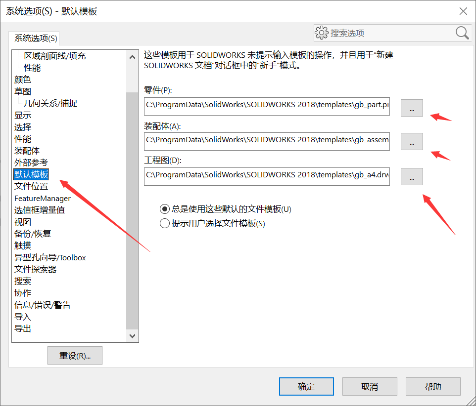
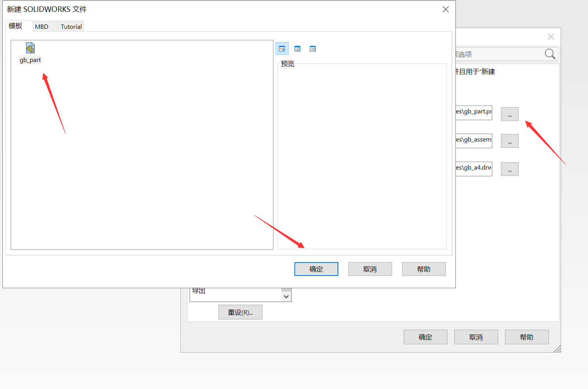
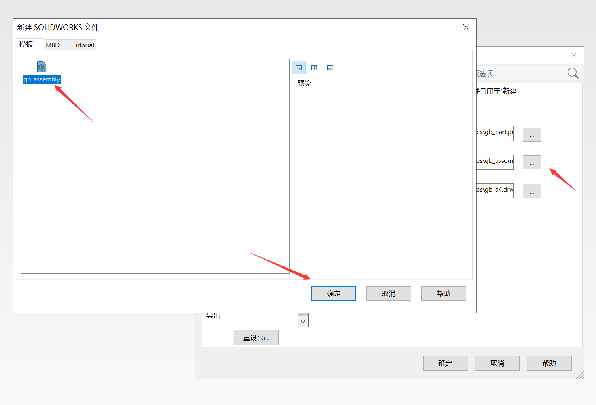
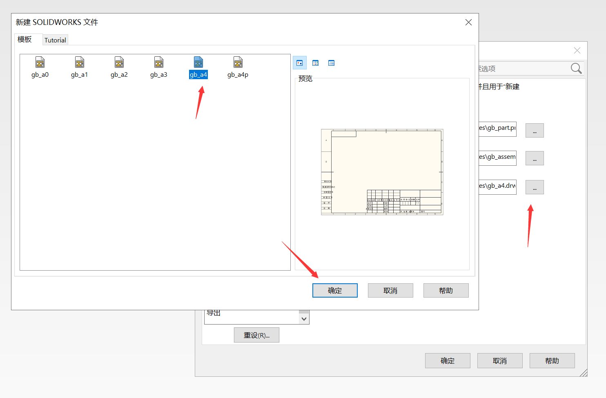

---

**创建时间**：2022年4月23日10:49:34
**最新更新**：2022年4月23日10:50:09

---

**Problem Description**：SolidWorks new assembly, engineering drawings can still only open parts, but also prompted the default template is invalid, how to deal with?

**核心思路**：具体定义一下默认模板即可

---

# 设置默认模板

* 打开设置区，点击`工具`→`选项`→`默认模板`→挨个点`...`选模板
  * 
  * 
  * 
  * 
    

* 工程图一般用A4模板，方便打印
  * 

# Ref

* [SolidWorks常见问题精选100问：1默认模板无效，无法新建和打开step模型](http://xifengboke.com/post/1211.html)
