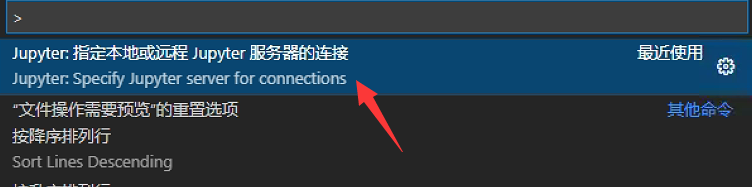
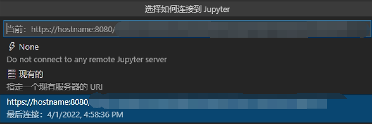
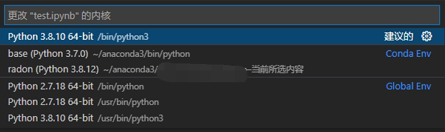

---

**创建时间**：2022年4月1日17:01:00
**最新更新**：2022年4月1日17:05:02

---

**核心思路**：`Jupyter:指定本地或远程Jupyter服务器的连接`

---

# 配置方案

* 在`Visual Studio Code`内，通过ssh连上远程主机后，按`Ctrl`+`Shift`+`P`，选`Jupyter:指定本地或远程Jupyter服务器的连接`，接下来选默认的那个，回车，就能选kernel了

# 成功效果
* 如下图，可以正常选择kernel。

# Ref
* [Vscode连接通过ssh远程调试jupyter内核错误！](https://blog.csdn.net/sinat_33909696/article/details/117405827)
