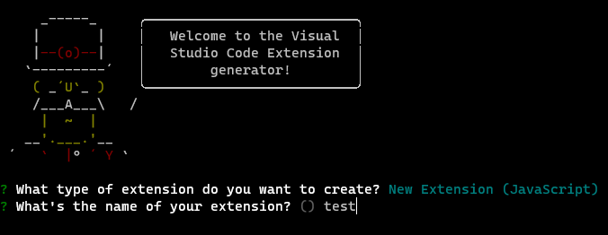

---

**创建时间**：2022年4月28日17:47:58
**最新更新**：2022年4月29日11:43:49

---

**Problem Description**：How do I compile plugin source code for Visual Studio Code? How do I do secondary development?

**核心思路**：
* 装`yo`和`generator-code`脚手架
* 装`yarn`（装完的这步不用，没装的等下当场报错跟你讲）
* 装`vsce`（可能报错，博文里给出了2种指令）
* 编译`.vsix`
* 通过`.vsix`给`Visual Studio Code`装插件

---

# 装必备插件
* 打开`Bash`（我用的`Git-Bash`），输入如下指令

```bash
npm install -g yo generator-code
```

## 你要有源码不用干这步：自己初始化一个项目，你也可以yo一下
* 你如果想自己搞一个新的插件项目，你就在`Bash`输入如下指令
	* 按照你的需求选，你也可以依次选择，下面是一个示例
	  * `New Extension (JavaScript)`
	  * 设你想要的插件名
	  * 设你想要的项目名，或者直接用括号里的
	  * 写你对插件的描述
	  * 在js文件中启动语义检测，`jsconfig.json`中`compilerOptions.checkJs`会变为`true`：`Y`
	  * 是否初始化`Git`仓库：`Y`
	  * 选你想要的包管理方式：`yarn`
	* 各个选项的区别
	  * `New Extension (TypeScript)` ：`TypeScript`语法的项目，内置hello world命令
	  * `New Extension (JavaScript)` : `JavaScript`语法的项目，内置了hello world命令
	  * `New Color Theme` ：主题项目，内置了主题，用于自定义主题
	  * `New Language Support`：语言支持项目，内置了语法支持配置，用于支持特殊语言
	  * `New Code Snippets`：代码片段项目，内置了代码片段配置，用于配置代码片段，输入触发字符，快速生成代码片段
	  * `New Keymap`：快捷键项目，内置了快捷键配置，用于自定义快捷键行为
	  * `New Extension Pack`：插件集合项目，内置了插件集合配置，用于定制插件集，可实现快速安装一组插件
	  * `New Language Pack (Localization)`：暂未查到


```bash
yo code
```

* 
* 
* 
* 
* 
* 
* 

# yarn
* 不装可能报错，在`Bash`里输入如下指令装`yarn`
	* 报错见[配置Visual Studio Code插件时提示'yarn' 不是内部或外部命令，也不是可运行的程序 解决办法](./a88b7358.html)

```bash
npm install -g yarn
```

# vsce
* 在`Bash`内输入如下指令安装`vsce`
	* 下面给出2个指令，一个不行就换另一个~
	* 我用`npm install -g vsce`会报错...用下面就行
```bash
npm install -g vsce
```

```bash
npm install --global vsce
```

# 编译出.vsix
* 进入你搞到的插件源码所在目录，如下图，在`Bash`内输入如下指令即可得到`.vsix`文件
	* 一个成功的示例如下下图

```bash
vsce package
```

* 
* 
* 编译出来长这样
	* 

# 给Visual Studio Code装插件
* 打开`Visual Studio Code`，点`扩展`→`···`→`从VSIX安装...`→选他→`安装`→安装成功后右下角会有提示，你也能在`扩展`里找到他
	* 
	* 
	* 

# Ref
* [vsce](https://www.npmjs.com/package/vsce)
* [记一次前端"vscode插件编写实战"超详细的分享会(建议收藏哦)(上篇)](https://segmentfault.com/a/1190000038553748)
* [从0到1开发一款自己的vscode插件](https://segmentfault.com/a/1190000040720760)
* [vscode插件开发指南(一)-理论篇](https://juejin.cn/post/6960626872791072798)
