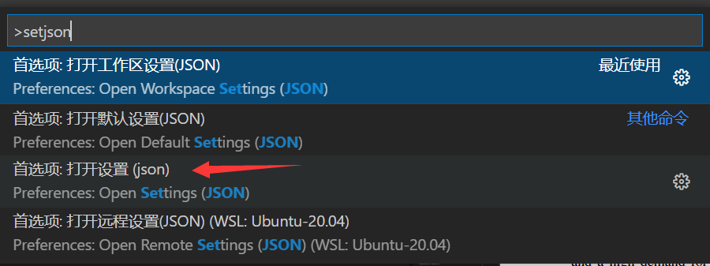

---

**创建时间**：2022年4月29日11:09:59
**最新更新**：2022年4月29日11:09:59

---

**Problem Description**：How to open settings.json file in Visual Studio Code

**核心思路**：<kbd>F1</kbd>或者<kbd>Ctrl</kbd>+<kbd>Shift</kbd>+<kbd>P</kbd>，再输入`setjson`

---

# 打开Visual Studio Code配置
* 在`Visual Studio Code`内按<kbd>F1</kbd>，输入`setjson`，选择`打开设置(json)`
	* <kbd>F1</kbd>这个快捷键冲突的话，就按<kbd>Ctrl</kbd>+<kbd>Shift</kbd>+<kbd>P</kbd>
	* 

# Ref
* [VSCode怎么打开settings.json文件](https://blog.csdn.net/weixin_43798960/article/details/109362907)
