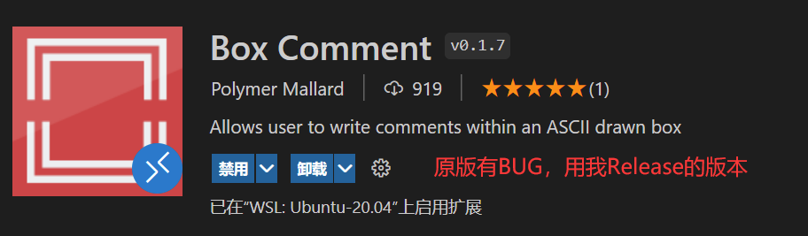
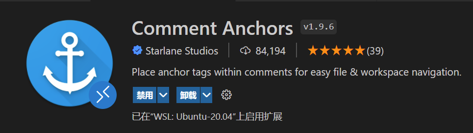
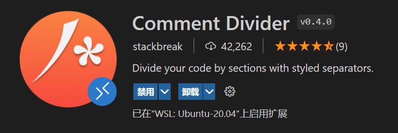
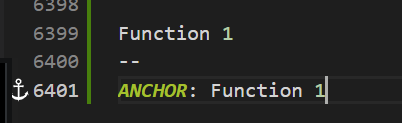
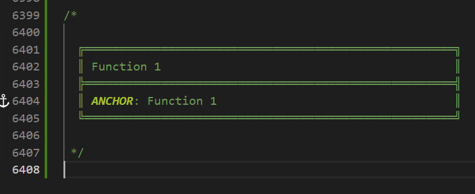
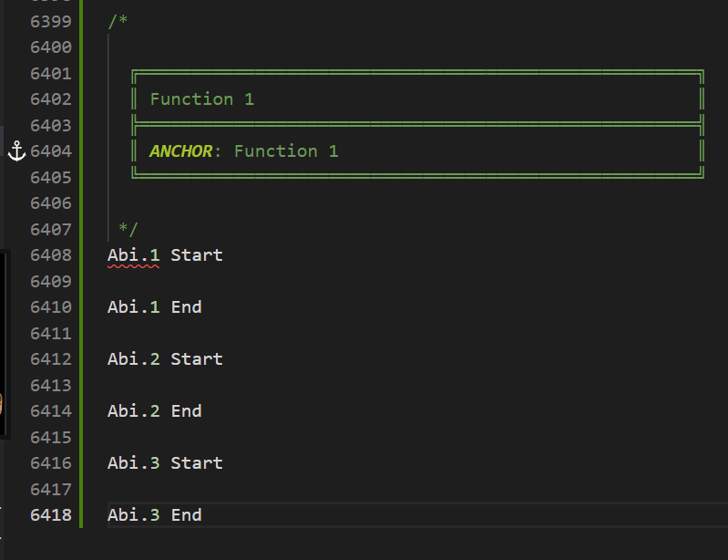
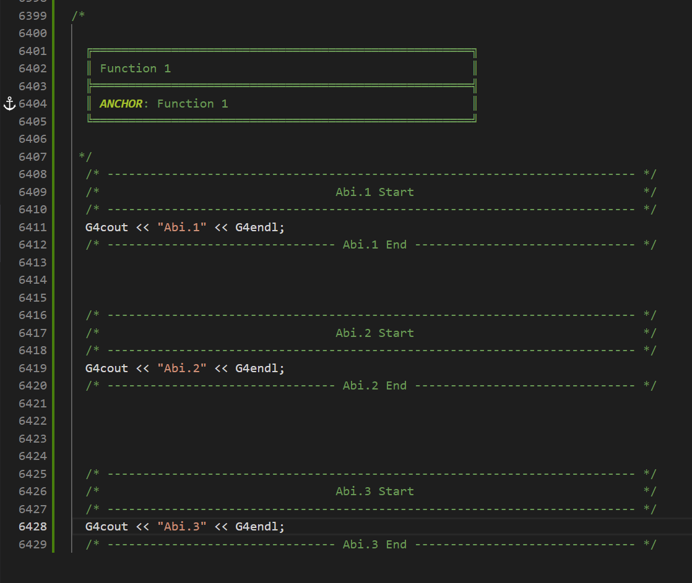
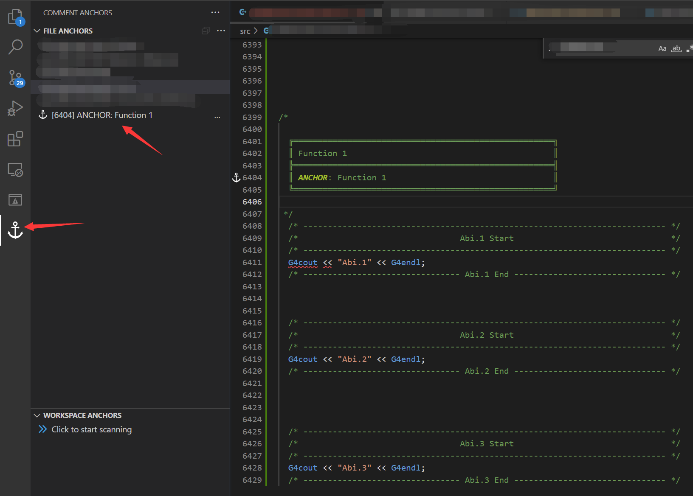

---

**创建时间**：2022年4月28日19:18:45
**最新更新**：2022年4月30日12:34:30

---

**Problem Description**：Visual Studio Code Comment plugin recommended configuration combination, does it enable fast code jumping within VS Code + multi-level beautiful comments?

**核心思路**：
* 几个插件
	* 快速跳转`Comment Anchors`
	* 代码注释分段`Comment Divider`
	* 代码Box注释`Box Comment`
		* `Comment Box`也行，就是感觉效果有待提高
* 按位置分
	* 功能块头用`Box Comment`+`Comment Anchors`注释并设定锚点
	* 内容分段用`Comment Divider`


---

# 插件介绍

* 见[Box Comment修复版Release——Visual Studio Code如何给注释块添加自定义的方框？如何添加带Box的美化注释块？](./dbacadce.html)

# 实现
* 现希望实现区分功能头与内容分段的代码注释，如
	* 代码块名字是`Function 1`
	* 代码块的锚点是`ANCHOR: Function 1`
	* 代码块有3段
		* 功能段1`Abi.1`
		* 功能段2`Abi.2`
		* 功能段3`Abi.3`
* 注释实现
	* 功能块头用`Box Comment`
	  * [我整的Release](https://github.com/Myoontyee/vscode-box-comment-withRelease/releases/tag/v1.0.0)
	  * 
	* 锚点用`Comment Anchors`
	  * 
	* 内容分段用`Comment Divider`
	  * 
	
* 实现步骤如下几图
	* 前面代码行数是个示例，不用管
		* 
	* 按快捷键<kbd>Ctrl</kbd>+<kbd>Shift</kbd>+<kbd>;</kbd>
		* 
	* 功能块`Start`用<kbd>Shift</kbd>+<kbd>Alt</kbd>+<kbd>X</kbd>
	* 功能块`End`用<kbd>Alt</kbd>+<kbd>X</kbd>
	* 得到下下图
		* 
		* 

* 实现效果如下

```C++
/* 

  ╔═════════════════════════════════════════════════════╗
  ║ Function 1                                          ║
  ╠═════════════════════════════════════════════════════╣
  ║ ANCHOR: Function 1                                  ║
  ╚═════════════════════════════════════════════════════╝

 */
  /* -------------------------------------------------------------------------- */
  /*                                 Abi.1 Start                                */
  /* -------------------------------------------------------------------------- */
  G4cout << "Abi.1" << G4endl;
  /* -------------------------------- Abi.1 End ------------------------------- */


  /* -------------------------------------------------------------------------- */
  /*                                 Abi.2 Start                                */
  /* -------------------------------------------------------------------------- */
  G4cout << "Abi.2" << G4endl;
  /* -------------------------------- Abi.2 End ------------------------------- */


  /* -------------------------------------------------------------------------- */
  /*                                 Abi.3 Start                                */
  /* -------------------------------------------------------------------------- */
  G4cout << "Abi.3" << G4endl;
  /* -------------------------------- Abi.3 End ------------------------------- */

```

* 包含的锚点在这
  * **锚点插件**是`Comment Anchors`
  * 
