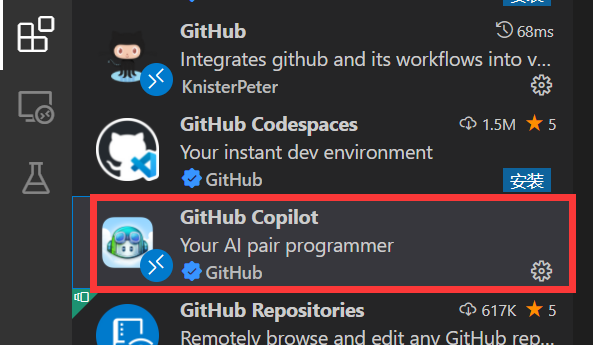
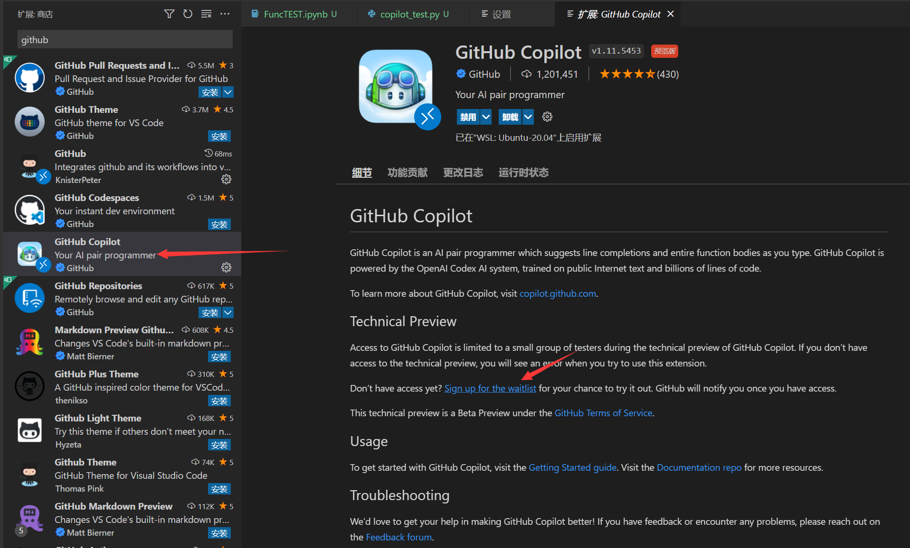
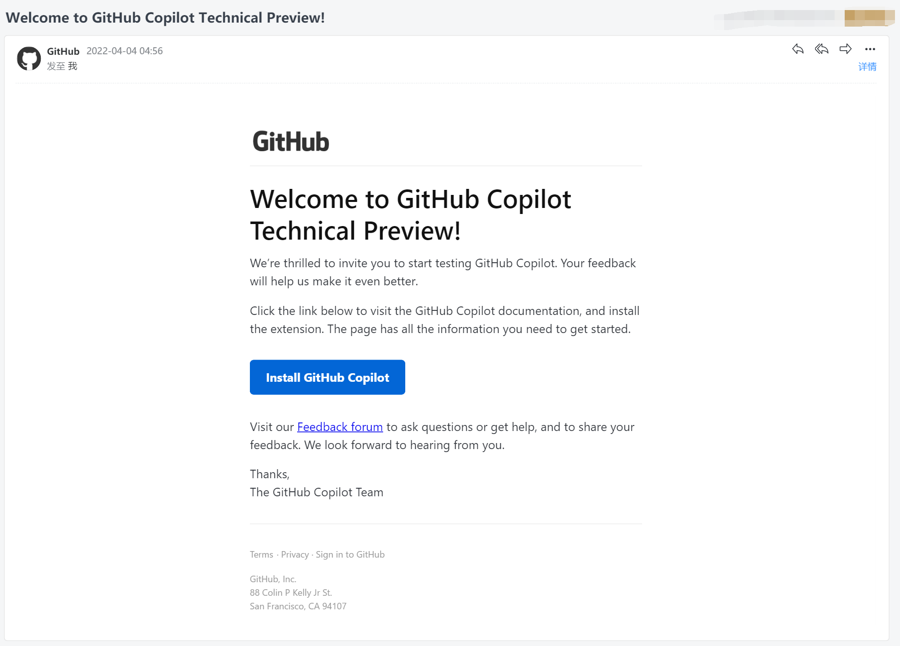
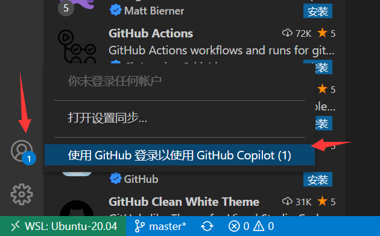
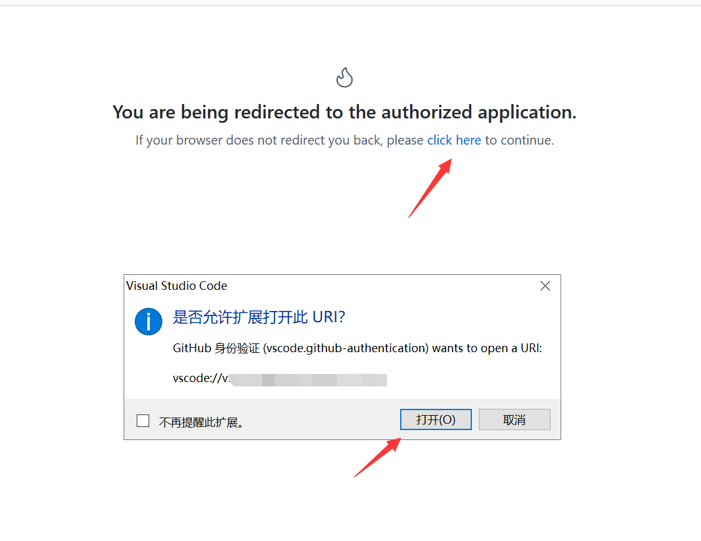
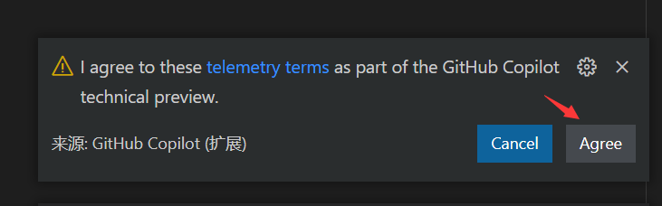
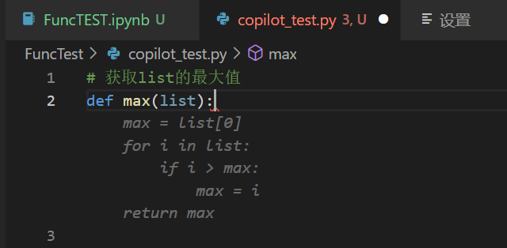
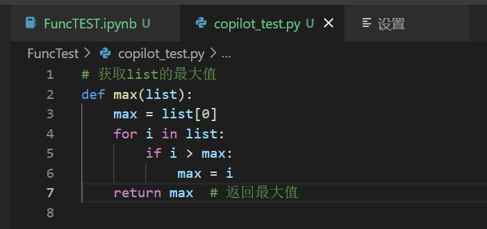

---

**创建时间**：2022年4月4日10:07:33
**最新更新**：2022年4月7日15:18:38

---

**核心思路**：装插件，等邮件，登录在左下角，按Tab部署代码

---

# 安装
* 打开`Visual Studio Code`，`扩展`→`GitHub Copilot`安装

# 申请试用
* 打开`GitHub Copilot`拓展→`Sign up for the waitlist`，在网页里申请，之后通过申请会发邮件给你

# 登录
* 在左下角，点击`账户-已请求登录`→`试用GitHub登录以使用GitHub Copilot`→`Authorize github`→`click here`→`打开`→重新启动`Visual Studio Code`→右下角点`Agree`

# 使用
* 按`Tab`，会出现注释，你觉得没问题，就按Tab，会部署这块代码

* 可以按`Alt`+`[`和`Alt`+`]`选择不同的建议代码

# Ref
* [VSCODE 安装Copilot 插件实现AI辅助编程](https://blog.csdn.net/smset028/article/details/122960913)
