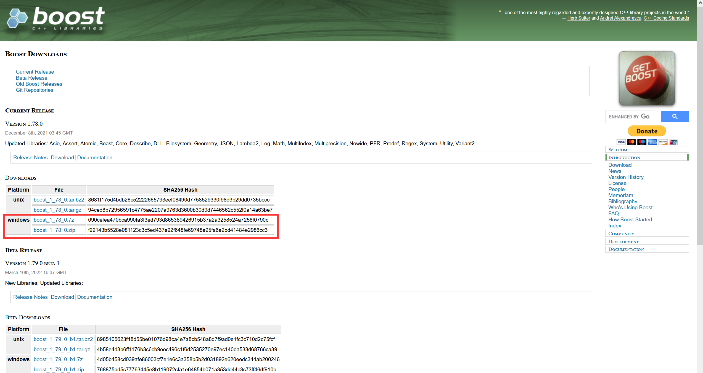
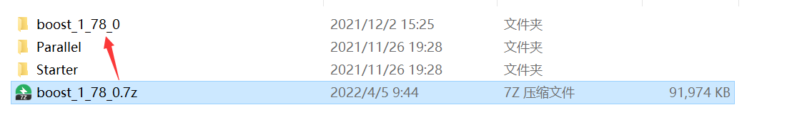
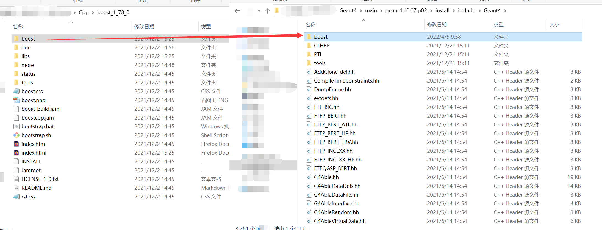
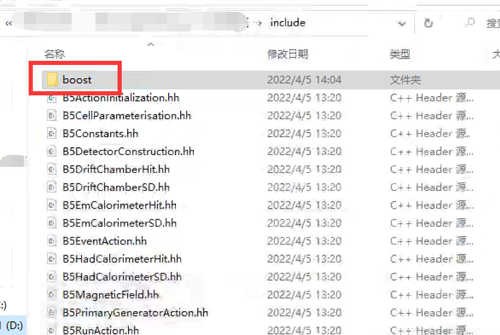
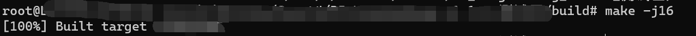

---

**创建时间**：2022年4月5日10:16:53
**最新更新**：2022年4月5日14:12:41

---

**Problem Description**：WSL + Geant4 configure C++ boost library, configure external library can also refer to this post

**核心思路**：

* 两种配置方式
	* 外部库放`.\geant4.10.07.p02\install\include\Geant4`这个文件夹下
	* 外部库放项目文件夹下的`.\include`下

---

* 目前我`string`分割是用`boost`库搞的，没库苦手啥都干不动啊...从头写要老命了，效率又丢人，说出去都不好意思，那好吧，那就发挥聪明才智让Geant4能调用`C++`的外部库呗！

# 背景
* 下面这大段话来自`Ref`，简单来说就是`Boost`库真的很`Boost`，能`Boost`我的代码

> Boost 是一个功能强大、构造精巧、跨平台、开源并且完全免费的 C++ 程序库。
>
> 1998 年，Beman G.Dawes（C++标准委员会成员之一）发起倡议并建立了 Boost 社区，其目的是向 C++ 程序员提供免费的、经同行审查的、可移植的、高质量的 C++ 源程序库。
>
> Boost 强调程序库要与 C++ 标准库很好地共同工作，建立在“既有的实践”之上并提供参考实现，因此 Boost 库可以适合最后的标准化。
>
> 自创立以来，Boost 社区的工作已经取得了卓越的成果，C++ 标准库中有三分之二来自 Boost 库，而且将来 Boost 库中还会有更多的库进入新标准。
>
> C++ 四十余年的发展历史中产生了数不清的程序库，有影响力的程序库也不计其数，然而其中没有一个程序库能够与 Boost 相提并论，Boost 有着其他程序库无法比拟的优点，具体如下：
>
> 许多 Boost 库的作者本身就是 C++ 标准委员会成员，因此，Boost“天然”成了标准库的后备，负责向新标准输送组件，这也使得 Boost 获得了“准”标准库的美誉。
>
> Boost 独特的同行审查制度保证了每一个 Boost 库组件都经过了严格的审查和验证，使其具有很高的工业强度，甚至超过大多数商业产品的实现。
>
> Boost 采用了类似 STL 的编程范式，但却并没有 STL 那样晦涩难懂，其代码格式优美清晰、易于阅读，而且 Boost 附带丰富的说明文档——它既是一个程序库，也是一个很有价值的学习现代 C++ 编程的范本。
>
> Boost 的发布采用 Boost Software License，这是一个不同于 GPL 和 Apache 的非常宽松的许可证，该许可证允许库用户将 Boost 用于任何用途，既鼓励非商业用途，也鼓励商业用途。用户无须支付任何费用，不受任何限制，即可轻松享有 Boost 的全部功能。
>
> Boost 官方于 2019 年 12 月发布的 1.72 版本，共包含 160 余个库/组件，涵盖字符串与文本处理、容器、迭代器、算法、图像处理、模板元编程、并发编程等多个领域，使用 Boost，将大大增强 C++ 的功能和表现力。


# 下载部署库
* 从[Boost官网下载页面](https://www.boost.org/users/download/)下载如下其中一个，我下的是`boost_1_78_0.zip`


* 解压出来，解压完后目录下的`boost`文件，即对下图来说是`boost_1_78_0\boost`这个文件复制粘贴，当然你也可以剪切到`Geant4`根目录下`.\geant4.10.07.p02\install\include\Geant4`的文件夹内



* 部署位置1、2按本机设置来

## 部署位置1



## 部署位置2


# 调用

* 在你的Geant4内调用它，比如我要做字符串分割，那么我可以按如下指令调用

```C++
#include "boost/algorithm/string.hpp" // 2022年4月5日 字符串处理
```

* 可以按如下方式使用
```C++
  // ===========================================================================
  // 2022年4月5日
  // 字符串分割，分割小数点前的整数部分
  // ===========================================================================
  // 按字符分割string
  std::string str = std::to_string((double)((fTargetAngle/deg)));
  std::vector<std::string> strs;
  boost::split(strs, str, boost::is_any_of("."));
  // ===========================================================================
```

# 编译
* 按正常情况编译即可，即进入`.\build`文件夹，在`Bash`（如`WSL`）内输入`cmake ..`，`make -jN`（`N`是线程数，按需输入，我的电脑是`make -j16`），编译成功！


# Ref
* [boost库在visual studio、DevC++和vscode上的环境配置](https://blog.csdn.net/qq_41854911/article/details/118440683)
