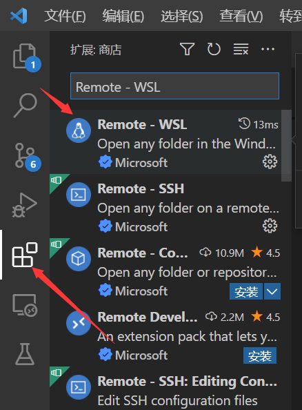
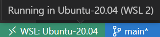
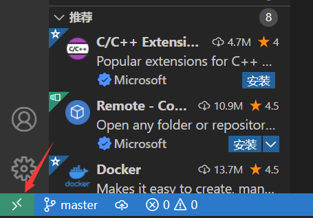
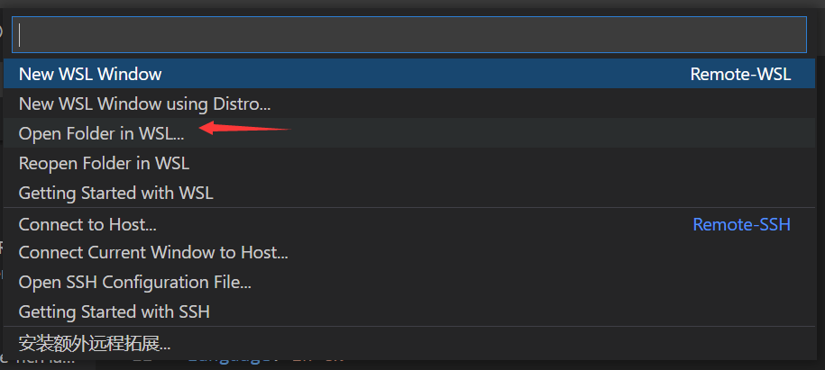
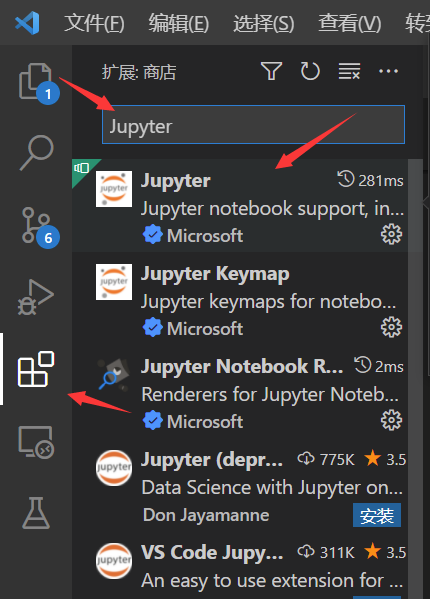
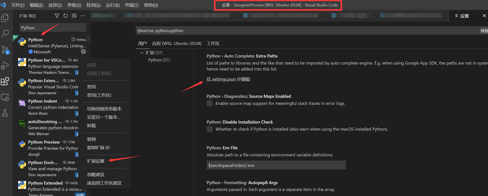
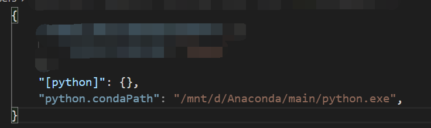
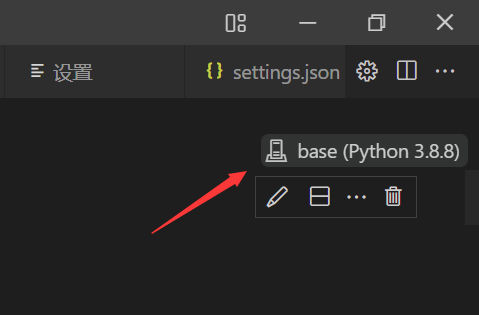
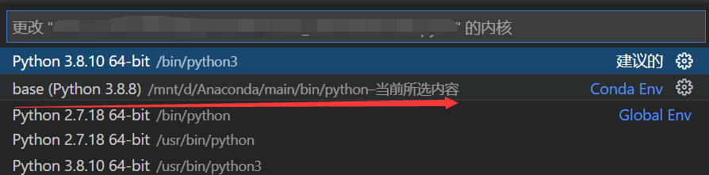
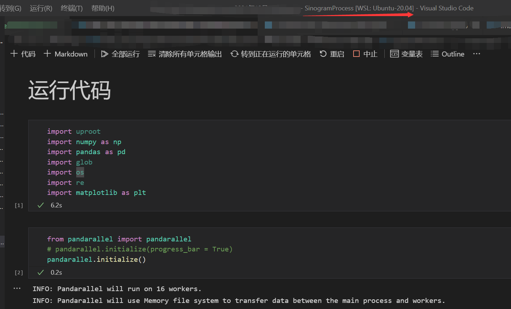

---


title: WSL + Visual Studio Code + Anaconda配置方案
tags:
  - Python
category:
  - Python
abbrlink: 495264bf
date: 2022-03-14 17:13:59
---

**核心思路**：
* `WSL`、`Visual Studio Code（VS Code）`与`Anaconda`安装完成
* `VS Code`装`Remote - WSL`插件
* 通过`VS Code`远程链接进`WSL`，装`Jupyter`插件，配置
* 选对应的内核，运行代码


---


# WSL、VS Code与Anaconda安装
暂略


# VS Code装Remote - WSL插件
* 打开`VS Code`，点击`扩展`→搜索`Remote - WSL`→点`安装`



# 通过VS Code进入WSL，装插件
* 注意从这一步起，`VS Code`一直是链接`WSL`的状态，左下角得如图
	* 即，在`Windows`下打开`VS Code`，在`VS Code`内链接`WSL`，再进行本步及以下步骤



* 通过`VS Code`进入`WSL`，左下角`打开远程窗口`→`Open Folder in WSL`→打开对应文件夹→打开对应代码（此时`VS Code`已进入`WSL`环境）→`扩展`→搜索`Jupyter`→安装










# 设置Jupyter插件

* 设置`Python`插件，点击`管理`→`扩展设置`→找到`Python > Auto Complete: Extra Paths`→在`settings.json`中编辑→输入如下指令
	* 其中`python.condaPath`要改成自己对应的文件夹

```json

{


 "[python]": {},

 "python.condaPath": "/mnt/d/Anaconda/main/python.exe", 

}

```






# 选择对应的内核
* 点击右上角（或直接运行代码块），选择对应的内核

  






* 配置完成，即可顺利运行代码



# Ref

* [机器学习Python编程环境：VSCode+Anaconda](https://zhuanlan.zhihu.com/p/40378960)
* [anaconda+vscode+wsl 配置python运行环境_@（一.一）@的博客-程序员宝宝](https://www.cxybb.com/article/qq_45480755/104613117)
* [WIN10 WSL Ubuntu+Anaconda+VSCode配置多Python开发环境_takeeasy2的专栏-程序员宅基地](https://www.cxyzjd.com/article/takeeasy2/112800095)
* [WIN10安装WSL并使用VScode连接WSL](https://blog.csdn.net/weixin_43876113/article/details/105261577)
