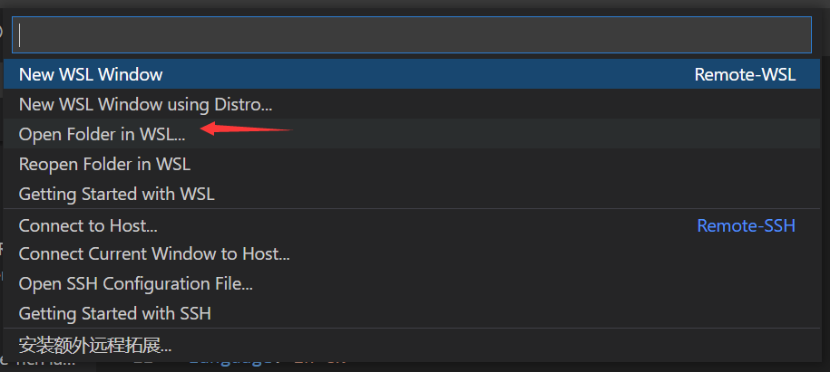

---

**创建时间**：2022年3月18日22:33:08
**最新更新**：2022年3月19日10:54:04


---

# Visual Studio Code配置WSL
具体见[WSL + Visual Studio Code + Anaconda配置方案](./495264bf.html)

## VS Code装Remote - WSL插件

* 打开`VS Code`，点击`扩展`→搜索`Remote - WSL`→点`安装`


## 通过VS Code进入WSL，装插件
* 注意从这一步起，`VS Code`一直是链接`WSL`的状态，左下角得如图
	* 即，在`Windows`下打开`VS Code`，在`VS Code`内链接`WSL`，再进行本步及以下步骤



* 注意此处打开的文件夹，可以从Windows下进入（默认打开是`\\wsl$\Ubuntu-20.04`），可以从下图侧进入


# 安装库
* 在`WSL`内的某一特定文件夹，安装如下拓展
	* `C/C++`
	* `C++ Intellisense`
	* `CMake Tools`


* 在`Visual Studio Code`内按`Ctrl`+`Shift`+`P`，输入`C/C++ :Edit Configurations`→`C/C++:编辑配置(JSON)`，修改代码如下下图所示


<div style="overflow:auto;width:100%"> <table width="auto" style="white-space:nowrap"> 
<tr>
<td> <div align = center> <strong>修改前</strong></div> </td> <td> <div align = center> <strong>修改后</strong></div> </td>
</tr>
<tr>
<td> 

```C++
{
{
    "configurations": [
        {
            "name": "Win32",
            "includePath": [
                "${workspaceFolder}/**"
            ],
            "defines": [
                "_DEBUG",
                "UNICODE",
                "_UNICODE"
            ],
            "cStandard": "c17",
            "cppStandard": "c++17",
            "intelliSenseMode": "windows-msvc-x64"
        }
    ],
    "version": 4
}
}
```

</td>
<td>

```C++
{
    "configurations": [
        {
            "name": "Win32",
            "browse": {
                "path": [
                    "${workspaceFolder}/src",                                       // 链接source
                    "${workspaceFolder}/include",                                   // 链接include
                    "/mnt/d/Geant4/main/geant4.10.07.p02/install/include/Geant4"    // 链接Geant4头文件

                ],
                "limitSymbolsToIncludedHeaders": true
            },
            "includePath": [
                "${workspaceFolder}/src",                                       // 链接source
                "${workspaceFolder}/include",                                   // 链接include
                "/mnt/d/Geant4/main/geant4.10.07.p02/install/include/Geant4"    // 链接Geant4头文件

            ],
            // "defines": [
            //     "_DEBUG",
            //     "UNICODE",
            //     "_UNICODE"
            // ],
            "defines": [
            ],
            "cStandard": "c17",
            "cppStandard": "c++17",
            // "intelliSenseMode": "windows-msvc-x64"
            "intelliSenseMode": "clang-x64"
        }
    ],
    "version": 4
}
```

</td>
</table>
</div>


<!-- <div style="overflow:auto;width:100%"> <table width="auto" style="white-space:nowrap">   

| <div align = center> 修改前</div>                            | <div align = center> 修改后</div>                            |
| :----------------------------------------------------------- | ------------------------------------------------------------ |
| <pre><code>{<br>    "configurations": [<br>        {<br>            "name": "Win32",<br>            "includePath": [<br>                "${workspaceFolder}/**"<br>            ],<br>            "defines": [<br>                "_DEBUG",<br>                "UNICODE",<br>                "_UNICODE"<br>            ],<br>            "cStandard": "c17",<br>            "cppStandard": "c++17",<br>            "intelliSenseMode": "windows-msvc-x64"<br>        }<br>    ],<br>    "version": 4<br>}<br></code></pre> | <pre><code>{<br>    "configurations": [<br>        {<br>            "name": "Win32",<br>            "browse": {<br>                "path": [<br>                    "${workspaceFolder}/src",                                       // 链接source<br>                    "${workspaceFolder}/include",                                   // 链接include<br>                    "/mnt/d/Geant4/main/geant4.10.07.p02/install/include/Geant4"    // 链接Geant4头文件<br><br>                ],<br>                "limitSymbolsToIncludedHeaders": true<br>            },<br>            "includePath": [<br>                "${workspaceFolder}/src",                                       // 链接source<br>                "${workspaceFolder}/include",                                   // 链接include<br>                "/mnt/d/Geant4/main/geant4.10.07.p02/install/include/Geant4"    // 链接Geant4头文件<br><br>            ],<br>            // "defines": [<br>            //     "_DEBUG",<br>            //     "UNICODE",<br>            //     "_UNICODE"<br>            // ],<br>            "defines": [<br>            ],<br>            "cStandard": "c17",<br>            "cppStandard": "c++17",<br>            // "intelliSenseMode": "windows-msvc-x64"<br>            "intelliSenseMode": "clang-x64"<br>        }<br>    ],<br>    "version": 4<br>}<br></code></pre> |

</table> </div> -->


# 配置完成

* 配置完成后代开代码，有自动补全，且库引用正常


# Ref
* [VS Code中添加Geant4、Root的外部库](https://www.bilibili.com/read/cv6037918)
