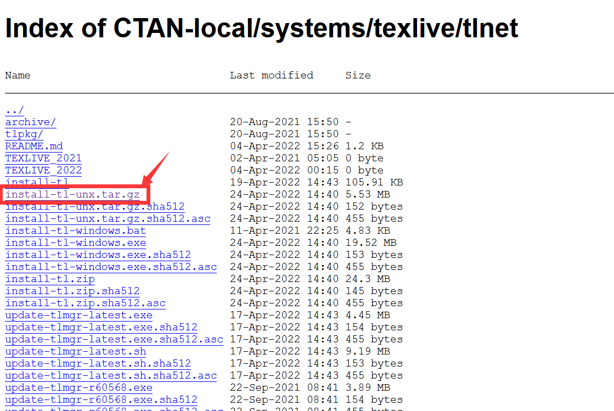
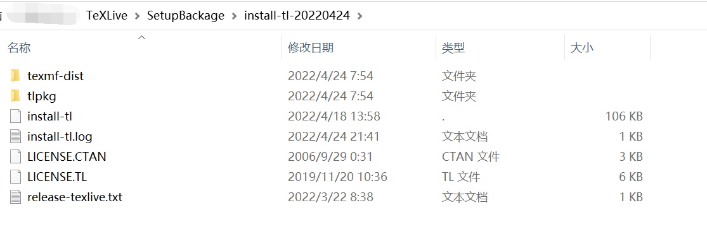
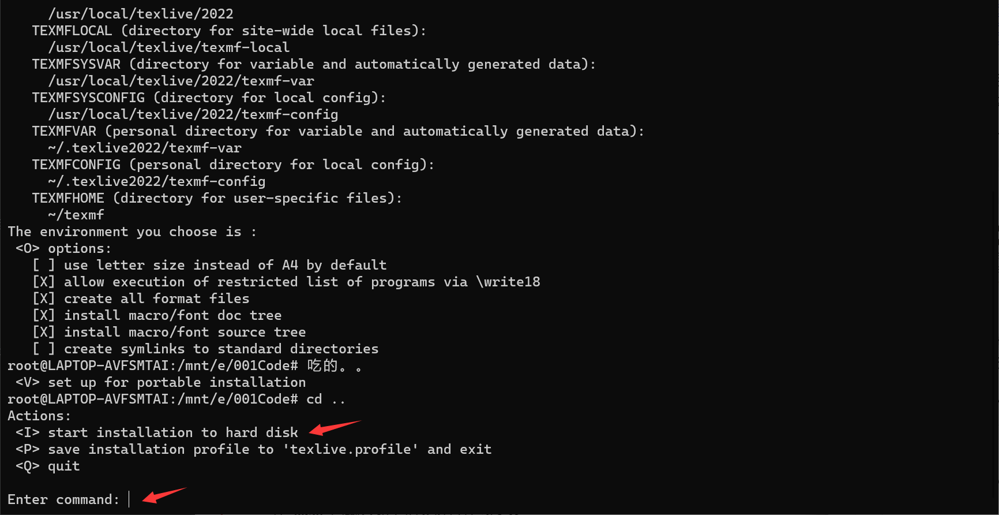
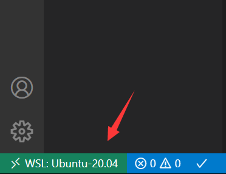
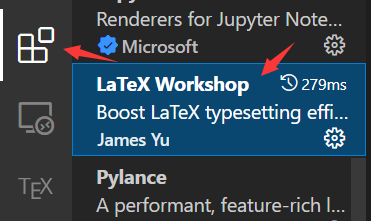
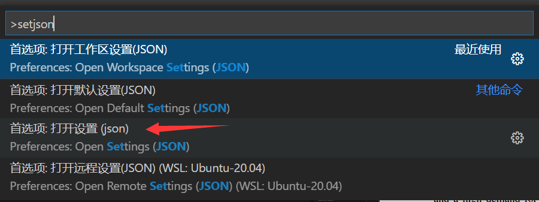
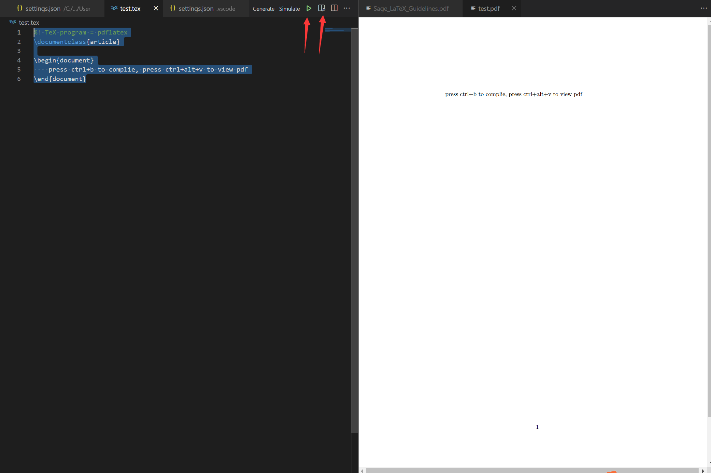

---

**创建时间**：2022年4月25日11:31:01
**最新更新**：2022年4月26日09:53:09

---

**Problem Description**：WSL2 + Visual Studio Code + LaTeX configuration tutorial

**核心思路**：
* 装`TeX Live`
* 同步字体
* `Visual Studio Code`里装拓展`LaTeX Workshop`
* 配置拓展
* 做测试

---

**环境**：
* Windows 10 21H2
* WSL 2
* Ubuntu 20.04 LTS on Windows
* Visual Studio Code 1.66.2
* TeX Live 2022
* LaTeX Workshop v8.25.0

---

# 安装Tex Live
* 进入[华为云镜像](https://mirrors.huaweicloud.com/CTAN/systems/texlive/tlnet/)，选`install-tl-unx.tar.gz`这个安装
	* 
* 下载下来以后，先解压这个`install-tl-unx.tar.gz`，得到`install-tl-20220424`这样一个文件夹
	* 根据你下载的版本不同，后面的数字也会不同
	* 


* 然后打开`bash`（`WSL`的`bash`），进对应目录（解压`install-tl-unx.tar.gz`的目录，这里是进入到`install-tl-20220424`里头）
* 在`bash`内输入如下指令进行在线安装
	* 看到下图信息后，输入`I`，按回车

```bash
./install-tl -repository https://mirrors.huaweicloud.com/CTAN/systems/texlive/tlnet/
```

* 

* 添加到环境变量，在`bash`内输入如下信息
	* 先进`/usr/local/texlive`看看下面的数字文件夹是啥，我装的是`2022`版本所以是`2022`

```bash
cd /usr/local/texlive/2022/bin/x86_64-linux
./tlmgr path add
```


* 在`bash`内输入如下信息安装缺少的库+更新

```bash
apt-get install build-essential
tlmgr update --self --all
```

# 同步字体
* 在`bash`内输入如下指令安装`fontconfig`

```bash
apt install fontconfig
```

* 创建本地配置，在`bash`内输入如下指令

```bash
vi /etc/fonts/local.conf
```

* 配置写入，在上一步操作完成后把下面信息复制粘贴进去
	* 然后`ESC`，`:wq`保存

```bash
<?xml version="1.0"?>
<!DOCTYPE fontconfig SYSTEM "fonts.dtd">
<fontconfig>
    <dir>/mnt/c/Windows/Fonts</dir>
</fontconfig>
```

* 在`bash`内输入如下指令刷新字体缓存

```bash
fc-cache -fv
```

# WSL + Visual Studio Code安装插件
* 先在对应目录打开`Remote - WSL`，启动`WSL`环境，后在拓展中找到`LaTeX Workshop`安装
  * 
  * 


# Visual Studio Code配置
* 在`Visual Studio Code`内按<kbd>F1</kbd>，输入`setjson`，选择`打开设置(json)`
  * <kbd>F1</kbd>这个快捷键冲突的话，就按<kbd>Ctrl</kbd>+<kbd>Shift</kbd>+<kbd>P</kbd>
  * 

* 在`"latex-workshop.intellisense.biblatexJSON.replace": {},`语句下方添加如下语句，然后保存
  * 注意一定要在最外侧的大括号`{}`内添加

```json
    "latex-workshop.latex.tools": [
        {
          "name": "texify",
          "command": "texify",
          "args": [
            "--synctex",
            "--pdf",
            "--tex-option=\"-interaction=nonstopmode\"",
            "--tex-option=\"-file-line-error\"",
            "%DOC%.tex"
          ]
        },
        {
            // 编译工具和命令
            "name": "xelatex",
            "command": "xelatex",
            "args": [
                "-synctex=1",
                "-interaction=nonstopmode",
                "-file-line-error",
                "%DOC%"
            ]
        },
        {
            "name": "pdflatex",
            "command": "pdflatex",
            "args": [
                "-synctex=1",
                "-interaction=nonstopmode",
                "-file-line-error",
                "%DOC%"
            ]
        },
        {
            "name": "bibtex",
            "command": "bibtex",
            "args": [
                "%DOCFILE%"
            ]
        }
      ],
    "latex-workshop.latex.recipes": [
        {
          "name": "PDFLaTeX",
          "tools": [
            "pdflatex"
          ]
      	},
        {
          "name": "XeLaTeX",
          "tools": [
            "xelatex"
          ]
        },
        {
          "name": "latexmk",
          "tools": [
            "latexmk"
          ]
        },
        {
          "name": "BibTeX",
          "tools": [
            "bibtex"
          ]
        },
        {
          "name": "pdflatex -> bibtex -> pdflatex*2",
          "tools": [
            "pdflatex",
            "bibtex",
            "pdflatex",
            "pdflatex"
          ]
        },
        {
          "name": "xelatex -> bibtex -> xelatex*2",
          "tools": [
            "xelatex",
            "bibtex",
            "xelatex",
            "xelatex"
          ]
        }
    ],
```

# 做个测试
* 在`Visual Studio Code`的项目文件夹内新建一个`test.tex`，输入以下内容，然后`Build LaTeX project`，再`View LaTeX PDF file`
	* `Build LaTeX project`是下图那个绿色三角形
	* `View LaTeX PDF file`是下图绿色三角形旁边那个
* 得到如下图所示图像时，表示配置成功！

```tex
%! TeX program = pdflatex
\documentclass{article}

\begin{document}
    press ctrl+b to complie, press ctrl+alt+v to view pdf
\end{document}
```

* 

# Ref
* [在 WSL 中安装 LaTeX](https://www.shushuwoa.com/2021/02/05/%E5%9C%A8-WSL-%E4%B8%AD%E5%AE%89%E8%A3%85-LaTeX/)
* [使用VSCode编写LaTeX](https://zhuanlan.zhihu.com/p/38178015)
